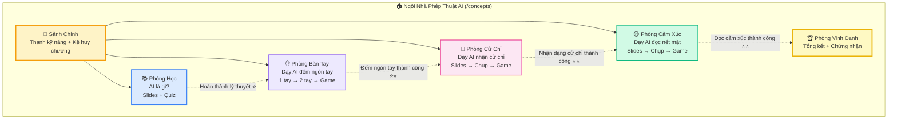
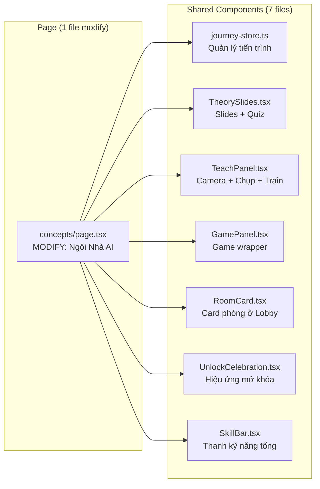

# 🧪 Phòng Thí Nghiệm AI Của Bé — Kế Hoạch Xây Dựng (v4)

## Tầm nhìn sáng tạo

Biến trang `/concepts` thành một **"Ngôi Nhà Phép Thuật AI"** — nơi bé bước vào và tự do khám phá các **căn phòng** khác nhau. Mỗi phòng là một **trải nghiệm hoàn chỉnh** (học + thực hành + chơi), và các phòng kết nối với nhau qua hệ thống phần thưởng.

### Triết lý thiết kế

| Nguyên tắc | Giải thích |
|---|---|
| 🏠 **Thế giới, không phải đường thẳng** | Bé bước vào "ngôi nhà" và chọn phòng, không bị ép đi từng bước |
| 🎨 **Giao diện tự kể chuyện** | UI/UX và animation tự dẫn dắt bé — không cần chatbot, không cần giọng đọc |
| ⭐ **Gamification mềm mại** | Sao, huy chương, sticker — không áp lực, chỉ khuyến khích |
| 🔓 **Mở khóa tự nhiên** | Phòng mới sáng lên kèm celebration khi bé tiến bộ |
| 🔇 **Âm thanh tiết chế** | Chỉ dùng hiệu ứng âm thanh ngắn (click, thành công, mở khóa) — không TTS, không giọng đọc |
| 📱 **Tất cả trong 1 trang** | Không nhảy route, bé ở lại `/concepts` và "đi giữa các phòng" |

---

## Cách dẫn dắt bé — Giao diện là người kể chuyện

Không chatbot, không giọng đọc TTS. **Bé là nhân vật chính** — giao diện phản ứng theo hành động của bé bằng visual feedback.

### 1. 📢 Smart Status Banners (thông báo ngữ cảnh)
- Thanh thông báo thay đổi theo hành động của bé, hiển thị ở vị trí cố định
- Gradient background, icon lớn, text ngắn gọn — bé đọc được ngay
- Ví dụ khi chụp đủ mẫu: Banner xanh lá `"✅ Đã chụp đủ 10 mẫu! Nhấn nút Huấn Luyện để tiếp tục →"`
- Ví dụ khi thiếu mẫu: Banner cam `"📸 Cần thêm 3 ảnh nữa cho nhóm 1 Ngón Tay"`
- Banner tự động cập nhật real-time theo state — **bé thấy ngay kết quả hành động của mình**

### 2. 🎉 Celebration & Micro-animations
- Khi mở khóa → Fullscreen confetti + emoji particles + **SFX ngắn** (tiếng chuông/pháo hoa)
- Khi huấn luyện xong → Progress bar chạy + icon sao bay vào thanh kỹ năng
- Khi đoán đúng trong game → Emoji lớn xuất hiện giữa màn hình rồi fade out
- Card phòng tự thay đổi visual: xám → sáng → viền vàng → badge sao
- **Giao diện "sống" — phản ứng theo từng bước tiến của bé**

### 3. 🪧 Inline Guidance Text (hướng dẫn nhúng)
- Text hướng dẫn nhúng trực tiếp vào giao diện (không phải popup/bubble)
- Styling đặc biệt: Nền pastel, icon lớn, font đậm, viền bo tròn
- Ví dụ: Ở tab "Dạy 1 tay" hiện hộp: `"💡 Di chuyển tay nhẹ nhàng khi chụp để AI học được nhiều góc độ!"`
- Text thay đổi theo bước bé đang ở — **luôn hiện ngay trước mắt, không cần lắng nghe**

### 4. 🔊 Hiệu ứng âm thanh (SFX only — không TTS)
Chỉ dùng **âm thanh ngắn** cho các khoảnh khắc quan trọng:
- `playClickSound()` — khi click nút, chọn tab
- `playSuccessSound()` — khi hoàn thành bước, đoán đúng trong game
- Hiệu ứng unlock — tiếng chuông/pháo hoa khi mở khóa phòng/tab mới
- **Không dùng TTS/giọng đọc** — bé đọc text trên giao diện, tự chủ nhịp độ học

---

## Bản đồ Ngôi Nhà Phép Thuật AI



> [!NOTE]
> Nét đứt = **khuyến nghị** thứ tự, không ép buộc. Phòng chưa mở hiển thị card xám mờ + icon 🔒 + tooltip: *"Hoàn thành [phòng trước] để mở khóa!"*

---

## Chi tiết từng phòng

### 🚪 Sảnh Chính (Lobby)

Màn hình đầu tiên khi bé mở trang.

**Thiết kế:**
- Background: Gradient ấm áp (vàng/cam/hồng), bọt khí/ngôi sao bay nhẹ nhàng
- **TTS tự động**: *"Chào mừng bé đến Ngôi Nhà Phép Thuật AI! Hãy chọn một phòng để bắt đầu nhé!"*
- **Tiêu đề lớn** ở trên: "🏠 Ngôi Nhà Phép Thuật AI" + subtitle nhỏ: "Bé sẽ làm cô giáo dạy AI học!"
- **Thanh kỹ năng tổng (SkillBar)** — 4 biểu tượng tròn với progress ring: 📚 ✋ 🤜 😊
- **4 cánh cửa phòng** xếp 2x2 grid (responsive 1 cột trên mobile), mỗi cửa là RoomCard:
  - `available`: Sáng, viền gradient, glow pulse, progress bar bên dưới → click vào được
  - `locked`: Xám mờ, icon 🔒, tag "Hoàn thành [X] để mở khóa" → click hiện toast thông báo
  - `completed`: Viền vàng, badge ⭐ ở góc, tag "✅ Hoàn thành!"
- **Kệ Huy Chương** — Thanh ngang phía dưới hiển thị các huy chương/sticker đã thu thập (slots trống = hình tròn mờ)

---

### 📚 Phòng Học (Theory Room)

**Luồng trải nghiệm:**
```
[Banner TTS] "Cùng tìm hiểu AI là gì nhé!"
  ↓
Slide 1: "AI là gì nhỉ? 🤔" (nội dung hiện tại + animation emoji lớn)
  ↓
Slide 2: "AI nhìn thế giới qua camera 📷"
  ↓  
Slide 3: "AI học hỏi từ ví dụ 📚"
  ↓
Quiz thử thách (confetti khi đúng, shake khi sai)
  ↓
[Celebration] ⭐ "Ngôi Sao Tri Thức" bay vào thanh kỹ năng
  ↓
[Status banner] "✅ Phòng Bàn Tay đã sẵn sàng!" + card Phòng Bàn Tay sáng lên
```

**Cải tiến so với `/concepts` hiện tại:**
- Animation minh họa cho từng slide (emoji bounce, scale)
- Nút "Nghe lại 🔊" hoạt động thực sự (TTS)
- Quiz có confetti particle khi đúng, shake animation khi sai
- Step indicator dots ở dưới slides

---

### ✋ Phòng Bàn Tay (Hand Room)

Phòng này có **3 tab bên trong**:

```
┌─────────────────────────────────────────────────────┐
│  ✋ Phòng Bàn Tay                    [← Về Sảnh]   │
│                                                      │
│  [Tab 1: Dạy 1 tay] [Tab 2: Dạy 2 tay 🔒] [Tab 3: Trò chơi 🔒] │
│                                                      │
│  ┌──────────────┐  ┌──────────────────────────┐     │
│  │ Chọn lớp:    │  │ 📹 Camera                 │     │
│  │ ☝️ 1 Ngón    │  │                            │     │
│  │ ✌️ 2 Ngón    │  │  (chỉ vẽ skeleton          │     │
│  │              │  │   1 bàn tay khi Tab 1)     │     │
│  │ [GIỮ CHỤP]  │  │                            │     │
│  │              │  ├──────────────────────────┤     │
│  │ Gallery mẫu  │  │ 🧠 Kết quả dự đoán AI     │     │
│  │              │  │ "1 Ngón Tay ☝️ — 95%"     │     │
│  └──────────────┘  └──────────────────────────┘     │
│                                                      │
│  [Status banner] "📸 Đã chụp 12/10 ảnh — Đủ mẫu!"  │
└─────────────────────────────────────────────────────┘
```

**Tab 1: Dạy AI — 1 Bàn Tay**
- [TTS] *"Hãy giơ 1 ngón tay trước camera và giữ nút chụp nhé!"*
- Camera detect tối đa 2 tay nhưng **CHỈ VẼ skeleton bàn tay đầu tiên** (bàn tay thứ 2 không hiện skeleton)
- 2 class: 1 Ngón ☝️ + 2 Ngón ✌️
- [Status banner] cập nhật real-time: *"📸 Đã chụp 5/10 ảnh cho nhóm 1 Ngón"*
- Khi đủ ≥10 mẫu/class → Nút "Huấn Luyện AI 🧠" sáng lên
- Huấn luyện xong → [Celebration overlay] → Tab 2 tự mở khóa + sáng lên

**Tab 2: Dạy AI — 2 Bàn Tay 🔓**
- [TTS] *"Tuyệt vời! Giờ hãy thử giơ cả 2 bàn tay nhé!"*
- Camera vẽ skeleton **CẢ 2 BÀN TAY** — moment "wow" khi bé thấy cả 2 tay có xương
- 2 class mới: 2 Tay mỗi tay 1 Ngón ☝️☝️ + 2 Tay mỗi tay 2 Ngón ✌️✌️
- Khi đủ mẫu → Huấn luyện → Tab 3 mở khóa + Celebration

**Tab 3: 🎮 Trò Chơi Đếm Ngón Tay 🔓**
- [TTS] *"Hãy giơ đúng số ngón tay mà AI yêu cầu nhé!"*
- Reuse logic từ `/challenge/fingers`, embed trực tiếp trong tab
- Hỗ trợ 2 bàn tay (tổng 0-10 ngón)
- Đạt ≥3 điểm → 🏅 "Huy Chương Bàn Tay Vàng" + Phòng Cử Chỉ mở khóa

---

### 🤜 Phòng Cử Chỉ (Gesture Room)

**Mini slides giới thiệu (2-3 slides):**
- Slide 1: *"Cử chỉ là ngôn ngữ bí mật của bàn tay! 🤫"*
- Slide 2: *"Mỗi cử chỉ có bản đồ xương tay khác nhau"*
- Quiz nhanh → ⭐

**Tab 1: Dạy AI Cử Chỉ**
- 4 classes: Thích 👍, Quyết Tâm ✊, Chiến Thắng ✌️, Chào Bạn ✋
- Reuse logic validate từ `teach-gestures` (golden dataset)
- [Status banner] phản ứng theo prediction: *"AI đoán: Thích 👍 — Độ tự tin 92%"*

**Tab 2: 🎮 Trò Chơi Ảo Thuật Tay 🔓**
- Reuse từ `/challenge/gestures`
- [TTS] *"Hãy làm cử chỉ Chiến Thắng ✌️!"*
- Khi đúng → emoji particle ✌️ bay lên + âm thanh thắng
- Đạt ≥3 điểm → 🏅 "Huy Chương Ảo Thuật Gia" + Phòng Cảm Xúc mở

---

### 😊 Phòng Cảm Xúc (Emotion Room)

**Mini slides (2-3 slides):**
- Slide 1: *"Khuôn mặt bé nói lên rất nhiều điều! 😊"*
- Slide 2: *"AI đặt 468 điểm nhỏ xíu lên mặt bé như bản đồ kỳ diệu! 🗺️"*
- Quiz nhanh → ⭐

**Tab 1: Dạy AI Cảm Xúc**
- 4 classes: Vui 😀, Buồn 😢, Ngạc nhiên 😲, Bình thường 😐
- Dùng FaceMesh (reuse từ `teach-face`)
- [Status banner] phản ứng real-time: *"AI đoán: Vui vẻ 😀 — 88%"*

**Tab 2: 🎮 Trò Chơi Thám Tử Mặt 🔓**
- Reuse từ `/challenge/face`
- [TTS] *"Bé hãy làm mặt Ngạc Nhiên 😲!"*
- Hoàn thành → 🏆 Phòng Vinh Danh mở khóa

---

### 🏆 Phòng Vinh Danh (Trophy Room) — Mở khi hoàn thành cả 3 phòng

- Hiển thị toàn bộ huy chương đã thu thập trên kệ lớn
- **Chứng nhận** "Nhà Khoa Học AI Nhí" — có ngày hoàn thành, có thể tải về
- [TTS] *"Chúc mừng bé đã hoàn thành xuất sắc! Bé là Nhà Khoa Học AI Nhí rồi!"*
- Nút chụp ảnh chứng nhận

---

## User Review Required

> [!IMPORTANT]
> **Quyết định #1: Tất cả trong `/concepts` hay route mới?**
> Tôi đề xuất **modify trực tiếp trang `/concepts`** thành Ngôi Nhà Phép Thuật AI. Trang concepts cũ khá đơn giản (chỉ 232 dòng). Hoặc tạo route mới nếu bạn muốn giữ trang cũ.

> [!IMPORTANT]
> **Quyết định #2: Cơ chế skeleton 1 tay** — Khi ở Tab "Dạy 1 tay", tôi sẽ chỉ vẽ skeleton cho `hands[0]` (bàn tay đầu tiên detect được) và bỏ qua `hands[1]`. Model vẫn detect 2 tay nhưng UI chỉ hiện 1. Bạn OK?

---

## Open Questions

> [!IMPORTANT]
> 1. **Bé có cần đăng nhập không?** Đề xuất: KHÔNG bắt buộc. Tiến trình lưu localStorage. Nộp bài cho giáo viên mới cần login.
> 2. **Nội dung slides**: Giữ nguyên 3 slides hiện tại cho Phòng Học, tạo mới cho Cử Chỉ/Cảm Xúc. Bạn có nội dung riêng muốn thêm?
> 3. **Tiêu chuẩn unlock** — Bạn muốn điều chỉnh gì?
>    - Phòng Bàn Tay: Mở sau khi hoàn thành Phòng Học
>    - Tab "2 tay": Sau khi dạy 1 tay thành công (≥10 mẫu/class + huấn luyện)
>    - Tab "Game": Sau khi dạy 2 tay thành công
>    - Phòng Cử Chỉ: Sau khi game Bàn Tay ≥3 điểm
>    - Phòng Cảm Xúc: Sau khi game Cử Chỉ ≥3 điểm

---

## Proposed Changes

### Tổng quan kiến trúc



---

### Component 1: Journey Progress Store

#### [NEW] [journey-store.ts](file:///D:/HOCTAP/Learn-Hub/client/src/lib/journey-store.ts)

Quản lý toàn bộ tiến trình, lưu localStorage.

```typescript
interface JourneyState {
  // Phòng Học
  theoryCompleted: boolean;
  
  // Phòng Bàn Tay
  hand1Trained: boolean;
  hand2Unlocked: boolean;
  hand2Trained: boolean;
  handGameUnlocked: boolean;
  handGameBestScore: number;
  
  // Phòng Cử Chỉ
  gestureRoomUnlocked: boolean;
  gestureTheoryDone: boolean;
  gestureTrained: boolean;
  gestureGameUnlocked: boolean;
  gestureGameBestScore: number;
  
  // Phòng Cảm Xúc
  emotionRoomUnlocked: boolean;
  emotionTheoryDone: boolean;
  emotionTrained: boolean;
  emotionGameUnlocked: boolean;
  emotionGameBestScore: number;
  
  // Tổng
  badges: string[];
  totalStars: number;
}
```

Exports:
- `useJourneyStore()` — React hook trả về `[state, updateState]`
- `resetJourney()` — Reset toàn bộ

---

### Component 2: Shared UI Components (6 files mới)

#### [NEW] [RoomCard.tsx](file:///D:/HOCTAP/Learn-Hub/client/src/components/journey/RoomCard.tsx)

Card đại diện cho mỗi "phòng" ở Lobby.

Props:
- `title`, `icon`, `description`
- `status: 'locked' | 'available' | 'in-progress' | 'completed'`
- `progress: number` (0-100)
- `onClick()`
- `colorScheme` — Bảng màu (border, bg gradient, text)
- `lockMessage?: string` — Text hiển thị khi locked

Trạng thái visual:
- `locked` → Opacity 0.5, grayscale, icon 🔒, tag lockMessage
- `available` → Sáng, glow pulse border, nút CTA nổi bật
- `in-progress` → Viền gradient, progress bar phía dưới
- `completed` → Viền vàng, badge ⭐ góc trên, tag "✅ Hoàn thành"

#### [NEW] [TheorySlides.tsx](file:///D:/HOCTAP/Learn-Hub/client/src/components/journey/TheorySlides.tsx)

Component tái sử dụng cho bài học lý thuyết (reuse nội dung từ `/concepts` hiện tại).

Props:
- `slides: { title, content, image, voice, color, borderColor }[]`
- `quiz: { question, options: { label, isCorrect }[] }`
- `onComplete: () => void`

Bên trong:
- Step indicator dots
- Nút Nghe 🔊 (gọi `speakVietnamese()`)
- Quiz với confetti khi đúng, shake khi sai
- Gọi `onComplete()` khi hoàn thành quiz

#### [NEW] [TeachPanel.tsx](file:///D:/HOCTAP/Learn-Hub/client/src/components/journey/TeachPanel.tsx)

**Component cốt lõi** — Panel dạy AI, tái sử dụng logic từ các trang teach.

Props:
- `mode: 'hand-1' | 'hand-2' | 'gesture' | 'emotion'`
- `classes: { id, label, voicePrompt }[]`
- `goldenDataset?: any[]` — Dữ liệu chuẩn để validate
- `minSamplesPerClass: number` — Ngưỡng tối thiểu (mặc định 10)
- `maxVisibleSkeletons: number` — **1 hoặc 2** (kiểm soát vẽ skeleton)
- `onTrainComplete: (samples: StoredSample[]) => void`

Bên trong:
- Sử dụng `useCamera()` + `useMl5Handpose()` hoặc `useMl5FaceMesh()` tùy mode
- Canvas drawing loop: **`hands.slice(0, maxVisibleSkeletons)` — chỉ vẽ đúng số skeleton**
- Logic capture, validate, train reuse từ các trang teach hiện có
- Gallery preview mẫu (reuse `SampleGallery`)
- Status banner contextual: hiện thông tin đếm mẫu, cảnh báo, kết quả dự đoán
- Nút "Huấn Luyện AI 🧠"
- Validation toast

#### [NEW] [GamePanel.tsx](file:///D:/HOCTAP/Learn-Hub/client/src/components/journey/GamePanel.tsx)

Wrapper game, embed trò chơi trực tiếp.

Props:
- `gameType: 'fingers' | 'gestures' | 'face'`
- `onScoreReached: (score: number) => void`

Bên trong: reuse logic từ các trang game tương ứng (`fingers/page.tsx`, `gestures/page.tsx`, `face/page.tsx`).

#### [NEW] [UnlockCelebration.tsx](file:///D:/HOCTAP/Learn-Hub/client/src/components/journey/UnlockCelebration.tsx)

Full-screen celebration overlay khi mở khóa phòng/tab mới.

- Confetti CSS particles bay từ dưới lên
- Emoji lớn ở giữa (🔓 → ⭐ → 🎉) với sequence animation
- Text: *"🔓 Mở khóa: [Tên phòng/tab]!"*
- TTS đọc thông báo
- Tự đóng sau 3 giây hoặc click bất kỳ đâu

#### [NEW] [SkillBar.tsx](file:///D:/HOCTAP/Learn-Hub/client/src/components/journey/SkillBar.tsx)

Thanh kỹ năng tổng — hiển thị 4 biểu tượng tròn (📚 ✋ 🤜 😊) với SVG progress ring quanh mỗi icon. Khi skill hoàn thành → ring đầy + icon sáng + badge ⭐ nhỏ.

---

### Component 3: Trang chính (Modify concepts page)

#### [MODIFY] [page.tsx](file:///D:/HOCTAP/Learn-Hub/client/src/app/(public)/concepts/page.tsx)

**Thay thế hoàn toàn** trang concepts hiện tại (232 dòng).

Quản lý state `currentView`:
```
'lobby'   → Sảnh chính, hiển thị SkillBar + 4 RoomCard + Kệ Huy Chương
'theory'  → Phòng Học (TheorySlides)
'hand'    → Phòng Bàn Tay (tabs: teach-1, teach-2, game)
'gesture' → Phòng Cử Chỉ (tabs: theory-slides, teach, game)
'emotion' → Phòng Cảm Xúc (tabs: theory-slides, teach, game)
'trophy'  → Phòng Vinh Danh
```

Mỗi "phòng" render inline với animation slide-in. Nút "← Quay về Sảnh" luôn hiện ở header.

---

### Component 4: Cập nhật Trang Chủ

#### [MODIFY] [page.tsx](file:///D:/HOCTAP/Learn-Hub/client/src/app/(public)/page.tsx)

Thay thế Card "1. Lớp Học AI" hiện tại (dẫn đến `/concepts`) bằng card nổi bật hơn — "🏠 Ngôi Nhà Phép Thuật AI" với animation shimmer và badge "✨ MỚI".

---

## Tóm tắt danh sách file

### Files mới (7 files)
| # | File | Mô tả |
|---|------|--------|
| 1 | `client/src/lib/journey-store.ts` | Store tiến trình (localStorage + React hook) |
| 2 | `client/src/components/journey/RoomCard.tsx` | Card phòng ở Lobby (4 trạng thái) |
| 3 | `client/src/components/journey/TheorySlides.tsx` | Slides lý thuyết + quiz tái sử dụng |
| 4 | `client/src/components/journey/TeachPanel.tsx` | Panel dạy AI (core — camera, chụp, train) |
| 5 | `client/src/components/journey/GamePanel.tsx` | Panel game wrapper |
| 6 | `client/src/components/journey/UnlockCelebration.tsx` | Hiệu ứng mở khóa (confetti + TTS) |
| 7 | `client/src/components/journey/SkillBar.tsx` | Thanh kỹ năng tổng (progress rings) |

### Files sửa (2 files)
| # | File | Thay đổi |
|---|------|----------|
| 1 | `client/src/app/(public)/concepts/page.tsx` | Thay thế hoàn toàn → Ngôi Nhà Phép Thuật AI |
| 2 | `client/src/app/(public)/page.tsx` | Cập nhật card "Lớp Học AI" → "Ngôi Nhà Phép Thuật AI" |

---

## Thứ tự triển khai

| Bước | Task | Mô tả |
|------|------|-------|
| **1** | `journey-store.ts` | Store + hook quản lý tiến trình |
| **2** | `SkillBar.tsx` + `UnlockCelebration.tsx` | UI atoms |
| **3** | `RoomCard.tsx` + `TheorySlides.tsx` | Lobby + Phòng Học |
| **4** | `TeachPanel.tsx` | Core — refactor logic teach vào shared component |
| **5** | `GamePanel.tsx` | Game wrapper |
| **6** | `concepts/page.tsx` | Tích hợp tất cả thành Ngôi Nhà AI |
| **7** | Cập nhật `page.tsx` (trang chủ) | Card mới |
| **8** | Build + Test | Verify toàn bộ flow |

---

## Verification Plan

### Build Check
```bash
cd D:\HOCTAP\Learn-Hub\client
npm run build
```

### Manual Testing Checklist
- [ ] Mở `/concepts` → Sảnh chính với SkillBar + 4 phòng + Kệ huy chương
- [ ] TTS tự động chào đón khi vào trang
- [ ] Phòng Học: Slides → Quiz đúng → ⭐ bay vào SkillBar → Celebration
- [ ] Phòng Bàn Tay Tab 1: Camera vẽ skeleton **chỉ 1 tay**
- [ ] Chụp đủ mẫu → Banner "Đủ mẫu!" → Huấn luyện → Tab 2 mở (celebration)
- [ ] Tab 2: Camera vẽ skeleton **cả 2 tay** → Huấn luyện → Tab 3 mở
- [ ] Tab 3 (Game): Đạt 3 điểm → 🏅 Huy chương → Phòng Cử Chỉ mở khóa
- [ ] Phòng Cử Chỉ: Slides → Dạy 4 cử chỉ → Game → Phòng Cảm Xúc mở
- [ ] Phòng Cảm Xúc: Slides → Dạy 4 cảm xúc → Game → Phòng Vinh Danh mở
- [ ] Phòng Vinh Danh: Huy chương + Chứng nhận
- [ ] Refresh trang → Tiến trình giữ nguyên (localStorage)
- [ ] Responsive: Mobile + Tablet
