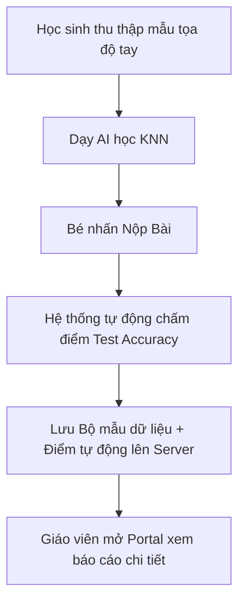

# Kế hoạch triển khai: Bé Dạy AI Học & Hệ Thống Chấm Bài Cho Giáo Viên

Nền tảng giúp học sinh tiểu học khám phá AI thông qua camera, tự thu thập dữ liệu tọa độ tay/mặt để dạy AI học, đồng thời cung cấp công cụ chấm bài trực quan cho giáo viên để đánh giá mức độ hiểu bài của học sinh.

---

## 1. Thuật Ngữ: Nên Dùng "Train" Hay "Dạy"?

Để phù hợp nhất với tâm lý học sinh tiểu học và đảm bảo tính giáo dục khoa học, chúng tôi đề xuất kết hợp cả hai như sau:
- **Trên giao diện tương tác của bé:** Dùng từ **"DẠY"** (Ví dụ: *"Bé hãy dạy bạn AI học nhé!"*, *"Bắt đầu dạy AI 🚀"*). Từ này rất gần gũi, giúp bé cảm thấy mình như một giáo viên đang hướng dẫn một người bạn nhỏ (AI).
- **Trong phần giải thích kiến thức (Concepts) & Giáo án:** Sử dụng song song để giải thích thuật ngữ chuyên ngành: *"Trong khoa học máy tính, việc **dạy** AI học được gọi là **Huấn luyện (Train)** mô hình..."*.

---

## 2. Giải Pháp Cho Bài Tập: "Nhận diện 1 ngón, 2 ngón và đếm ngón trên 2 tay"

Học sinh sẽ thực hiện nhiệm vụ dạy AI phân biệt các trạng thái:
- **Lớp 1:** ☝️ 1 ngón tay
- **Lớp 2:** ✌️ 2 ngón tay
- **Lớp 3:** 👐 2 bàn tay (và nhận diện tổng số ngón tay hiển thị)

Hệ thống sẽ hướng dẫn bé từng bước sử dụng camera để thu thập các dáng tay này làm dữ liệu đầu vào.

---

## 3. Đề Xuất Cơ Chế Chấm Bài Dành Cho Giáo Viên (Teacher Assessment)

Để giáo viên biết học sinh thực sự hiểu cách hoạt động của AI (chứ không chỉ nhấn nút ngẫu nhiên), hệ thống sẽ hoạt động theo quy trình sau:

### Cơ chế 1: Chấm điểm tự động (Auto-Testing Engine)
Khi học sinh nhấn **"Nộp bài"**, hệ thống Client sẽ chạy một bộ kiểm tra ẩn (Golden Test Dataset) gồm **10 mẫu tọa độ chuẩn** (ví dụ: 3 mẫu 1 ngón tay, 3 mẫu 2 ngón tay, 4 mẫu 2 bàn tay) có sẵn trên hệ thống:
1. Hệ thống đưa các mẫu chuẩn này qua mô hình KNN mà học sinh vừa dạy.
2. Tính toán độ chính xác: **Test Accuracy** = `(Số mẫu đoán đúng / 10) * 100%`.
3. Nếu bé thu thập mẫu cẩu thả (ví dụ: nhãn "1 ngón" nhưng lại chụp ảnh lúc giơ 5 ngón hoặc không có tay), mô hình của bé sẽ đoán sai bộ Test chuẩn này và bị điểm thấp. Điều này phản ánh trung thực việc bé đã hiểu cách cung cấp dữ liệu sạch cho AI hay chưa.

### Cơ chế 2: Trang tổng quan dành cho Giáo viên (Teacher Dashboard)
Giáo viên đăng nhập và truy cập vào danh sách bài nộp của lớp để xem chi tiết:
- **Điểm số tự động (Auto-Score):** Dựa trên Test Accuracy ở trên.
- **Thống kê dữ liệu (Dataset Quality):** Xem số lượng ảnh mẫu bé đã chụp cho mỗi lớp (Ví dụ: Lớp 1 có 8 ảnh, Lớp 2 có 9 ảnh - xem bé có chụp quá ít hay không).
- **Bản đồ Xương tay trực quan (Skeleton Preview):** Hệ thống vẽ lại hình ảnh các khung xương tay (vector landmarks) mà học sinh đã chụp cho từng lớp. Giáo viên có thể nhìn lướt qua xem học sinh có giơ nhầm dáng tay ở các lớp tương ứng không.
- **Câu hỏi phản tư (Self-Reflection):** Trẻ trả lời câu hỏi ngắn trước khi nộp: *"Làm sao để bạn AI nhận diện chính xác hơn?"* (Đáp án mong đợi của trẻ: *"Phải giữ tay im lặng khi chụp"*, *"Chụp ở nơi đủ ánh sáng"*, *"Chụp nhiều góc độ khác nhau"*).

---

## Proposed Changes

### [Component 1] Client (Next.js)

#### [NEW] [teach/page.tsx](file:///d:/HOCTAP/Learn-Hub/client/src/app/(public)/challenge/teach/page.tsx)
- Trang giao diện cho học sinh thực hành nhiệm vụ: "Giúp bạn AI phân biệt ngón tay".
- Tích hợp camera chụp ảnh mẫu, hiển thị số mẫu đã thu thập cho 3 lớp (1 ngón, 2 ngón, 2 tay).
- Tích hợp công cụ train mô hình KNN trên các điểm tọa độ hand keypoints.
- Nút **"Nộp bài cho Thầy Cô 🎒"** mở popup trả lời câu hỏi trắc nghiệm/phản tư ngắn trước khi lưu kết quả lên server.

#### [NEW] [teacher/page.tsx](file:///d:/HOCTAP/Learn-Hub/client/src/app/(public)/teacher/page.tsx)
- Trang dành cho giáo viên đăng nhập để xem danh sách học sinh làm bài tập.
- Hiển thị bảng tổng hợp: Tên học sinh, Điểm số tự động (Test Accuracy), Tổng số mẫu đã chụp, câu trả lời phản tư.
- Khi click vào từng học sinh, hiển thị trực quan các tư thế xương tay mà học sinh đó đã chụp để lưu làm dữ liệu dạy AI.

#### [MODIFY] [layout.tsx](file:///d:/HOCTAP/Learn-Hub/client/src/app/(public)/layout.tsx)
- Cập nhật Navbar hiển thị nút **"Trang Giáo Viên 👩‍🏫"** (nếu tài khoản là giáo viên hoặc hiển thị chung để thử nghiệm).

---

### [Component 2] Server (NestJS)

#### [NEW] [submission.entity.ts](file:///d:/HOCTAP/Learn-Hub/server/src/modules/submissions/entities/submission.entity.ts)
- Bảng lưu kết quả bài tập của học sinh: `id`, `userId`, `challengeType` ('teach'), `accuracy` (điểm kiểm tra tự động), `dataset` (JSON chứa danh sách tọa độ các mẫu mà bé đã chụp), `reflectionAnswer` (câu trả lời của bé), `createdAt`.

#### [NEW] [submissions.module.ts](file:///d:/HOCTAP/Learn-Hub/server/src/modules/submissions/submissions.module.ts)
- `POST /submissions` (Học sinh nộp bài)
- `GET /submissions` (Giáo viên lấy toàn bộ danh sách bài nộp kèm thông tin học sinh)

---

## Verification Plan

### Automated Tests
- Chạy build và lint toàn bộ dự án để kiểm tra cú pháp và kiểu dữ liệu.

### Manual Verification
1. Đăng nhập tài khoản học sinh, thực hiện thu thập mẫu tay cho 3 lớp.
2. Bấm "Dạy AI" và kiểm tra mô hình có hoạt động đúng khi giơ tay trước camera.
3. Bấm "Nộp bài", hệ thống tự động chạy kiểm tra chéo và gửi dữ liệu lên server thành công.
4. Truy cập trang `/teacher` dưới quyền giáo viên, kiểm tra xem có thấy bài nộp của học sinh vừa làm, các hình vẽ xương tay biểu diễn mẫu chụp có hiển thị trực quan và đúng chuẩn hay không.
