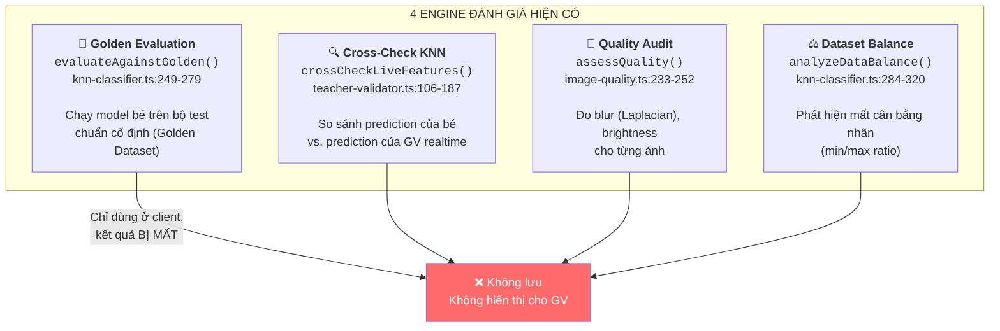
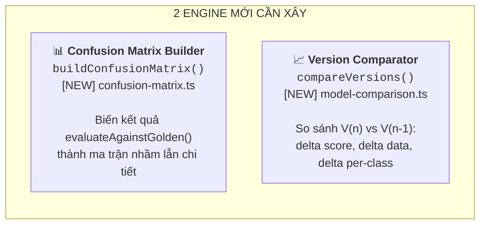
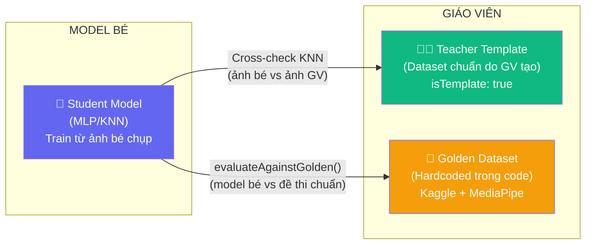
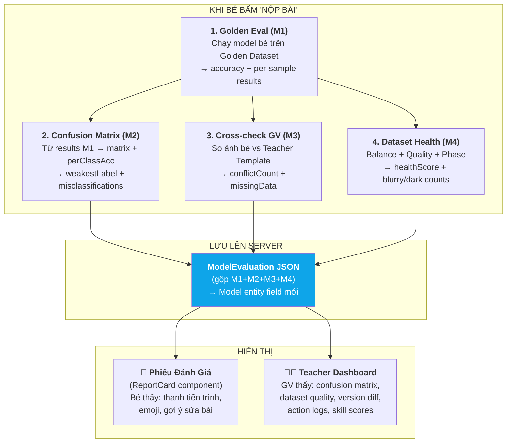
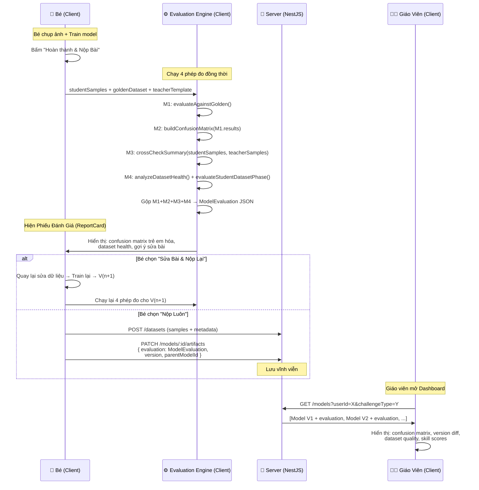

# Evaluation Plan: Đánh Giá Model Bé & Model Giáo Viên

## 1. Bản Đồ Toàn Bộ Công Cụ Đánh Giá

### Hiện tại hệ thống có gì?

Sau khi phân tích sâu toàn bộ codebase, mình thấy Learn-Hub **đã có sẵn 4 "engine" đánh giá riêng biệt**, nhưng chúng đang hoạt động **rời rạc** — không kết nối, không lưu trữ, không hiển thị cho giáo viên:



### Thêm 2 engine mới cần xây:



---

## 2. Model Bé vs. Model Giáo Viên: Chính Xác Là Gì?

> [!IMPORTANT]
> Trước khi nói về đánh giá, cần định nghĩa rõ 2 loại "model" trong hệ thống:

### Model của Bé (Student Model)

| Thuộc tính | Giá trị |
|---|---|
| **Thuật toán** | Neural Network (MLP) via [`TfTrainer`](file:///d:/HOCTAP/Learn-Hub/client/src/lib/tf-trainer.ts) — hoặc KNN nếu fallback |
| **Dữ liệu train** | Bé tự chụp bằng camera (10-50 ảnh landmark) |
| **Lưu ở đâu** | Client train → Cloudinary (weights) + Server (metadata) |
| **Entity** | [`Model`](file:///d:/HOCTAP/Learn-Hub/server/src/modules/models/entities/model.entity.ts) + [`Dataset`](file:///d:/HOCTAP/Learn-Hub/server/src/modules/datasets/entities/dataset.entity.ts) |
| **Mỗi lần train** | Tạo 1 Model record mới + 1 Dataset record mới |

### Model/Template của Giáo Viên (Teacher Model)

Giáo viên thực ra có **2 vai trò** trong hệ thống:

**Vai trò 1 — "Bộ Dữ Liệu Mẫu" (Teacher Template):**
- GV tạo bộ dataset chuẩn tại [`/teacher/training`](file:///d:/HOCTAP/Learn-Hub/client/src/app/(private)/teacher/training/page.tsx) → lưu với `isTemplate: true`
- Dataset này được publish → bé download qua `api.getTemplates(challengeType)`
- **Dùng để:** Cross-check ảnh bé bằng KNN (`crossCheckLiveFeatures()`) — "Cô thấy đây là nhãn X, bé lại gắn nhãn Y"
- Code: [`AIFeedbackModal.tsx:47-96`](file:///d:/HOCTAP/Learn-Hub/client/src/components/journey/AIFeedbackModal.tsx#L47-L96)

**Vai trò 2 — "Bộ Test Chuẩn" (Golden Dataset):**
- Đây là bộ dữ liệu **đóng gói sẵn trong code** (hardcoded), KHÔNG phải do GV tạo
- Nguồn: Kaggle datasets (Hand Gesture Landmarks, FER-2013) đã được chuẩn hóa
- Files: [`golden-dataset.ts`](file:///d:/HOCTAP/Learn-Hub/client/src/lib/golden-dataset.ts) (10 mẫu tay), [`golden-gestures-dataset.ts`](file:///d:/HOCTAP/Learn-Hub/client/src/lib/golden-gestures-dataset.ts) (~360 mẫu cử chỉ), [`golden-face-dataset.ts`](file:///d:/HOCTAP/Learn-Hub/client/src/lib/golden-face-dataset.ts) (~15 mẫu mặt)
- **Dùng để:** Test model bé bằng `evaluateAgainstGolden()` — giống đề thi chuẩn



---

## 3. Ma Trận Đánh Giá: Ai Đánh Giá Ai, Bằng Gì?

### 3.1. Đánh Giá Model Bé (4 Phép Đo)

| # | Phép đánh giá | Đo cái gì? | Bằng công cụ nào? | Input | Output | Hiện có? |
|---|---|---|---|---|---|---|
| **M1** | **Accuracy trên Golden Dataset** | Model bé dự đoán đúng bao nhiêu mẫu trong bộ test chuẩn | [`evaluateAgainstGolden()`](file:///d:/HOCTAP/Learn-Hub/client/src/lib/knn-classifier.ts#L249-L279) | `studentSamples` + `GOLDEN_*_DATASET` | `{ accuracy: 75, results: [...] }` | ✅ Có |
| **M2** | **Confusion Matrix** | Model bé nhầm nhãn nào với nhãn nào, bao nhiêu lần | `buildConfusionMatrix()` (MỚI) | Output M1 `.results` | `{ matrix: number[][], perClassAccuracy: {...}, weakestLabel }` | ❌ Cần xây |
| **M3** | **Cross-check với GV** | Ảnh bé gắn nhãn X, nhưng GV model đoán nhãn Y → ảnh bé có thể sai | [`crossCheckLiveFeatures()`](file:///d:/HOCTAP/Learn-Hub/client/src/lib/teacher-validator.ts#L106-L187) + [`validateStudentSamplesWithTeacherModel()`](file:///d:/HOCTAP/Learn-Hub/client/src/lib/teacher-validator.ts#L193-L245) | `studentSamples` + `teacherSamples` | `{ isConflict, isMissingData, teacherLabel, studentLabel }` mỗi ảnh | ✅ Có |
| **M4** | **Dataset Health** | Bộ dữ liệu bé có sạch không (mờ, tối, mất cân bằng) | [`analyzeDatasetHealth()`](file:///d:/HOCTAP/Learn-Hub/client/src/lib/ml-classifier.ts#L61-L84) + [`evaluateStudentDatasetPhase()`](file:///d:/HOCTAP/Learn-Hub/client/src/lib/teacher-validator.ts#L34-L100) | `studentSamples` | `{ healthScore, isImbalanced, phase, blurryCount, darkCount }` | ✅ Có |

### 3.2. Đánh Giá "Model" Giáo Viên

Model GV **không được đánh giá theo cách thông thường** — vì nó đóng vai **thước đo chuẩn**, không phải đối tượng bị đo. Cụ thể:

| Vai trò GV | Cách "đánh giá" | Chi tiết |
|---|---|---|
| **Golden Dataset** | Không đánh giá — đây là **đề thi chuẩn** | Giống SAT/IELTS: đề thi không bị chấm điểm, thí sinh mới bị chấm |
| **Teacher Template** | Đánh giá **gián tiếp** qua `crossCheckLiveFeatures()` | Nếu GV template kém (ảnh GV mờ, ít mẫu), cross-check sẽ cho kết quả sai → ảnh hưởng ngược bé |

> [!NOTE]
> **Teacher Template Quality** — Một vấn đề tiềm ẩn:
> Nếu GV tạo template với dữ liệu kém (ví dụ: chỉ 3 ảnh mỗi nhãn, ảnh mờ), thì cross-check sẽ **sai lệch** — hệ thống sẽ báo "bé sai" trong khi thực ra GV sai. Giải pháp: **Áp dụng cùng bộ đánh giá M4 (Dataset Health) cho template GV** trước khi cho publish.

### 3.3. Bảng Tổng Hợp: Đánh Giá Gì, Khi Nào, Cho Ai Xem?



---

## 4. Chi Tiết Từng Phép Đánh Giá

### M1: Golden Evaluation (Chấm Model Bé Trên Đề Thi Chuẩn)

**Đã có:** [`evaluateAgainstGolden()`](file:///d:/HOCTAP/Learn-Hub/client/src/lib/knn-classifier.ts#L249-L279)

**Cách hoạt động:**
1. Lấy tất cả `studentSamples` (ảnh landmark bé đã chụp)
2. Với mỗi mẫu trong Golden Dataset (`GOLDEN_TEST_DATASET`):
   - Chạy KNN: tìm K mẫu gần nhất trong `studentSamples`
   - So sánh nhãn KNN đoán vs. nhãn đúng (`expectedLabel`)
3. Tính `accuracy = correctCount / totalCount * 100`

**Mapping Challenge → Golden Dataset:**

| Challenge Type | Golden Dataset File | Số mẫu test | Labels |
|---|---|---|---|
| `teach` (Ngón tay) | [`golden-dataset.ts`](file:///d:/HOCTAP/Learn-Hub/client/src/lib/golden-dataset.ts) | 10 (5+5) | "1 Ngón Tay ☝️", "2 Ngón Tay ✌️" |
| `teach-gestures` (Cử chỉ) | [`golden-gestures-dataset.ts`](file:///d:/HOCTAP/Learn-Hub/client/src/lib/golden-gestures-dataset.ts) | ~360 (60/class × 6 classes) | class_1→class_6 (Thumb, Fist, Peace, Open, Rock, Point) |
| `teach-face` (Cảm xúc) | [`golden-face-dataset.ts`](file:///d:/HOCTAP/Learn-Hub/client/src/lib/golden-face-dataset.ts) | ~15 (5/class × 3 classes) | class_1→class_3 (Happy, Sad, Surprised) |
| `teach-two-hands` (2 tay) | Dùng chung `golden-dataset.ts` | 10 | Giống `teach`, mỗi tay classify riêng |

**Output (đã có sẵn):**
```typescript
{
  accuracy: 75,           // Tổng accuracy
  correctCount: 7,
  totalCount: 10,
  results: [              // Chi tiết từng mẫu test
    { expectedLabel: "1 Ngón Tay ☝️", predictedLabel: "1 Ngón Tay ☝️", isCorrect: true, confidence: 92, avgDistance: 0.12 },
    { expectedLabel: "2 Ngón Tay ✌️", predictedLabel: "1 Ngón Tay ☝️", isCorrect: false, confidence: 67, avgDistance: 0.45 },
    // ...
  ]
}
```

### M2: Confusion Matrix Builder (MỚI — Cần Xây)

**Input:** `results` từ M1
**Output:** Ma trận nhầm lẫn + phân tích per-class

```typescript
// [NEW] client/src/lib/confusion-matrix.ts

interface ConfusionMatrixResult {
  labels: string[];                          // ['1 Ngón Tay ☝️', '2 Ngón Tay ✌️']
  matrix: number[][];                        // [[9, 1], [3, 7]] (rows=actual, cols=predicted)
  perClassAccuracy: Record<string, number>;  // { '1 Ngón Tay ☝️': 90, '2 Ngón Tay ✌️': 70 }
  perClassPrecision: Record<string, number>; // { '1 Ngón Tay ☝️': 75, '2 Ngón Tay ✌️': 87 }
  perClassRecall: Record<string, number>;    // { '1 Ngón Tay ☝️': 90, '2 Ngón Tay ✌️': 70 }
  weakestLabel: string;                      // '2 Ngón Tay ✌️'
  strongestLabel: string;                    // '1 Ngón Tay ☝️'
  misclassifications: {                      // Top nhầm lẫn
    trueLabel: string;
    predictedLabel: string;
    count: number;
    percentage: number;                      // % so với tổng mẫu của trueLabel
    exampleIndices: number[];                // Chỉ mục mẫu bị nhầm (để hiện thumbnail)
  }[];
}

function buildConfusionMatrix(
  results: { expectedLabel: string; predictedLabel: string; isCorrect: boolean }[]
): ConfusionMatrixResult {
  // 1. Thu thập tất cả labels
  const labelSet = new Set<string>();
  results.forEach(r => { labelSet.add(r.expectedLabel); labelSet.add(r.predictedLabel); });
  const labels = Array.from(labelSet).sort();
  const n = labels.length;
  const labelIndex = new Map(labels.map((l, i) => [l, i]));

  // 2. Xây ma trận n×n
  const matrix = Array.from({ length: n }, () => Array(n).fill(0));
  results.forEach(r => {
    const actual = labelIndex.get(r.expectedLabel)!;
    const predicted = labelIndex.get(r.predictedLabel)!;
    matrix[actual][predicted]++;
  });

  // 3. Per-class metrics
  const perClassAccuracy: Record<string, number> = {};
  const perClassPrecision: Record<string, number> = {};
  const perClassRecall: Record<string, number> = {};
  
  labels.forEach((label, i) => {
    const rowSum = matrix[i].reduce((a, b) => a + b, 0);  // Tổng mẫu thật của class i
    const colSum = matrix.map(row => row[i]).reduce((a, b) => a + b, 0); // Tổng mẫu predicted là class i
    const tp = matrix[i][i]; // True Positive
    
    perClassRecall[label] = rowSum > 0 ? Math.round((tp / rowSum) * 100) : 0;
    perClassPrecision[label] = colSum > 0 ? Math.round((tp / colSum) * 100) : 0;
    perClassAccuracy[label] = perClassRecall[label]; // Cho đơn giản, dùng recall = "đoán đúng bao nhiêu"
  });

  // 4. Tìm nhãn yếu/mạnh nhất
  const weakestLabel = labels.reduce((a, b) => perClassAccuracy[a] < perClassAccuracy[b] ? a : b);
  const strongestLabel = labels.reduce((a, b) => perClassAccuracy[a] > perClassAccuracy[b] ? a : b);

  // 5. Misclassifications (off-diagonal)
  const misclassifications: ConfusionMatrixResult['misclassifications'] = [];
  labels.forEach((trueLabel, i) => {
    const rowSum = matrix[i].reduce((a, b) => a + b, 0);
    labels.forEach((predLabel, j) => {
      if (i !== j && matrix[i][j] > 0) {
        misclassifications.push({
          trueLabel, predictedLabel: predLabel,
          count: matrix[i][j],
          percentage: rowSum > 0 ? Math.round((matrix[i][j] / rowSum) * 100) : 0,
          exampleIndices: results
            .map((r, idx) => r.expectedLabel === trueLabel && r.predictedLabel === predLabel ? idx : -1)
            .filter(idx => idx >= 0),
        });
      }
    });
  });
  misclassifications.sort((a, b) => b.count - a.count);

  return { labels, matrix, perClassAccuracy, perClassPrecision, perClassRecall, weakestLabel, strongestLabel, misclassifications };
}
```

### M3: Cross-Check với Giáo Viên

**Đã có:** [`crossCheckLiveFeatures()`](file:///d:/HOCTAP/Learn-Hub/client/src/lib/teacher-validator.ts#L106-L187), [`validateStudentSamplesWithTeacherModel()`](file:///d:/HOCTAP/Learn-Hub/client/src/lib/teacher-validator.ts#L193-L245)

**Cách hoạt động:**
1. Với mỗi ảnh bé đã chụp → chạy qua model GV (KNN hoặc MLP)
2. Nếu GV model đoán nhãn A, nhưng bé gắn nhãn B → `isConflict = true`
3. Nếu GV model không nhận ra (confidence < 40%) → ảnh bé có thể là OOD

**Output cho evaluation (gom lại):**
```typescript
interface CrossCheckSummary {
  totalSamples: number;          // Tổng ảnh bé
  conflictCount: number;         // Bao nhiêu ảnh bé gắn sai nhãn (theo GV)
  missingDataCount: number;      // Bao nhiêu ảnh GV không nhận ra
  agreementRate: number;         // % ảnh bé và GV đồng ý (0-100)
  conflictDetails: {             // Chi tiết từng conflict
    sampleId: string;
    studentLabel: string;
    teacherLabel: string;
    teacherConfidence: number;
  }[];
  hasTeacherTemplate: boolean;   // false nếu GV chưa publish template
}
```

### M4: Dataset Health

**Đã có:** [`analyzeDatasetHealth()`](file:///d:/HOCTAP/Learn-Hub/client/src/lib/ml-classifier.ts#L61-L84), [`evaluateStudentDatasetPhase()`](file:///d:/HOCTAP/Learn-Hub/client/src/lib/teacher-validator.ts#L34-L100), [`assessQuality()`](file:///d:/HOCTAP/Learn-Hub/client/src/lib/image-quality.ts#L233-L252)

**Output cho evaluation (gom lại):**
```typescript
interface DatasetHealthSummary {
  sampleCount: number;
  classSummary: Record<string, number>;     // { '1 Ngón Tay': 12, '2 Ngón Tay': 8 }
  balanceRatio: number;                     // min/max = 8/12 = 0.67
  isImbalanced: boolean;
  phase: 'PHASE_A' | 'PHASE_B';            // PHASE_B = dataset hoàn hảo
  qualityScore: number;                     // 0-100 (từ analyzeDatasetHealth)
  blurrySampleCount: number;
  darkSampleCount: number;
  totalBadSamples: number;
  badSamplePercentage: number;              // % ảnh kém chất lượng
}
```

---

## 5. Schema Lưu Trữ: ModelEvaluation JSON

Mỗi lần bé nộp bài, toàn bộ 4 phép đo được gộp thành **1 JSON object** lưu vào Model entity:

```typescript
// Thêm vào Model entity (field mới)
@Column({ type: 'json', nullable: true })
evaluation?: ModelEvaluation;
```

```typescript
interface ModelEvaluation {
  // ── M1: Golden Accuracy ──
  goldenAccuracy: number;                    // 75
  goldenCorrectCount: number;                // 7
  goldenTotalCount: number;                  // 10

  // ── M2: Confusion Matrix ──
  confusionMatrix: {
    labels: string[];
    matrix: number[][];
    perClassAccuracy: Record<string, number>;
    weakestLabel: string;
    strongestLabel: string;
    misclassifications: {
      trueLabel: string;
      predictedLabel: string;
      count: number;
      percentage: number;
    }[];
  };

  // ── M3: Cross-check với GV ──
  crossCheck: {
    hasTeacherTemplate: boolean;
    totalSamples: number;
    conflictCount: number;
    agreementRate: number;
  };

  // ── M4: Dataset Health ──
  datasetHealth: {
    sampleCount: number;
    classSummary: Record<string, number>;
    balanceRatio: number;
    isImbalanced: boolean;
    phase: 'PHASE_A' | 'PHASE_B';
    qualityScore: number;
    blurrySampleCount: number;
    darkSampleCount: number;
  };

  // ── Metadata ──
  evaluatedAt: string;                       // ISO timestamp
  evaluationVersion: string;                 // '1.0' — để future migration
}
```

**Tại sao gộp vào 1 JSON field thay vì tách bảng riêng?**
- Mỗi Model đã có quan hệ 1:1 với 1 lần nộp → evaluation cũng 1:1.
- Giáo viên query `Model` → đã có sẵn evaluation mà không cần JOIN thêm bảng.
- JSON field linh hoạt: thêm metric mới không cần migration database.

---

## 6. Luồng Dữ Liệu End-to-End



---

## 7. Trường Hợp Đặc Biệt

### 7.1. Không Có Golden Dataset

| Challenge | Có Golden Dataset? | Giải pháp fallback |
|---|---|---|
| `teach` (Ngón tay 1 tay) | ✅ 10 mẫu | Dùng bình thường |
| `teach-two-hands` (2 tay) | ✅ Dùng chung `golden-dataset.ts` | Mỗi tay classify riêng |
| `teach-face` (Cảm xúc) | ✅ ~15 mẫu | Dùng bình thường |
| `teach-gestures` (Cử chỉ) | ✅ ~360 mẫu | Dùng bình thường |
| **Custom challenge** (tương lai) | ❌ Chưa có | **Fallback:** dùng M3 (cross-check GV) + M4 (dataset health) thay thế. `goldenAccuracy = null`, `confusionMatrix = null` |

### 7.2. Không Có Teacher Template

Nếu GV chưa publish template cho challenge đó:
- M3 (Cross-check) → `crossCheck.hasTeacherTemplate = false`, `agreementRate = null`
- M1, M2, M4 vẫn hoạt động bình thường (không phụ thuộc vào GV)
- Hiện cảnh báo cho GV: "⚠️ Chưa có Teacher Template cho challenge này. Cross-check bị tắt."

### 7.3. Bé Nộp Lần Đầu (V1) vs. Nộp Lại (V2+)

| Metric | V1 (lần đầu) | V2+ (nộp lại) |
|---|---|---|
| `version` | 1 | n+1 |
| `parentModelId` | `null` | ID của model V(n) |
| Version comparison | Không hiện | **Hiện delta:** V(n) → V(n+1) |
| `improvementScore` | 0 (không có delta) | `(lastScore - firstScore) * 2` |
| Debugging Score | 0 (không có action logs) | Từ action logs giữa V(n) và V(n+1) |

---

## 8. Giáo Viên Thấy Gì: Mapping Dữ Liệu → UI

### Tầng 1: Class Overview (Bảng Tổng Quan)

| Dữ liệu | Nguồn | Cột trên bảng |
|---|---|---|
| Accuracy mới nhất | `model.evaluation.goldenAccuracy` | "Điểm AI" |
| Số lần train | `model.version` | "Lần train" |
| Nhãn yếu nhất | `model.evaluation.confusionMatrix.weakestLabel` | "Nhãn yếu" |
| Dataset health | `model.evaluation.datasetHealth.phase` | Icon: ✅ PHASE_B / ⚠️ PHASE_A |
| Overall skill | `assessment.overallScore` | ⭐ rating |

### Tầng 2: Student Detail (Xem 1 Bé)

| Phần UI | Dữ liệu | Nguồn |
|---|---|---|
| **Biểu đồ tiến trình** | `[V1.goldenAccuracy, V2.goldenAccuracy, ...]` | Query tất cả models by userId + challengeType, sort by version |
| **Kỹ năng radar** | `assessment.dataCurationScore`, `debuggingScore`, `improvementScore` | Assessment entity |
| **Danh sách versions** | `model.version`, `model.evaluation.goldenAccuracy`, `model.evaluation.datasetHealth.sampleCount` | Model entities |

### Tầng 3: Model Version Detail (Xem 1 Lần Nộp)

| Phần UI | Dữ liệu | Nguồn |
|---|---|---|
| **Confusion Matrix** | `model.evaluation.confusionMatrix.matrix`, `.labels`, `.perClassAccuracy` | Model.evaluation JSON |
| **Nhầm lẫn cụ thể** | `model.evaluation.confusionMatrix.misclassifications` | Model.evaluation JSON |
| **Chất lượng dữ liệu** | `model.evaluation.datasetHealth.*` | Model.evaluation JSON |
| **Cross-check GV** | `model.evaluation.crossCheck.conflictCount`, `.agreementRate` | Model.evaluation JSON |
| **So sánh version** | So `model.evaluation` vs `parentModel.evaluation` | JOIN Model ↔ parentModel |
| **Action logs** | `actionLogs[]` filtered by modelId | ActionLog entity |

---

## 9. Skill Assessment: Công Thức Chi Tiết

Khi bé bấm "Nộp Luôn" (kết thúc vòng lặp), hệ thống tính điểm kỹ năng tổng kết:

### 9.1. Data Curation Score (30%)

> "Bé có biết chuẩn bị dữ liệu tốt không?"

```
dataCurationScore = (balanceScore × 40 + qualityScore × 40 + volumeScore × 20) / 100

Trong đó:
- balanceScore = model_cuối.evaluation.datasetHealth.balanceRatio × 100
  (1.0 = hoàn hảo, 0.5 = mất cân bằng 2:1)
  
- qualityScore = model_cuối.evaluation.datasetHealth.qualityScore
  (0-100, từ analyzeDatasetHealth)
  
- volumeScore = min(100, sampleCount / expectedMinimum × 100)
  (expectedMinimum = 10 × số_classes)
```

### 9.2. Debugging Score (35%)

> "Bé có sửa đúng chỗ yếu không?"

```
debuggingScore = (targetedActions / totalActions) × 100

Trong đó:
- targetedActions = số lần bé thêm/xóa ảnh ở đúng nhãn yếu nhất
  (wasWeakestLabel = true trong ActionLog)
  
- totalActions = tổng số lần bé thêm/xóa ảnh giữa các versions
  (action = 'ADD_SAMPLES' | 'DELETE_SAMPLES' trong ActionLog)

Trường hợp đặc biệt:
- Nếu bé nộp V1 luôn (không train lại) → debuggingScore = 0
  (Không có action log → không thể đánh giá kỹ năng sửa lỗi)
- Nếu totalActions = 0 → debuggingScore = 0
```

### 9.3. Improvement Score (35%)

> "AI có thực sự tốt hơn qua các lần train?"

```
improvementScore = min(100, delta × 2)

Trong đó:
- delta = model_cuối.goldenAccuracy - model_đầu.goldenAccuracy
  
Ví dụ:
- V1=40%, V3=65% → delta=25 → improvementScore = 50
- V1=40%, V3=90% → delta=50 → improvementScore = 100 (cap)
- V1=85%, V1=85% → delta=0 → improvementScore = 0
  (Bé giỏi từ đầu, nhưng không có gì để cải thiện)

Trường hợp đặc biệt:
- Nếu chỉ có V1 → improvementScore = 0
- Nếu delta < 0 (tệ hơn) → improvementScore = 0
```

### 9.4. Overall Score

```
overallScore = dataCurationScore × 0.30 + debuggingScore × 0.35 + improvementScore × 0.35
```

> [!NOTE]
> **Edge case quan trọng:** Bé train V1 đạt 95% ngay lần đầu:
> - `dataCurationScore` = cao (dữ liệu tốt)
> - `debuggingScore` = 0 (không cần debug)
> - `improvementScore` = 0 (không có delta)
> - `overallScore` ≈ 30% (chỉ từ dataCuration)
> 
> **Giải pháp:** Nếu `model_đầu.goldenAccuracy >= 85` VÀ `version == 1`, áp dụng **bonus "First-Try Mastery"**:
> ```
> if (firstModelAccuracy >= 85 && totalVersions === 1) {
>   overallScore = Math.max(overallScore, firstModelAccuracy);
>   narrative.summary = "Bé đã chuẩn bị dữ liệu xuất sắc ngay từ đầu! AI đạt ${accuracy}% mà không cần sửa bài.";
> }
> ```

---

## 10. Đánh Giá Teacher Template (Đảm Bảo Chất Lượng GV)

Trước khi GV publish template, hệ thống nên tự động chạy đánh giá:

```typescript
function validateTeacherTemplate(teacherSamples: StoredSample[], classes: { id: string; label: string }[]) {
  // 1. Dataset Health (dùng lại M4)
  const health = analyzeDatasetHealth(teacherSamples);
  const phase = evaluateStudentDatasetPhase(teacherSamples, classes, 5, 15);
  // GV cần ít nhất 15 mẫu/class (cao hơn bé)
  
  // 2. Self-consistency: Cross-validate bằng Leave-One-Out
  let correctCount = 0;
  teacherSamples.forEach((sample, i) => {
    const others = teacherSamples.filter((_, j) => j !== i);
    const pred = classifyKNN(sample.features, others, 3);
    if (pred.label === sample.label) correctCount++;
  });
  const selfConsistency = Math.round((correctCount / teacherSamples.length) * 100);
  // Nếu < 80% → template GV có vấn đề (ảnh gắn sai nhãn, ảnh quá giống nhau)

  // 3. Golden Evaluation (nếu có)
  const goldenResult = evaluateAgainstGolden(teacherSamples, getGoldenDataset(challengeType));
  // Nếu < 90% → template GV chưa đủ tốt làm thước đo

  return {
    healthScore: health.healthScore,
    phase: phase.phase,
    selfConsistency,
    goldenAccuracy: goldenResult.accuracy,
    isPublishable: phase.phase === 'PHASE_B' && selfConsistency >= 80 && goldenResult.accuracy >= 85,
    warnings: [] // TODO: Collect warnings based on thresholds
  };
}
```

---

## 11. Tóm Tắt: Bảng Mapping Công Cụ → Code — Trạng Thái Triển Khai

> Cập nhật: 10/08/2026 23:48

| Công cụ | File | Trạng thái | Dùng để |
|---|---|---|---|
| `evaluateAgainstGolden()` | [`knn-classifier.ts:249`](file:///d:/HOCTAP/Learn-Hub/client/src/lib/knn-classifier.ts#L249) | ✅ Có sẵn | M1: Chấm model bé |
| `buildConfusionMatrix()` | [`confusion-matrix.ts`](file:///d:/HOCTAP/Learn-Hub/client/src/lib/confusion-matrix.ts) | ✅ **ĐÃ TẠO** | M2: Ma trận nhầm lẫn |
| `crossCheckLiveFeatures()` | [`teacher-validator.ts:106`](file:///d:/HOCTAP/Learn-Hub/client/src/lib/teacher-validator.ts#L106) | ✅ Có sẵn | M3: So ảnh bé vs GV |
| `validateStudentSamplesWithTeacherModel()` | [`teacher-validator.ts:193`](file:///d:/HOCTAP/Learn-Hub/client/src/lib/teacher-validator.ts#L193) | ✅ Có sẵn | M3: Batch cross-check |
| `analyzeDatasetHealth()` | [`ml-classifier.ts:61`](file:///d:/HOCTAP/Learn-Hub/client/src/lib/ml-classifier.ts#L61) | ✅ Có sẵn | M4: Sức khỏe dataset |
| `evaluateStudentDatasetPhase()` | [`teacher-validator.ts:34`](file:///d:/HOCTAP/Learn-Hub/client/src/lib/teacher-validator.ts#L34) | ✅ Có sẵn | M4: Phase A/B |
| `assessQuality()` | [`image-quality.ts:233`](file:///d:/HOCTAP/Learn-Hub/client/src/lib/image-quality.ts#L233) | ✅ Có sẵn | M4: Blur + brightness |
| `compareVersions()` | [`model-comparison.ts`](file:///d:/HOCTAP/Learn-Hub/client/src/lib/model-comparison.ts) | ✅ **ĐÃ TẠO** | So sánh V(n) vs V(n-1) |
| `computeAssessment()` | [`skill-assessment.ts`](file:///d:/HOCTAP/Learn-Hub/client/src/lib/skill-assessment.ts) | ✅ **ĐÃ TẠO** | Tính điểm kỹ năng |
| `useModelEvaluation()` | [`useModelEvaluation.ts`](file:///d:/HOCTAP/Learn-Hub/client/src/hooks/useModelEvaluation.ts) | ✅ **ĐÃ TẠO** | Hook gộp M1+M2+M3+M4 |
| `validateTeacherTemplate()` | `teacher-validator.ts` | ✅ **ĐÃ TẠO** | Đảm bảo chất lượng GV |

### Tóm tắt tiến độ:
- **10/10 công cụ** đã được triển khai hoàn chỉnh.
- **UI Components** đã được trích xuất hoàn chỉnh, tuân thủ Reusability.
- **Feedback Loop** (Nộp Luôn tính Assessment, Sửa Bài) đã được wiring toàn bộ.
- **Strict Type Checking (Phase 7)**: Đã xóa toàn bộ `any` type (trong loop fetch hay component rendering) thay bằng interfaces chuẩn như `ModelResponse` và `AssessmentResponse`. Hệ thống đạt chuẩn Type-Safety và quy tắc strict của React 19 (không set state inside effect) với mức xác thực cao nhất từ trình biên dịch (`npx tsc --noEmit` exit 0).
