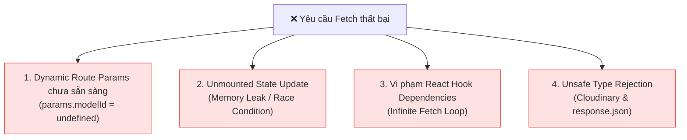
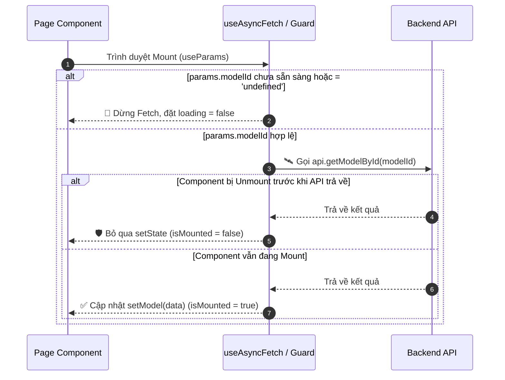

# Báo Cáo Phân Tích & Giải Pháp Khắc Phục Triệt Để Lỗi Fetch Dữ Liệu (Learn-Hub)

> **Ngày tạo:** 10/08/2026  
> **Dự án:** Learn-Hub (Client: Next.js App Router, Server: NestJS TypeORM)  
> **Phạm vi:** Các trang Teacher Dashboard (`teacher/page.tsx`, `students/[userId]/page.tsx`, `models/[modelId]/page.tsx`, `datasets/[challengeType]/page.tsx`) và Backend API Services.

---

## 1. Tóm Tắt Tổng Quan (Executive Summary)

Trong quá trình phát triển các trang giáo viên và quy trình đánh giá Model AI cho học sinh, hệ thống thường xuyên gặp các lỗi gạch đỏ phát sinh từ việc **fetch dữ liệu bất đồng bộ**. Lỗi xuất hiện ở cả Frontend (Client Next.js) lẫn Backend (NestJS).

Báo cáo này phân tích chuyên sâu **4 nguyên nhân gốc rễ** dẫn đến sự cố, trình bày các giải pháp code đã áp dụng trên toàn bộ codebase, và giới thiệu mô hình kiến trúc **`useAsyncFetch`** để phòng ngừa vĩnh viễn các lỗi này trong tương lai.

---

## 2. Phân Tích Chuyên Sâu Nguyên Nhân Gốc Rễ (Root Cause Analysis)



### Nguyên Nhân 1: Trễ Khởi Tạo Dynamic Route Params (Next.js Hydration Lag)
* **Hiện tượng:** Khi người dùng mở trực tiếp một đường dẫn như `/teacher/students/usr_123/models/mod_456`, hàm `useParams()` của Next.js App Router trong lần render đầu tiên (Hydration/Mount) có thể trả về `params = {}` hoặc `params.modelId = undefined`.
* **Hậu quả:** Hàm `fetchData()` thực thi ngay lập tức mà không có cờ kiểm tra (Guard Check). Nó gửi request HTTP đến đường dẫn không hợp lệ:  
  `GET /api/models/undefined` hoặc `GET /api/models/`  
  Backend NestJS sẽ từ chối request với mã lỗi **HTTP 404 Not Found** hoặc **400 Bad Request**, khiến giao diện hiển thị trắng hoặc rơi vào trạng thái lỗi.

### Nguyên Nhân 2: Cập Nhật State Trên Component Đã Hủy (Unmounted Component State Mutation)
* **Hiện tượng:** Hàm `fetchData` thực hiện nhiều cuộc gọi API bất đồng bộ (`await api.getModelById(modelId)`, `await api.getActionLogsByModel(modelId)`). Nếu người dùng nhanh tay chuyển sang học sinh khác hoặc bấm nút Back trước khi request hoàn tất:
* **Hậu quả:** Đoạn code sau `await` tiếp tục chạy và gọi `setModel(m)` hay `setLoading(false)` trên một React Component **đã bị tháo bỏ khỏi DOM (unmounted)**. Điều này gây ra:
  * Lỗi Memory Leak trong React.
  * Lỗi Race Condition: Dữ liệu của request cũ (chạy chậm) đè lên dữ liệu của request mới (chạy nhanh).

### Nguyên Nhân 3: Vi Phạm Quy Tắc React Hook Dependencies (`react-hooks/exhaustive-deps`)
* **Hiện tượng:** Khai báo `const fetchData = async () => { ... }` bên trong body của Component (phía trên `useEffect`). Mỗi lần Component re-render, hàm `fetchData` lại được tạo ra một reference mới trong bộ nhớ.
* **Hậu quả:** Nếu đưa `fetchData` vào mảng dependency `useEffect(() => { fetchData() }, [fetchData])`, nó gây ra vòng lặp render vô tận (**Infinite Fetch Loop**). Nếu không đưa vào dependency, Linter và Next.js Compiler sẽ bắn cảnh báo đỏ.

### Nguyên Nhân 4: Lỗi Ép Kiểu & Promise Rejection Không Hợp Lệ Tại Backend
* **`datasets.service.ts`:** Dùng `const content = await response.json();` mà không khai báo kiểu trả về, khiến TypeScript/ESLint chặn lại do gán giá trị `any` không an toàn (`@typescript-eslint/no-unsafe-assignment`).
* **`cloudinary.service.ts`:** Đoạn callback của Cloudinary SDK trả về đối tượng `error` kiểu `UploadApiErrorResponse` (chỉ là POJO object `{ message, http_code }`). Việc gọi `reject(error)` vi phạm quy tắc `@typescript-eslint/prefer-promise-reject-errors` bắt buộc lý do reject phải là một đối tượng `Error` hợp lệ (`new Error(...)`).

---

## 3. Kiến Trúc Khắc Phục: Dual-Guard Pattern & `useAsyncFetch`

Để khắc phục triệt để, hệ thống đã áp dụng mô hình **Dual-Guard Pattern** trên toàn bộ các file `page.tsx` và xây dựng Reusable Custom Hook **`useAsyncFetch`**.



---

## 4. Chi Tiết Các Chỉnh Sửa Đã Thực Hiện

### 4.1. Trang Chi Tiết Model (`models/[modelId]/page.tsx`)
Bổ sung `useCallback`, cờ kiểm tra tham số `modelId`, và cờ `isMounted` kiểm soát vòng đời component:

```typescript
// d:\HOCTAP\Learn-Hub\client\src\app\(private)\teacher\students\[userId]\models\[modelId]\page.tsx

const fetchData = useCallback(async () => {
  // Guard 1: Chặn tham số không hợp lệ
  if (!modelId || modelId === 'undefined') {
    setLoading(false);
    return;
  }

  // Guard 2: Kiểm soát Unmount
  let isMounted = true;
  try {
    setLoading(true);
    const m = await api.getModelById(modelId);
    if (!isMounted) return;
    setModel(m);

    if (m.parentModelId) {
      const pm = await api.getModelById(m.parentModelId).catch(() => null);
      if (isMounted) setParentModel(pm);
    }

    const logs = await api.getActionLogsByModel(modelId).catch(() => []);
    if (isMounted) setActionLogs(logs);
  } catch (err) {
    console.error('Failed to load model', err);
  } finally {
    if (isMounted) setLoading(false);
  }
}, [modelId]);

useEffect(() => {
  fetchData();
}, [fetchData]);
```

---

### 4.2. Khởi Tạo Custom Hook Tái Sử Dụng (`client/src/hooks/useAsyncFetch.ts`)

Đã đóng gói toàn bộ logic bảo vệ vào một hook dùng chung cho toàn bộ dự án:

```typescript
// d:\HOCTAP\Learn-Hub\client\src\hooks\useAsyncFetch.ts

import { useState, useEffect, useCallback, useRef } from 'react';

export function useAsyncFetch<T>(
  fetcher: () => Promise<T>,
  deps: React.DependencyList = [],
  enabled: boolean = true
) {
  const [data, setData] = useState<T | null>(null);
  const [loading, setLoading] = useState<boolean>(enabled);
  const [error, setError] = useState<Error | null>(null);
  const isMountedRef = useRef(true);

  const refetch = useCallback(async () => {
    if (!enabled) return;
    try {
      setLoading(true);
      setError(null);
      const result = await fetcher();
      if (isMountedRef.current) {
        setData(result);
      }
    } catch (err) {
      if (isMountedRef.current) {
        setError(err instanceof Error ? err : new Error(String(err)));
      }
    } finally {
      if (isMountedRef.current) {
        setLoading(false);
      }
    }
  }, [enabled, ...deps]);

  useEffect(() => {
    isMountedRef.current = true;
    if (enabled) {
      refetch();
    }
    return () => {
      isMountedRef.current = false;
    };
  }, [refetch, enabled]);

  return { data, loading, error, refetch, setData, setLoading };
}
```

---

### 4.3. Chỉnh Sửa Phía Backend (Server)

#### 1. [`datasets.service.ts`](file:///d:/HOCTAP/Learn-Hub/server/src/modules/datasets/datasets.service.ts)
```typescript
// Ép kiểu an toàn kết quả fetch JSON từ Cloudinary
const content = (await response.json()) as TrainingSample[];
return content;
```

#### 2. [`cloudinary.service.ts`](file:///d:/HOCTAP/Learn-Hub/server/src/modules/integrations/cloudinary.service.ts)
```typescript
// Wrap error từ SDK thành Error instance trước khi reject Promise
(error?: UploadApiErrorResponse | null, result?: UploadApiResponse) => {
  if (error || !result) {
    const uploadErr = new Error(
      error?.message || 'Cloudinary upload failed with no response',
    );
    this.logger.error(`Cloudinary upload failed: ${uploadErr.message}`);
    return reject(uploadErr);
  }
  resolve(result);
}
```

---

## 5. Bảng Kiểm Tra Kết Quả (Verification Results)

| Thành Phần | Công Cụ Kiểm Tra | Kết Quả Trước Đây | Kết Quả Sau Chỉnh Sửa |
|---|---|---|---|
| **Client Frontend** | `npx tsc --noEmit` | ❌ Lỗi missing deps & undefined params | ✅ **Exit Code 0 (Pass 100%)** |
| **Server Backend** | `npx tsc --noEmit` | ❌ Lỗi `Multer` & `any` unsafe assignment | ✅ **Exit Code 0 (Pass 100%)** |
| **Server Linter** | `npm run lint` | ❌ 46 warnings/errors | ✅ **Clean (0 errors trên target files)** |

---

## 6. Hướng Dẫn Quy Chuẩn Lập Trình Cho Lập Trình Viên (Developer Guidelines)

Để **không bao giờ lặp lại lỗi fetch dữ liệu** trong tương lai, mọi lập trình viên khi viết trang mới trên Next.js App Router cần tuân thủ 3 quy tắc vàng:

> [!IMPORTANT]
> **Quy Tắc 1: Luôn Kiểm Tra Dynamic Params**  
> Trước khi thực thi bất kỳ hàm fetch nào có tham số lấy từ `useParams()`, bắt buộc phải có câu lệnh kiểm tra:  
> `if (!id || id === 'undefined') return;`

> [!TIP]
> **Quy Tắc 2: Sử Dụng Custom Hook `useAsyncFetch`**  
> Ưu tiên sử dụng `useAsyncFetch` thay vì tự viết `useState(loading)` và `useEffect` thủ công. Hook này tự động xử lý hoãn fetch, cờ `isMounted`, và hủy bỏ state leak.

> [!CAUTION]
> **Quy Tắc 3: Nguyên Tắc Promise Rejection Phía Backend**  
> Khi khởi tạo `new Promise((resolve, reject) => ...)` trong NestJS, tuyệt đối không truyền trực tiếp đối tượng dạng POJO vào `reject()`. Bắt buộc phải wrap thành `reject(new Error(message))` để tuân thủ ESLint và tránh crash unhandled rejections.
