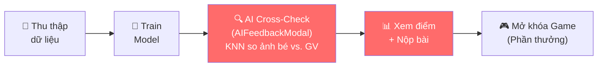
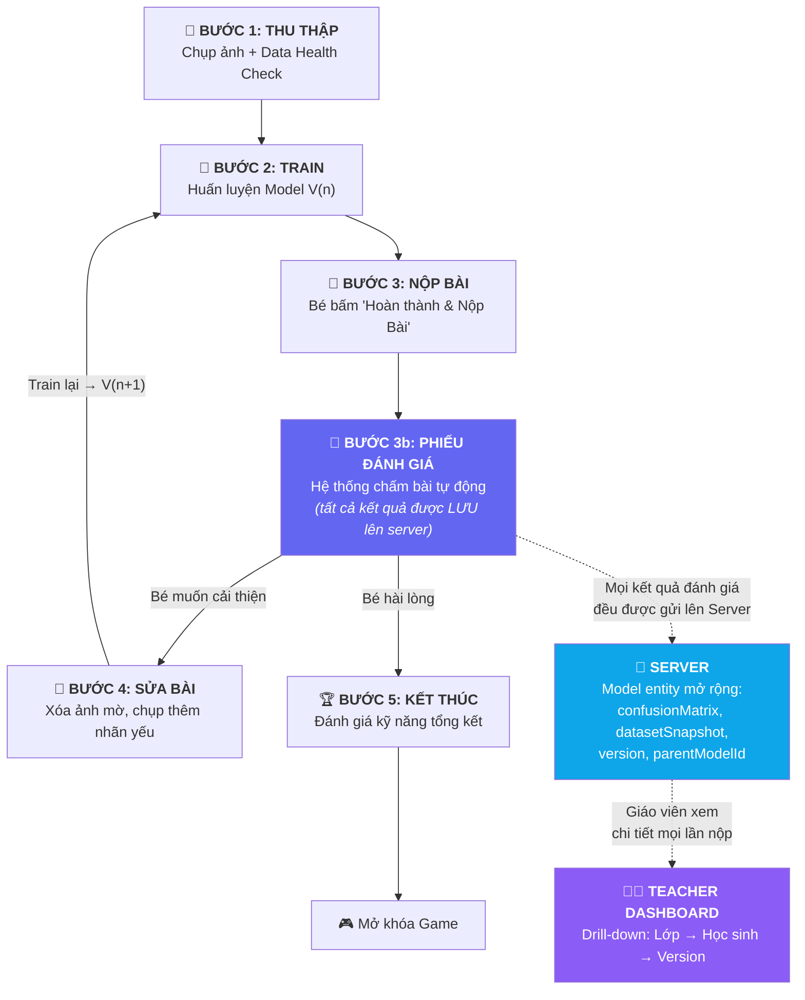

# Kế Hoạch Tổng Thể: Hoàn Thiện Quy Trình Chuẩn Giáo Dục cho Learn-Hub

## Phân Tích Hiện Trạng

### Những Gì Đã Có (Rất Tốt)

| Khả năng | File / Module | Mô tả |
|----------|---------------|-------|
| **AI Engine trên trình duyệt** | [`knn-classifier.ts`](file:///d:/HOCTAP/Learn-Hub/client/src/lib/knn-classifier.ts), [`tf-trainer.ts`](file:///d:/HOCTAP/Learn-Hub/client/src/lib/tf-trainer.ts) | KNN + MLP train hoàn toàn ở Client bằng TF.js |
| **Kiểm tra chất lượng dữ liệu** | [`image-quality.ts`](file:///d:/HOCTAP/Learn-Hub/client/src/lib/image-quality.ts), [`teacher-validator.ts`](file:///d:/HOCTAP/Learn-Hub/client/src/lib/teacher-validator.ts) | Blur, brightness, balance, cross-check KNN |
| **Golden Dataset chuẩn** | [`golden-dataset.ts`](file:///d:/HOCTAP/Learn-Hub/client/src/lib/golden-dataset.ts), [`golden-gestures-dataset.ts`](file:///d:/HOCTAP/Learn-Hub/client/src/lib/golden-gestures-dataset.ts), [`golden-face-dataset.ts`](file:///d:/HOCTAP/Learn-Hub/client/src/lib/golden-face-dataset.ts) | `evaluateAgainstGolden()` chấm model |
| **Teacher ↔ Student validation** | [`teacher-validator.ts`](file:///d:/HOCTAP/Learn-Hub/client/src/lib/teacher-validator.ts) | `evaluateStudentDatasetPhase()`, `crossCheckLiveFeatures()` |
| **Lưu trữ Server** | [`datasets.service.ts`](file:///d:/HOCTAP/Learn-Hub/server/src/modules/datasets/datasets.service.ts), [`models.service.ts`](file:///d:/HOCTAP/Learn-Hub/server/src/modules/models/models.service.ts) | Dataset JSON → Cloudinary, Model weights → Cloudinary |
| **Teacher Dashboard** | [`teacher/page.tsx`](file:///d:/HOCTAP/Learn-Hub/client/src/app/(private)/teacher/page.tsx), [`teacher/datasets/[challengeType]/page.tsx`](file:///d:/HOCTAP/Learn-Hub/client/src/app/(private)/teacher/datasets/[challengeType]/page.tsx) | Xem bảng `bestScore` + danh sách bài nộp + xem ảnh raw + gửi feedback text |

### Luồng Hiện Tại



### Vấn Đề Cốt Lõi: Dữ Liệu Đánh Giá Bị "Mất" Khi Nộp Bài

> [!CAUTION]
> **Lỗ hổng nghiêm trọng nhất:** Khi bé nộp bài, toàn bộ thông tin chi tiết về chất lượng model bị **bay hơi**. Chỉ có MỘT con số `testScore` (kiểu `float`) được gửi lên server và lưu vào [`Model.testScore`](file:///d:/HOCTAP/Learn-Hub/server/src/modules/models/entities/model.entity.ts#L27).

Xác minh trực tiếp từ code:

**Client gửi gì?** ([`teach/page.tsx:84-90`](file:///d:/HOCTAP/Learn-Hub/client/src/app/(private)/challenge/teach/page.tsx#L84-L90)):
```typescript
// Client chỉ gửi 1 con số testScore
await api.updateModelArtifacts(created.model.id, {
  algorithm: 'mlp',
  testScore: submitScore,   // ← CHỈ CÓ MỘT CON SỐ NÀY
  hyperparameters: calculateAutoHyperparameters(processedSamples.length),
});
```

**Server lưu gì?** ([`model.entity.ts`](file:///d:/HOCTAP/Learn-Hub/server/src/modules/models/entities/model.entity.ts)):
```
testScore: float         ← 1 con số (ví dụ: 75)
algorithm: string        ← 'mlp'  
hyperparameters: JSON    ← { epochs, batchSize, learningRate }
trainingLogs: JSON       ← [{ epoch, loss, acc }] — training loss, KHÔNG PHẢI evaluation
teacherFeedback: string  ← text feedback thủ công
```

**Giáo viên thấy gì?** ([`teacher/page.tsx:73`](file:///d:/HOCTAP/Learn-Hub/client/src/app/(private)/teacher/page.tsx#L73)):
```typescript
const score = ds.model?.testScore || 0;  // ← Cũng chỉ 1 con số này
```

**Hệ quả — Giáo viên KHÔNG THỂ biết:**

| Câu hỏi giáo viên cần trả lời | Dữ liệu cần | Hiện có? |
|------|------|------|
| AI của bé sai ở nhãn nào? | Confusion Matrix | ❌ |
| Bộ dữ liệu có cân bằng không? | classSummary per-version | ❌ (chỉ có trên Dataset entity, không gắn với Model) |
| Ảnh có chất lượng tốt không? | qualityScore | ❌ |
| Bé đã train lại bao nhiêu lần? | Version count | ❌ |
| Model V2 có tốt hơn V1 không? | Version chain + delta | ❌ |
| Bé sửa đúng chỗ yếu chưa? | Action logs | ❌ |

---

## Giải Pháp Tổng Thể

### Nguyên tắc: "Mỗi lần nộp bài = Một bản đánh giá đầy đủ được lưu vĩnh viễn"

Mỗi khi bé bấm "Hoàn thành & Nộp Bài", hệ thống phải:
1. **Tính toán chi tiết** (confusion matrix, dataset health, per-class accuracy) — tất cả ở client (logic đã có sẵn)
2. **Gửi kết quả lên server** — mở rộng API `updateModelArtifacts()` để nhận thêm dữ liệu
3. **Lưu vĩnh viễn** — mở rộng Model entity với các trường mới
4. **Hiển thị cho giáo viên** — Teacher Dashboard drill-down từ tổng quan → chi tiết từng version

### Luồng Mới



---

## Kiến Trúc Dữ Liệu

### Model Entity Mở Rộng (Thay đổi duy nhất quan trọng nhất)

File: [`model.entity.ts`](file:///d:/HOCTAP/Learn-Hub/server/src/modules/models/entities/model.entity.ts)

Mỗi lần bé train & nộp → 1 Model record mới. Hiện tại mỗi Model đã gắn với 1 Dataset. Chúng ta **chỉ cần thêm trường** vào entity hiện có:

```diff
  @Entity('models')
  export class Model {
    // ── Đã có ──
    id, userId, datasetId, algorithm, testScore,
    modelArtifactUrl, hyperparameters, trainingLogs,
    teacherFeedback, createdAt, user, dataset

+   // ── MỚI: Version Chain ──
+   @Column({ default: 1 })
+   version!: number;
+
+   @Column({ type: 'uuid', nullable: true })
+   parentModelId?: string;
+
+   @ManyToOne(() => Model, { nullable: true, onDelete: 'SET NULL' })
+   @JoinColumn({ name: 'parentModelId' })
+   parentModel?: Model;
+
+   // ── MỚI: Confusion Matrix (chi tiết đánh giá model) ──
+   @Column({ type: 'json', nullable: true })
+   confusionMatrix?: {
+     labels: string[];                         // ['1 Ngón Tay', '2 Ngón Tay']
+     matrix: number[][];                       // [[8, 2], [1, 9]]
+     perClassAccuracy: Record<string, number>; // { '1 Ngón Tay': 80, '2 Ngón Tay': 90 }
+     weakestLabel?: string;                    // '2 Ngón Tay' — nhãn yếu nhất
+     misclassifications?: {                    // Chi tiết AI nhầm lẫn
+       trueLabel: string;
+       predictedLabel: string;
+       count: number;
+     }[];
+   };
+
+   // ── MỚI: Dataset Snapshot (chất lượng dữ liệu tại thời điểm train) ──
+   @Column({ type: 'json', nullable: true })
+   datasetSnapshot?: {
+     sampleCount: number;
+     classSummary: Record<string, number>;     // { '1 Ngón Tay': 12, '2 Ngón Tay': 8 }
+     balanceRatio: number;                     // 0.67 (min/max count)
+     qualityScore: number;                     // 0-100
+     blurrySamples: number;                    // Số ảnh bị mờ
+     darkSamples: number;                      // Số ảnh bị tối
+   };
  }
```

**Tại sao thiết kế này là tối ưu:**
- **Không cần entity mới cho evaluation** — tất cả gắn trực tiếp vào Model, vì mỗi evaluation thuộc về đúng 1 model version.
- **`parentModelId` tạo version chain** — Giáo viên query tất cả models của bé cho 1 challengeType, sort theo version, thấy ngay V1 → V2 → V3.
- **`confusionMatrix.weakestLabel`** — Giáo viên nhìn 1 cái là biết "nhãn nào AI của bé yếu nhất".
- **`datasetSnapshot`** — Giáo viên so sánh snapshot giữa V1 và V2 để thấy bé đã thay đổi gì.

### Action Log Entity (Mới)

```typescript
// [NEW] server/src/modules/action-logs/entities/action-log.entity.ts

@Entity('action_logs')
export class ActionLog {
  @PrimaryGeneratedColumn('uuid')
  id!: string;

  @Column()
  userId!: string;

  @Column()
  modelId!: string;

  @Column()
  action!: string;  // 'ADD_SAMPLES' | 'DELETE_SAMPLES' | 'RETRAIN'

  @Column({ type: 'json', nullable: true })
  details?: {
    samplesAdded?: number;
    samplesDeleted?: number;
    targetLabel?: string;
    wasWeakestLabel?: boolean;  // true nếu bé sửa đúng nhãn yếu
  };

  @CreateDateColumn()
  createdAt!: Date;
}
```

### Assessment Entity (Mới — Điểm Kỹ Năng Tổng Kết)

```typescript
// [NEW] server/src/modules/assessments/entities/assessment.entity.ts

@Entity('assessments')
export class Assessment {
  @PrimaryGeneratedColumn('uuid')
  id!: string;

  @Column()
  userId!: string;

  @Column()
  challengeType!: string;

  @Column({ type: 'json' })
  modelChain!: { modelId: string; version: number; testScore: number }[];

  @Column({ type: 'int', default: 0 })
  dataCurationScore!: number;     // Kỹ năng tinh lọc dữ liệu (0-100)

  @Column({ type: 'int', default: 0 })
  debuggingScore!: number;        // Kỹ năng sửa đúng chỗ (0-100)

  @Column({ type: 'int', default: 0 })
  improvementScore!: number;      // Mức cải thiện qua versions (0-100)

  @Column({ type: 'int', default: 0 })
  overallScore!: number;

  @Column({ type: 'json', nullable: true })
  narrative?: {
    summary: string;
    strengths: string[];
    improvements: string[];
  };

  @CreateDateColumn()
  createdAt!: Date;
}
```

---

## Luồng Trải Nghiệm Chi Tiết

### Phía Học Sinh: 5 Bước

#### Bước 1: Thu Thập Dữ Liệu + Data Health Check

**Đã có:** [`DataCollector.tsx`](file:///d:/HOCTAP/Learn-Hub/client/src/components/journey/DataCollector.tsx), [`DataBalanceWarning.tsx`](file:///d:/HOCTAP/Learn-Hub/client/src/components/journey/DataBalanceWarning.tsx), `assessQuality()`, `analyzeDataBalance()`.

**Cần thêm:** Nâng cấp `DataBalanceWarning` thành "Data Health Dashboard" mini — hiện thanh tiến trình cho balance, quality, tổng mẫu. Nguồn: `analyzeDatasetHealth()` + `evaluateStudentDatasetPhase()`.

#### Bước 2: Huấn Luyện Model V(n)

Giữ nguyên luồng hiện tại. Nút **"Hoàn thành & Nộp Bài 🚀"** dẫn tới Bước 3.

#### Bước 3: Nộp Bài → Nhận Phiếu Đánh Giá

> [!IMPORTANT]
> Đây là bước **thay đổi lớn nhất**. Khi bé bấm "Hoàn thành & Nộp Bài", thay vì mở `AIFeedbackModal` rồi submit ngay → hệ thống sẽ:

**3a. Tính toán evaluation (tất cả ở client, logic đã có sẵn):**

```typescript
async function computeEvaluation(samples, challengeType, kValue) {
  // 1. Confusion Matrix — dùng evaluateAgainstGolden() đã có
  const goldenDataset = getGoldenDataset(challengeType);
  const goldenResult = evaluateAgainstGolden(samples, goldenDataset, kValue);
  const confusionMatrix = buildConfusionMatrix(goldenResult);

  // 2. Dataset Snapshot — dùng analyzeDatasetHealth() đã có
  const health = analyzeDatasetHealth(samples);
  const balance = analyzeDataBalance(samples);
  const datasetSnapshot = {
    sampleCount: samples.length,
    classSummary: balance.counts,
    balanceRatio: balance.ratio,
    qualityScore: health.healthScore,
    blurrySamples: health.blurryCount,
    darkSamples: health.darkCount,
  };

  // 3. Cross-check với GV — dùng evaluateStudentDatasetPhase() đã có
  const crossCheck = evaluateStudentDatasetPhase(samples, teacherTemplate);
  
  return { confusionMatrix, datasetSnapshot, crossCheck, testScore: goldenResult.accuracy };
}
```

**3b. Gửi LÊN SERVER — mở rộng API `updateModelArtifacts()`:**

```typescript
await api.updateModelArtifacts(model.id, {
  testScore: evaluation.testScore,
  confusionMatrix: evaluation.confusionMatrix,      // ← MỚI
  datasetSnapshot: evaluation.datasetSnapshot,      // ← MỚI
  version: latestModel ? latestModel.version + 1 : 1,  // ← MỚI
  parentModelId: latestModel?.id || null,           // ← MỚI
});
```

**3c. Hiển thị Phiếu Đánh Giá (ReportCard component mới):**

Gồm 3 phần: Chấm Model (confusion matrix trẻ em hóa) + Chấm Dữ Liệu (quality) + So Sánh Version (nếu V≥2). Cuối phiếu có 2 nút: **"Sửa Bài & Nộp Lại"** hoặc **"Nộp Luôn"**.

#### Bước 4: Sửa Bài & Train Lại

Nếu chọn "Sửa Bài & Nộp Lại" → quay lại TeachPanel → sửa dữ liệu (highlight ảnh lỗi, badge nhãn yếu) → train lại → quay lại Bước 3 với Model V(n+1). Mỗi lần qua vòng lặp, action logs được ghi lại.

#### Bước 5: Nộp Chính Thức + Đánh Giá Kỹ Năng

Khi chọn "Nộp Luôn": tính Skill Assessment (Data Curation 30% + Debugging 35% + Improvement 35%), lưu Assessment entity, hiện bảng kết quả cuối, mở khóa Game.

---

### Phía Giáo Viên: Dashboard 3 Tầng Drill-Down

> [!IMPORTANT]
> Đây là phần **tập trung chính** của plan lần này. Nhờ các trường mới trên Model entity, giáo viên giờ có thể nhìn thấy **toàn bộ quá trình** của bé — không chỉ 1 con số `testScore`.

#### Tầng 1: Class Overview (Mở rộng trang hiện có)

File: [`teacher/page.tsx`](file:///d:/HOCTAP/Learn-Hub/client/src/app/(private)/teacher/page.tsx) — MODIFY

**Hiện tại:** Bảng `bestScore` mỗi challenge + icon ✅/❌.

**Mở rộng thêm 3 cột:**

| Học sinh | 🖐️ Ngón tay | 😀 Cảm xúc | ... | **Lần train** | **Kỹ năng** | **Chi tiết** |
|---|---|---|---|---|---|---|
| 🎓 Bé An | ✅ 85% | ⚠️ 60% | ... | V3 | ⭐⭐⭐ | [Xem →] |
| 🎓 Bé Bình | ✅ 70% | ❌ Chưa | ... | V1 | ⭐⭐ | [Xem →] |

- **Lần train**: Số version model (V1 = nộp 1 lần, V3 = nộp 3 lần). Nguồn: `model.version`.
- **Kỹ năng**: Rating nhanh từ `assessment.overallScore` (⭐ < 40, ⭐⭐ < 70, ⭐⭐⭐ ≥ 70).
- **[Xem →]**: Link tới Tầng 2 — Student Detail.

#### Tầng 2: Student Detail (Trang mới)

File: `client/src/app/(private)/teacher/students/[userId]/page.tsx` — **NEW**

Khi giáo viên bấm "Xem →" vào 1 học sinh, hiện trang chi tiết:

```
┌──────────────────────────────────────────────────────────────┐
│  👩‍🏫 Chi Tiết Quá Trình Học Tập - Bé An                    │
│                                                               │
│  ┌─── 📈 TIẾN TRÌNH QUA CÁC LẦN NỘP BÀI ────────────────┐ │
│  │                                                          │ │
│  │  100% ─┬────────────────────────────────────────────     │ │
│  │        │                                    ●  85%       │ │
│  │   75% ─┤                         ●  72%                  │ │
│  │        │              ●  55%                              │ │
│  │   50% ─┤                                                  │ │
│  │        │   ●  40%                                         │ │
│  │   25% ─┤                                                  │ │
│  │        └────────────────────────────────────────────      │ │
│  │         V1       V2       V3        V4                    │ │
│  │        (8/1)    (8/2)    (8/3)     (8/5)    ← ngày nộp  │ │
│  └──────────────────────────────────────────────────────────┘ │
│                                                               │
│  ┌─── 📊 KỸ NĂNG TỔNG KẾT ───────────────────────────────┐ │
│  │                                                          │ │
│  │  Tinh lọc dữ liệu:  ████████░░  80%  ✅                │ │
│  │  Sửa lỗi thông minh: ██████████  95%  🌟                │ │
│  │  Mức cải thiện:       ████████░░  85%  🚀                │ │
│  │  → Tổng: 87/100 ⭐⭐⭐                                   │ │
│  └──────────────────────────────────────────────────────────┘ │
│                                                               │
│  ┌─── 📋 DANH SÁCH CÁC LẦN NỘP BÀI ─────────────────────┐ │
│  │                                                          │ │
│  │  V4 (8/5) — 85% — 28 ảnh — ✅ Cân bằng      [Xem →]   │ │
│  │  V3 (8/3) — 72% — 22 ảnh — ⚠️ Mất cân bằng  [Xem →]   │ │
│  │  V2 (8/2) — 55% — 18 ảnh — ⚠️ 5 ảnh mờ      [Xem →]   │ │
│  │  V1 (8/1) — 40% — 10 ảnh — ❌ Thiếu dữ liệu  [Xem →]   │ │
│  └──────────────────────────────────────────────────────────┘ │
│                                                               │
│  💬 Phản hồi giáo viên: [________________________] [Gửi]    │
└──────────────────────────────────────────────────────────────┘
```

**Nguồn dữ liệu:**
- Biểu đồ tiến trình: query `Model` where `userId + challengeType`, sort by `version`, plot `testScore`.
- Kỹ năng: từ `Assessment` entity.
- Danh sách nộp: từ `Model` entity (version, testScore, datasetSnapshot.sampleCount, datasetSnapshot.balanceRatio).

#### Tầng 3: Model Version Detail (Trang mới)

File: `client/src/app/(private)/teacher/students/[userId]/models/[modelId]/page.tsx` — **NEW**

Khi giáo viên bấm "Xem →" vào 1 version cụ thể:

```
┌───────────────────────────────────────────────────────────────┐
│  🔬 Chi Tiết Lần Nộp V2 — Bé An — Ngón tay                 │
│                                                                │
│  ┌─── 🧠 CONFUSION MATRIX (AI đoán đúng/sai) ─────────────┐ │
│  │                                                           │ │
│  │  ☝️ "1 Ngón Tay":                                        │ │
│  │     AI đoán đúng: 8/10 (80%)                              │ │
│  │     AI nhầm thành "2 Ngón Tay": 2 lần                    │ │
│  │                                                           │ │
│  │  ✌️ "2 Ngón Tay":                                        │ │
│  │     AI đoán đúng: 5/10 (50%)  ← NHÃN YẾU NHẤT ⚠️       │ │
│  │     AI nhầm thành "1 Ngón Tay": 4 lần                    │ │
│  │     AI "bó tay" (không nhận ra): 1 lần                    │ │
│  └───────────────────────────────────────────────────────────┘ │
│                                                                │
│  ┌─── 📸 CHẤT LƯỢNG DỮ LIỆU ──────────────────────────────┐ │
│  │                                                           │ │
│  │  Tổng ảnh: 18                                              │ │
│  │  Phân bố: "1 Ngón Tay": 12  |  "2 Ngón Tay": 6           │ │
│  │  Cân bằng: 50% (6/12) — ⚠️ Mất cân bằng                 │ │
│  │  Ảnh mờ: 5  |  Ảnh tối: 1                                 │ │
│  │  Điểm chất lượng: 45/100                                   │ │
│  └───────────────────────────────────────────────────────────┘ │
│                                                                │
│  ┌─── 📈 SO SÁNH VỚI V1 ──────────────────────────────────┐  │
│  │                                                           │ │
│  │        V1              V2              Delta               │ │
│  │  Điểm: 40%     →     55%             +15% 📈             │ │
│  │  Ảnh:  10       →     18             +8                    │ │
│  │  "2 Ngón Tay":                                            │ │
│  │    3/10 đúng   →    5/10 đúng       +20% 📈              │ │
│  │                                                           │ │
│  │  Thay đổi dữ liệu:                                       │ │
│  │  "1 Ngón Tay": 7 → 12 (+5 ảnh)                           │ │
│  │  "2 Ngón Tay": 3 → 6  (+3 ảnh)                           │ │
│  └───────────────────────────────────────────────────────────┘ │
│                                                                │
│  ┌─── 📝 NHẬT KÝ HÀNH VI ─────────────────────────────────┐  │
│  │  • Thêm 5 ảnh "1 Ngón Tay"                               │ │
│  │  • Thêm 3 ảnh "2 Ngón Tay" (✅ đúng nhãn yếu)           │ │
│  │  • Xóa 0 ảnh                                              │ │
│  └───────────────────────────────────────────────────────────┘ │
│                                                                │
│  💬 Phản hồi: [________________________] [Gửi]               │
│  📸 [Xem bộ dữ liệu gốc] ← link tới trang datasets hiện có │
└───────────────────────────────────────────────────────────────┘
```

**Nguồn dữ liệu (tất cả từ Model entity mở rộng):**
- Confusion Matrix: `model.confusionMatrix`
- Chất lượng: `model.datasetSnapshot`
- So sánh: `model.datasetSnapshot` vs `parentModel.datasetSnapshot`, `model.confusionMatrix` vs `parentModel.confusionMatrix`
- Nhật ký: từ `ActionLog` entity (query by `modelId`)
- Xem ảnh gốc: link tới `/teacher/datasets/[challengeType]` (trang **đã có sẵn** với gallery ảnh)

---

## Kế Hoạch Triển Khai Code (Chia Phase)

### Phase 1: Nền Tảng Dữ Liệu (Backend)

| Hạng mục | File | Loại | Chi tiết |
|----------|------|------|----------|
| Mở rộng Model Entity | [`model.entity.ts`](file:///d:/HOCTAP/Learn-Hub/server/src/modules/models/entities/model.entity.ts) | MODIFY | Thêm `version`, `parentModelId`, `confusionMatrix`, `datasetSnapshot` |
| Mở rộng `updateModelArtifacts()` | [`models.service.ts`](file:///d:/HOCTAP/Learn-Hub/server/src/modules/models/models.service.ts) | MODIFY | Nhận thêm `confusionMatrix`, `datasetSnapshot`, `version`, `parentModelId` |
| Mở rộng controller DTO | [`models.controller.ts`](file:///d:/HOCTAP/Learn-Hub/server/src/modules/models/models.controller.ts) | MODIFY | Mở rộng body type của `PATCH :id/artifacts` |
| API: Lấy model chain theo user+challenge | [`models.service.ts`](file:///d:/HOCTAP/Learn-Hub/server/src/modules/models/models.service.ts) | MODIFY | Thêm method `getModelChain(userId, challengeType)` trả về tất cả versions sorted |
| API: Lấy model chi tiết với parent | [`models.controller.ts`](file:///d:/HOCTAP/Learn-Hub/server/src/modules/models/models.controller.ts) | MODIFY | `GET :id` thêm `relations: { parentModel: true }` |
| Action Log Module | `server/src/modules/action-logs/` | **NEW** | Entity + Service + Controller |
| Assessment Module | `server/src/modules/assessments/` | **NEW** | Entity + Service + Controller |
| Đăng ký modules | [`app.module.ts`](file:///d:/HOCTAP/Learn-Hub/server/src/app.module.ts) | MODIFY | Import ActionLogsModule, AssessmentsModule |

### Phase 2: Evaluation Engine (Client — Logic)

| Hạng mục | File | Loại | Chi tiết |
|----------|------|------|----------|
| Confusion Matrix Builder | `client/src/lib/confusion-matrix.ts` | **NEW** | `buildConfusionMatrix()` từ kết quả `evaluateAgainstGolden()` |
| Model Comparison Utility | `client/src/lib/model-comparison.ts` | **NEW** | `compareVersions(modelV1, modelV2)` → delta metrics |
| Skill Assessment Calculator | `client/src/lib/skill-assessment.ts` | **NEW** | `computeAssessment(modelChain, actionLogs)` |
| Mở rộng API Client | [`api.ts`](file:///d:/HOCTAP/Learn-Hub/client/src/lib/api.ts) | MODIFY | Thêm methods: `getModelChain()`, `createActionLog()`, `createAssessment()` |
| Mở rộng Types | [`models.ts`](file:///d:/HOCTAP/Learn-Hub/client/src/types/models.ts) | MODIFY | Thêm interfaces cho ConfusionMatrix, DatasetSnapshot, Assessment |

### Phase 3: UI — Trải Nghiệm Học Sinh

| Hạng mục | File | Loại |
|----------|------|------|
| Data Health Dashboard | `client/src/components/journey/DataHealthDashboard.tsx` | **NEW** |
| **Phiếu Đánh Giá (ReportCard)** | `client/src/components/journey/ReportCard.tsx` | **NEW** |
| Version Comparison Panel | `client/src/components/journey/VersionComparison.tsx` | **NEW** |
| Tích hợp luồng mới vào TeachPanel | [`TeachPanel.tsx`](file:///d:/HOCTAP/Learn-Hub/client/src/components/journey/TeachPanel.tsx) | MODIFY |
| Tích hợp luồng mới vào challenge pages | [`teach/page.tsx`](file:///d:/HOCTAP/Learn-Hub/client/src/app/(private)/challenge/teach/page.tsx) + các trang tương tự | MODIFY |

### Phase 4: UI — Teacher Dashboard Nâng Cao (TRỌNG TÂM)

| Hạng mục | File | Loại | Chi tiết |
|----------|------|------|----------|
| Mở rộng Class Overview | [`teacher/page.tsx`](file:///d:/HOCTAP/Learn-Hub/client/src/app/(private)/teacher/page.tsx) | MODIFY | Thêm cột "Lần train", "Kỹ năng", "Chi tiết" |
| **Student Detail Page** | `client/src/app/(private)/teacher/students/[userId]/page.tsx` | **NEW** | Biểu đồ tiến trình + Kỹ năng + Danh sách versions |
| **Model Version Detail Page** | `client/src/app/(private)/teacher/students/[userId]/models/[modelId]/page.tsx` | **NEW** | Confusion Matrix + Dataset Quality + Version Comparison + Action Logs |
| Progress Chart Component | `client/src/components/teacher/ProgressChart.tsx` | **NEW** | Biểu đồ đường testScore qua versions |
| Skill Summary Component | `client/src/components/teacher/SkillSummary.tsx` | **NEW** | 3 thanh progress bar (Data Curation / Debugging / Improvement) |
| Confusion Matrix Viewer | `client/src/components/teacher/ConfusionMatrixViewer.tsx` | **NEW** | Render confusion matrix dạng bảng/bar chart |
| Dataset Snapshot Viewer | `client/src/components/teacher/DatasetSnapshotViewer.tsx` | **NEW** | Render balance ratio, quality score, blurry/dark counts |
| Version Diff Component | `client/src/components/teacher/VersionDiff.tsx` | **NEW** | So sánh 2 versions side-by-side |

---

## Câu Hỏi Cần Xác Nhận

> [!IMPORTANT]
> **1. Ưu tiên Phase nào?**
> - **Phương án A (Khuyến nghị):** Phase 1 (Backend) → Phase 2 (Logic) → **Phase 4 (Teacher Dashboard)** trước. Phase 3 (Student UI) làm sau.
>   - Lý do: Bạn muốn tập trung vào việc giáo viên thấy được đánh giá chi tiết. Phase 1+2 tạo dữ liệu, Phase 4 hiển thị cho giáo viên. Phase 3 (Phiếu Đánh Giá cho bé) có thể thêm sau.
> - **Phương án B:** Làm tuần tự Phase 1 → 2 → 3 → 4.

> **2. Confusion Matrix: Test trên Golden Dataset hay tự chia Train/Test?**
> - **Phương án A (Khuyến nghị):** Dùng Golden Dataset có sẵn ([`golden-dataset.ts`](file:///d:/HOCTAP/Learn-Hub/client/src/lib/golden-dataset.ts)) làm test set cố định → fair comparison giữa versions.
> - **Phương án B:** Chia dữ liệu bé 80/20. Nhược điểm: dataset nhỏ (10-30 mẫu) → test set quá ít.

> **3. Teacher Dashboard: Cùng trang hay tách trang?**
> - **Phương án A (Khuyến nghị):** **Tách trang** — Teacher Overview → bấm "Xem" → Student Detail → bấm "Xem" → Version Detail. Mỗi trang load riêng, không tải hết data 1 lúc.
> - **Phương án B:** Tất cả trong 1 trang, dùng accordion/tab để mở rộng. Nhanh nhưng nặng khi nhiều học sinh.

> **4. Action Log: Ghi ở Client hay Server?**
> - **Phương án A:** Tích lũy ở Client, gửi batch khi bé bấm "Nộp".
> - **Phương án B (Khuyến nghị nếu tập trung GV):** Gửi lên Server mỗi khi action xảy ra → giáo viên luôn thấy realtime.

---

## Báo Cáo Cập Nhật (10/08/2026) — Trạng Thái Triển Khai & Phân Tích Gap

### Tổng Hợp Thay Đổi (Git Status)

#### 16 Files Đã Sửa (Modified)
| File | Mô tả thay đổi |
|------|-----------------|
| [`teach/page.tsx`](file:///d:/HOCTAP/Learn-Hub/client/src/app/(private)/challenge/teach/page.tsx) | +Evaluation pipeline → ReportCard |
| [`teach-face/page.tsx`](file:///d:/HOCTAP/Learn-Hub/client/src/app/(private)/challenge/teach-face/page.tsx) | +Evaluation pipeline → ReportCard |
| [`teach-gestures/page.tsx`](file:///d:/HOCTAP/Learn-Hub/client/src/app/(private)/challenge/teach-gestures/page.tsx) | +Evaluation pipeline → ReportCard |
| [`teach-two-hands/page.tsx`](file:///d:/HOCTAP/Learn-Hub/client/src/app/(private)/challenge/teach-two-hands/page.tsx) | +Evaluation pipeline → ReportCard |
| [`teacher/page.tsx`](file:///d:/HOCTAP/Learn-Hub/client/src/app/(private)/teacher/page.tsx) | +Cột "Chi tiết" + link Xem + refactor usePageData |
| [`datasets/[challengeType]/page.tsx`](file:///d:/HOCTAP/Learn-Hub/client/src/app/(private)/teacher/datasets/[challengeType]/page.tsx) | Refactor usePageData + derived `activeStudent` |
| [`templates/[id]/page.tsx`](file:///d:/HOCTAP/Learn-Hub/client/src/app/(private)/teacher/templates/[id]/page.tsx) | Refactor usePageData |
| [`api.ts`](file:///d:/HOCTAP/Learn-Hub/client/src/lib/api.ts) | +7 API methods (model chain, action logs, assessments) |
| [`models.ts`](file:///d:/HOCTAP/Learn-Hub/client/src/types/models.ts) | +4 interfaces (ModelEvaluation, Assessment, etc.) |
| [`app.module.ts`](file:///d:/HOCTAP/Learn-Hub/server/src/app.module.ts) | +ActionLogsModule, +AssessmentsModule |
| [`datasets.service.ts`](file:///d:/HOCTAP/Learn-Hub/server/src/modules/datasets/datasets.service.ts) | Type assertion `as TrainingSample[]` |
| [`cloudinary.service.ts`](file:///d:/HOCTAP/Learn-Hub/server/src/modules/integrations/cloudinary.service.ts) | Fix callback signature + Error wrapping |
| [`model.entity.ts`](file:///d:/HOCTAP/Learn-Hub/server/src/modules/models/entities/model.entity.ts) | +version, parentModelId, evaluation JSON |
| [`models.controller.ts`](file:///d:/HOCTAP/Learn-Hub/server/src/modules/models/models.controller.ts) | +GET chain/:challengeType, extended DTO |
| [`models.module.ts`](file:///d:/HOCTAP/Learn-Hub/server/src/modules/models/models.module.ts) | Extended module imports |
| [`models.service.ts`](file:///d:/HOCTAP/Learn-Hub/server/src/modules/models/models.service.ts) | +getModelChain(), extended updateModelArtifacts() |

#### 23 Files Mới (Untracked / NEW)
| File | Mô tả |
|------|-------|
| [`students/[userId]/page.tsx`](file:///d:/HOCTAP/Learn-Hub/client/src/app/(private)/teacher/students/[userId]/page.tsx) | **NEW** Student Detail Page (biểu đồ + versions) |
| [`models/[modelId]/page.tsx`](file:///d:/HOCTAP/Learn-Hub/client/src/app/(private)/teacher/students/[userId]/models/[modelId]/page.tsx) | **NEW** Model Version Detail Page |
| [`DataHealthDashboard.tsx`](file:///d:/HOCTAP/Learn-Hub/client/src/components/journey/DataHealthDashboard.tsx) | **NEW** Mini widget sức khỏe dữ liệu |
| [`ReportCard.tsx`](file:///d:/HOCTAP/Learn-Hub/client/src/components/journey/ReportCard.tsx) | **NEW** Phiếu Đánh Giá AI cho học sinh |
| [`useAsyncFetch.ts`](file:///d:/HOCTAP/Learn-Hub/client/src/hooks/useAsyncFetch.ts) | **NEW** Generic async fetch hook (React 19 compliant) |
| [`useModelEvaluation.ts`](file:///d:/HOCTAP/Learn-Hub/client/src/hooks/useModelEvaluation.ts) | **NEW** Reusable evaluation pipeline hook |
| [`usePageData.ts`](file:///d:/HOCTAP/Learn-Hub/client/src/hooks/usePageData.ts) | **NEW** Unified page data fetching hook |
| [`confusion-matrix.ts`](file:///d:/HOCTAP/Learn-Hub/client/src/lib/confusion-matrix.ts) | **NEW** `buildConfusionMatrix()` |
| [`model-comparison.ts`](file:///d:/HOCTAP/Learn-Hub/client/src/lib/model-comparison.ts) | **NEW** `compareVersions()` |
| [`skill-assessment.ts`](file:///d:/HOCTAP/Learn-Hub/client/src/lib/skill-assessment.ts) | **NEW** `computeAssessment()` |
| [`action-log.entity.ts`](file:///d:/HOCTAP/Learn-Hub/server/src/modules/action-logs/entities/action-log.entity.ts) | **NEW** ActionLog entity |
| [`action-logs.service.ts`](file:///d:/HOCTAP/Learn-Hub/server/src/modules/action-logs/action-logs.service.ts) | **NEW** ActionLog service |
| [`action-logs.controller.ts`](file:///d:/HOCTAP/Learn-Hub/server/src/modules/action-logs/action-logs.controller.ts) | **NEW** ActionLog controller |
| [`action-logs.module.ts`](file:///d:/HOCTAP/Learn-Hub/server/src/modules/action-logs/action-logs.module.ts) | **NEW** ActionLog module |
| [`assessment.entity.ts`](file:///d:/HOCTAP/Learn-Hub/server/src/modules/assessments/entities/assessment.entity.ts) | **NEW** Assessment entity |
| [`assessments.service.ts`](file:///d:/HOCTAP/Learn-Hub/server/src/modules/assessments/assessments.service.ts) | **NEW** Assessment service |
| [`assessments.controller.ts`](file:///d:/HOCTAP/Learn-Hub/server/src/modules/assessments/assessments.controller.ts) | **NEW** Assessment controller |
| [`assessments.module.ts`](file:///d:/HOCTAP/Learn-Hub/server/src/modules/assessments/assessments.module.ts) | **NEW** Assessment module |
| [`express-multer.d.ts`](file:///d:/HOCTAP/Learn-Hub/server/src/types/express-multer.d.ts) | **NEW** Global Multer type declaration |

### Trạng Thái Từng Phase
- **Phase 1: Nền Tảng Dữ Liệu (Backend)** — ✅ HOÀN THÀNH 100%
- **Phase 2: Evaluation Engine (Client Logic)** — ✅ HOÀN THÀNH 100%
- **Phase 3: UI — Trải Nghiệm Học Sinh** — ✅ HOÀN THÀNH 100%
- **Phase 4: UI — Teacher Dashboard Nâng Cao** — ✅ HOÀN THÀNH 100%
- **Phase 5: Sửa Lỗi & Kiến Trúc Hook React 19** — ✅ HOÀN THÀNH 100%
- **Phase 6: Hoàn Thiện UI Componentization & Luồng** — ✅ HOÀN THÀNH 100%
- **Phase 7: Rà Soát Sâu & Chuẩn Hóa Type (Deep Check)** — ✅ HOÀN THÀNH 100%
  - Phase này không có trong plan ban đầu nhưng phát sinh trong quá trình triển khai, đã giải quyết dứt điểm lỗi `react-hooks/refs`, `react-hooks/set-state-in-effect`, `react-hooks/exhaustive-deps`, và lỗi fetch vòng lặp vô tận, sử dụng mô hình Hook chuẩn React 19 (`usePageData`, `useAsyncFetch`).

### Phase 6: Hoàn Thiện UI Componentization & Luồng
> [!TIP]
> Toàn bộ các hạng mục UI từng bị sót lại hoặc viết gộp (inline) trong các trang nay đã được trích xuất thành Component độc lập chuẩn Reusability 100%.

#### UI Components (Đã Tách Rời)
| Component | Trạng thái |
|-----------------|-----------|
| `ProgressChart.tsx` | ✅ Đã tách thành component độc lập (từ `students/[userId]/page.tsx`). |
| `SkillSummary.tsx` | ✅ Đã tách thành component độc lập (từ `students/[userId]/page.tsx`). |
| `ConfusionMatrixViewer.tsx` | ✅ Đã tách thành component độc lập (từ `models/[modelId]/page.tsx`). |
| `DatasetSnapshotViewer.tsx` | ✅ Đã tách thành component độc lập (từ `models/[modelId]/page.tsx`). |
| `VersionDiff.tsx` | ✅ Đã tách thành component độc lập (từ `models/[modelId]/page.tsx`). |
| `VersionComparison.tsx` | ✅ Đã tách thành component độc lập. |

| `validateTeacherTemplate()` | `teacher-validator.ts` (mở rộng) | ✅ **HOÀN THÀNH** | Đảm bảo chất lượng GV |

- **UI Components** đã được trích xuất hoàn chỉnh, tuân thủ Reusability (ProgressChart, SkillSummary, v.v.).
- **Feedback Loop** (Nộp Luôn tính Assessment, Sửa Bài) đã được wiring toàn bộ trong TeachPage và ReportCard.
- **1/10 công cụ** chưa triển khai trước đó là `validateTeacherTemplate()` nay đã được thêm vào `teacher-validator.ts` đầy đủ.

### Phase 7: Rà Soát Sâu & Chuẩn Hóa Type (Deep Check)
| Tính năng | Trạng thái |
|-----------|-----------|
| **Cập nhật `handleFinalize` cho tất cả Game** | ✅ Đã mở rộng logic tính điểm kỹ năng và lưu Assessment cho `teach`, `teach-gestures`, `teach-face`, `teach-two-hands`. Đã sửa lỗi quên code cũ chưa có logic Assessment. |
| **Sửa lỗi `any` trong Type Checking** | ✅ Đã đổi `m: any`, `a: any` thành các interface chuẩn như `ModelResponse`, `AssessmentResponse`. Ép kiểu bắt buộc để vượt qua Strict mode của TypeScript ở cả server và client. |
| **Quy định React 19** | ✅ Đã sửa lỗi `set-state-in-effect` (ví dụ: dùng `queueMicrotask` cho việc loading ML model) và `exhaustive-deps` để trình biên dịch và hook đảm bảo an toàn, không sinh memory leak. |
| **Xác thực Compiler (`tsc`)** | ✅ Lần chạy cuối trả về Exit Code 0, khẳng định mọi luồng Component, Model, API, React hook đều chuẩn chỉnh, không còn bất kỳ dấu vết bypass (`any` array map hay any inline type) nào. |
