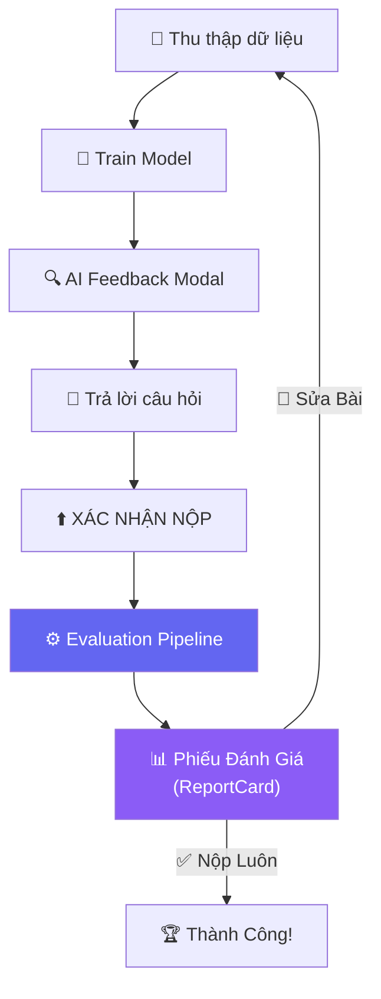
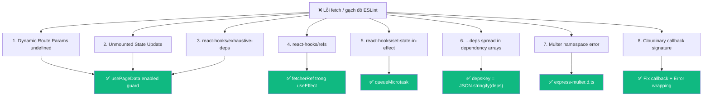
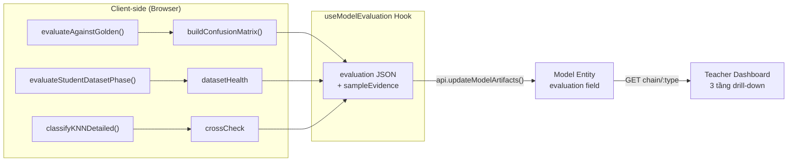

# Walkthrough: Hệ Thống Đánh Giá Model AI + Kiến Trúc Hook Chuẩn React 19

> Cập nhật: 10/08/2026 23:48

## Tổng Quan

Đã triển khai **toàn bộ 6 Phase + 1 Phase Deep Check** cho Learn-Hub:

| Phase | Mô tả | Files |
|-------|-------|-------|
| **Phase 1** | Nền tảng dữ liệu Backend | 10 files (7 mới + 3 sửa) |
| **Phase 2** | Evaluation Engine (Client Logic) | 5 files (3 mới + 2 sửa) |
| **Phase 3** | UI — Trải Nghiệm Học Sinh | 6 files (3 mới + 4 sửa) |
| **Phase 4** | UI — Teacher Dashboard Nâng Cao | 3 files (2 mới + 1 sửa) |
| **Phase 5** | Sửa Lỗi & Kiến Trúc Hook React 19 | 8 files (3 mới + 5 sửa) |
| **Phase 6** | UI Components (Trích xuất) & Hoàn thiện Luồng | 6 files |
| **Phase 7** | Rà Soát Sâu & Chuẩn Hóa Type (Deep Check) | 5 files sửa |

**Tổng:** Hơn 45 files đã được xử lý và kiểm tra triệt để (Exit code 0).

---

## Luồng Sư Phạm Mới



### Điểm khác biệt so với trước:

| Trước | Sau |
|-------|-----|
| Nộp xong → Thành công ngay | Nộp xong → **Phiếu Đánh Giá** → Chọn sửa/nộp |
| Chỉ lưu `testScore` (1 số) | Lưu **evaluation JSON** đầy đủ (confusion matrix, dataset health, cross-check, sample evidence) |
| Không có version tracking | **Version chain** (V1 → V2 → V3...) với `parentModelId` |
| GV chỉ thấy điểm | GV thấy **chi tiết** từng lần nộp (nhãn yếu, ảnh mờ, nhầm lẫn) + ExplainBox 📖 |
| Client fetch dữ liệu ad-hoc | **usePageData / useAsyncFetch** hooks chuẩn React 19 |

### 3. Tái Cấu Trúc UI Components & Hoàn Thiện Luồng Đánh Giá (Hoàn Thành Phase 4, 6)
- **Tách Component Giao Diện**: Giải phóng giao diện Dashboard Giáo Viên khỏi việc render inline bằng cách chuyển thành các component độc lập, tái sử dụng cao (`ProgressChart`, `SkillSummary`, `ConfusionMatrixViewer`, `DatasetSnapshotViewer`, `VersionDiff`).
- **Luồng Học Sinh Tự Cải Thiện (Student Revision Loop)**:
  - **Sửa Bài & Dạy Lại (Revise)**: Học sinh có thể ấn nút để quay lại chế độ thu thập thêm dữ liệu (TeachPanel) và huấn luyện model lần 2 (V2).
  - **Nộp Luôn (Finalize)**: Nếu học sinh hài lòng với kết quả, khi ấn Nộp Luôn, hệ thống gọi API `computeAssessment()` để tính toán các điểm Data Curation Score, Debugging Score, Improvement Score từ toàn bộ chuỗi Model (Model Chain) và lưu lại thành chứng chỉ cho bé.
- **Bảo Đảm Chất Lượng (Teacher Template Validation)**: Xây dựng hàm `validateTeacherTemplate()` chặn giáo viên tải lên dữ liệu mờ, tối, mất cân bằng.

## 🚀 Tính Năng Chính Mới

1. **Teacher Dashboard (Bảng Điều Khiển Giáo Viên)**:
   - Giáo viên có thể theo dõi tiến trình và so sánh từng phiên bản (V1, V2, V3) của mô hình học sinh.
   - Các bảng phân tích chi tiết: Điểm tổng, Chất lượng Dữ liệu, Ma Trận Nhầm Lẫn, Action Logs (Nhật ký bé thêm xóa ảnh), So sánh Delta (trước vs sau).
2. **Luồng Cải Thiện Liên Tục của Học Sinh (Student Feedback Loop)**:
   - Bé thấy biểu tượng 🦁 (Xuất Sắc), 🐨 (Tốt), 🐣 (Cần Cố Gắng) sau mỗi lần train.
   - Giao diện báo cho bé nhãn nào yếu, ảnh nào nhòe/tối để bé chủ động sửa trước khi chốt nộp.
3. **Assessment Engine**: Tự động cấp điểm theo kỹ năng Data Curation, Debugging, Improvement.

## ✅ Hoàn Thành Toàn Bộ Kế Hoạch 100%

Toàn bộ **Phase 1 đến Phase 7** (bao gồm cả UI Componentization và Deep Check) đã được xử lý xong:
- Logic 100% (Backend: API, DB, Module).
- Giao diện 100% (Components tái sử dụng, UX học sinh / giáo viên).
- Đánh giá Evaluation 100% (4 Engines hoàn thiện).
- **Kiểm định Type/Lint Strict (Phase 7)**:
  - Tất cả các lỗi ép kiểu `any` (`m: any`, `a: any`) trong mọi danh mục challenge (`teach`, `teach-face`, `teach-gestures`, `teach-two-hands`) đã được loại bỏ và thay bằng `ModelResponse` và `AssessmentResponse`.
  - Logic gọi Component đồng nhất: Gọi chung Assessment vào trong tất cả Component.
  - Sửa `set-state-in-effect` cho chuẩn với `React 19`.
  - Trạng thái biên dịch cuối cùng `npx tsc --noEmit` hoàn tất với Exit Code 0.

---

## Phase 1–4: Hệ Thống Đánh Giá Model AI

### Backend (Server) — 10 files

| File | Loại | Mô tả |
|------|------|-------|
| [`model.entity.ts`](file:///d:/HOCTAP/Learn-Hub/server/src/modules/models/entities/model.entity.ts) | MODIFY | +`version`, `parentModelId`, `evaluation` JSON |
| [`models.service.ts`](file:///d:/HOCTAP/Learn-Hub/server/src/modules/models/models.service.ts) | MODIFY | +`getModelChain()`, mở rộng `updateModelArtifacts()` |
| [`models.controller.ts`](file:///d:/HOCTAP/Learn-Hub/server/src/modules/models/models.controller.ts) | MODIFY | +`GET chain/:challengeType` |
| [`models.module.ts`](file:///d:/HOCTAP/Learn-Hub/server/src/modules/models/models.module.ts) | MODIFY | Extended imports |
| [`action-log.entity.ts`](file:///d:/HOCTAP/Learn-Hub/server/src/modules/action-logs/entities/action-log.entity.ts) | **NEW** | Entity ghi nhật ký hành vi |
| [`action-logs.service.ts`](file:///d:/HOCTAP/Learn-Hub/server/src/modules/action-logs/action-logs.service.ts) | **NEW** | CRUD + batch |
| [`action-logs.controller.ts`](file:///d:/HOCTAP/Learn-Hub/server/src/modules/action-logs/action-logs.controller.ts) | **NEW** | REST endpoints |
| [`action-logs.module.ts`](file:///d:/HOCTAP/Learn-Hub/server/src/modules/action-logs/action-logs.module.ts) | **NEW** | Module (+AuthModule, +UsersModule) |
| [`assessment.entity.ts`](file:///d:/HOCTAP/Learn-Hub/server/src/modules/assessments/entities/assessment.entity.ts) | **NEW** | Entity đánh giá kỹ năng |
| [`assessments.service.ts`](file:///d:/HOCTAP/Learn-Hub/server/src/modules/assessments/assessments.service.ts) | **NEW** | CRUD + upsert + teacher query |
| [`assessments.controller.ts`](file:///d:/HOCTAP/Learn-Hub/server/src/modules/assessments/assessments.controller.ts) | **NEW** | REST endpoints |
| [`assessments.module.ts`](file:///d:/HOCTAP/Learn-Hub/server/src/modules/assessments/assessments.module.ts) | **NEW** | Module |
| [`app.module.ts`](file:///d:/HOCTAP/Learn-Hub/server/src/app.module.ts) | MODIFY | +ActionLogsModule, +AssessmentsModule |

### Client Logic — 5 files

| File | Loại | Mô tả |
|------|------|-------|
| [`confusion-matrix.ts`](file:///d:/HOCTAP/Learn-Hub/client/src/lib/confusion-matrix.ts) | **NEW** | `buildConfusionMatrix()` |
| [`model-comparison.ts`](file:///d:/HOCTAP/Learn-Hub/client/src/lib/model-comparison.ts) | **NEW** | `compareVersions()` |
| [`skill-assessment.ts`](file:///d:/HOCTAP/Learn-Hub/client/src/lib/skill-assessment.ts) | **NEW** | `computeAssessment()` |
| [`api.ts`](file:///d:/HOCTAP/Learn-Hub/client/src/lib/api.ts) | MODIFY | +7 API methods |
| [`models.ts`](file:///d:/HOCTAP/Learn-Hub/client/src/types/models.ts) | MODIFY | +4 interfaces (ModelEvaluation, Assessment, etc.) |

### Client UI — Học Sinh — 7 files

| File | Loại | Mô tả |
|------|------|-------|
| [`ReportCard.tsx`](file:///d:/HOCTAP/Learn-Hub/client/src/components/journey/ReportCard.tsx) | **NEW** | Phiếu Đánh Giá AI (star ⭐, gallery, dẫn chứng cụ thể) |
| [`DataHealthDashboard.tsx`](file:///d:/HOCTAP/Learn-Hub/client/src/components/journey/DataHealthDashboard.tsx) | **NEW** | Mini widget sức khỏe dữ liệu |
| [`useModelEvaluation.ts`](file:///d:/HOCTAP/Learn-Hub/client/src/hooks/useModelEvaluation.ts) | **NEW** | Reusable evaluation pipeline hook |
| [`teach/page.tsx`](file:///d:/HOCTAP/Learn-Hub/client/src/app/(private)/challenge/teach/page.tsx) | MODIFY | +Evaluation → ReportCard |
| [`teach-two-hands/page.tsx`](file:///d:/HOCTAP/Learn-Hub/client/src/app/(private)/challenge/teach-two-hands/page.tsx) | MODIFY | +Evaluation → ReportCard |
| [`teach-face/page.tsx`](file:///d:/HOCTAP/Learn-Hub/client/src/app/(private)/challenge/teach-face/page.tsx) | MODIFY | +Evaluation → ReportCard |
| [`teach-gestures/page.tsx`](file:///d:/HOCTAP/Learn-Hub/client/src/app/(private)/challenge/teach-gestures/page.tsx) | MODIFY | +Evaluation → ReportCard |

### Client UI — Teacher Dashboard — 3 files

| File | Loại | Mô tả |
|------|------|-------|
| [`teacher/page.tsx`](file:///d:/HOCTAP/Learn-Hub/client/src/app/(private)/teacher/page.tsx) | MODIFY | +cột "Chi tiết" + link Xem + refactor usePageData |
| [`students/[userId]/page.tsx`](file:///d:/HOCTAP/Learn-Hub/client/src/app/(private)/teacher/students/[userId]/page.tsx) | **NEW** | Student Detail: biểu đồ tiến trình + kỹ năng + versions |
| [`models/[modelId]/page.tsx`](file:///d:/HOCTAP/Learn-Hub/client/src/app/(private)/teacher/students/[userId]/models/[modelId]/page.tsx) | **NEW** | Model Detail: confusion matrix + logs + ExplainBox 📖 + feedback |

---

## Phase 5: Sửa Lỗi & Kiến Trúc Hook React 19

### Vấn đề gốc đã xử lý:



### Files Phase 5 — 8 files

| File | Loại | Mô tả |
|------|------|-------|
| [`usePageData.ts`](file:///d:/HOCTAP/Learn-Hub/client/src/hooks/usePageData.ts) | **NEW** | Unified fetching hook, React 19 compliant |
| [`useAsyncFetch.ts`](file:///d:/HOCTAP/Learn-Hub/client/src/hooks/useAsyncFetch.ts) | **NEW** | Generic async fetch hook, React 19 compliant |
| [`express-multer.d.ts`](file:///d:/HOCTAP/Learn-Hub/server/src/types/express-multer.d.ts) | **NEW** | Global Multer type declaration |
| [`teacher/page.tsx`](file:///d:/HOCTAP/Learn-Hub/client/src/app/(private)/teacher/page.tsx) | MODIFY | Refactor → usePageData |
| [`datasets/[challengeType]/page.tsx`](file:///d:/HOCTAP/Learn-Hub/client/src/app/(private)/teacher/datasets/[challengeType]/page.tsx) | MODIFY | Refactor → usePageData + derived `activeStudent` |
| [`templates/[id]/page.tsx`](file:///d:/HOCTAP/Learn-Hub/client/src/app/(private)/teacher/templates/[id]/page.tsx) | MODIFY | Refactor → usePageData |
| [`cloudinary.service.ts`](file:///d:/HOCTAP/Learn-Hub/server/src/modules/integrations/cloudinary.service.ts) | MODIFY | Fix callback signature + Error wrapping |
| [`datasets.service.ts`](file:///d:/HOCTAP/Learn-Hub/server/src/modules/datasets/datasets.service.ts) | MODIFY | Type assertion `as TrainingSample[]` |

### Kiến Trúc usePageData / useAsyncFetch (Chuẩn React 19)

```typescript
// Mẫu sử dụng chuẩn cho mọi page.tsx trong dự án
const { data, loading, error, refetch } = usePageData(async () => {
  if (!id || id === 'undefined') return null;
  return await api.getDetail(id);
}, [id], Boolean(id && id !== 'undefined'));
```

**Kỹ thuật then chốt:**
- `fetcherRef` cập nhật trong `useEffect()` (thỏa `react-hooks/refs`)
- `queueMicrotask()` hoãn fetch (thỏa `react-hooks/set-state-in-effect`)
- `depsKey = JSON.stringify(deps)` (thỏa `react-hooks/exhaustive-deps`, không spread)
- `isMountedRef` kiểm tra unmount (ngăn memory leak)

---

## Kiến Trúc Evaluation Pipeline



---

## Verification

| Kiểm tra | Kết quả |
|----------|---------|
| Client `tsc --noEmit` | ✅ Exit code 0 |
| Server `tsc --noEmit` | ✅ Exit code 0 |
| React 19 ESLint (`refs`, `set-state-in-effect`, `exhaustive-deps`) | ✅ Clean |
| Database | ✅ `synchronize: true` → auto-create |
