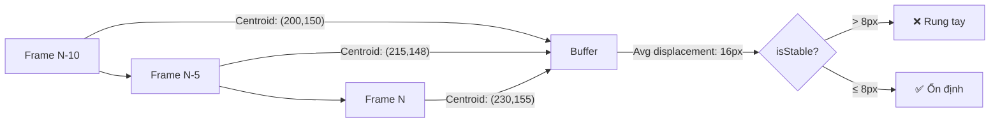

# Stability Detection — Chống rung tay (Positional Shake)

## Bối cảnh

Blur detection hiện tại chỉ phân tích **1 frame duy nhất** — nếu shutter speed đủ nhanh, frame vẫn "nét" dù tay đang rung. Cần thêm **stability detection** để theo dõi **vị trí keypoints qua nhiều frame liên tiếp**.



---

## Kiến trúc

### Tại sao dùng Hook riêng?

| Phương án | Ưu | Nhược |
|---|---|---|
| Thêm vào `assessQuality()` | Đơn giản | assessQuality chạy per-capture (300ms), không có lịch sử frame-to-frame |
| Code trực tiếp trong mỗi page | Không thêm file | Duplicate logic 6+ pages |
| **Hook `useStabilityDetector`** ✅ | **Tái sử dụng, tách biệt, testable** | Thêm 1 file |

### Data Flow mới

```
┌─────────────────────────────────────────────────────────────┐
│ requestAnimationFrame loop (mỗi ~16ms)                       │
│                                                               │
│   ML5 model.detectStart() ──► handsRef.current updated        │
│                                    │                          │
│                          useStabilityDetector                 │
│                          ┌─────────┴─────────┐                │
│                          │ Lấy centroid từ    │                │
│                          │ keypoints hiện tại │                │
│                          │         │          │                │
│                          │ Push vào circular  │                │
│                          │ buffer (10 slots)  │                │
│                          │         │          │                │
│                          │ Tính avg displace- │                │
│                          │ ment giữa các slot │                │
│                          │         │          │                │
│                          │ isStable = avg < 8 │                │
│                          └─────────┬─────────┘                │
│                                    │                          │
│   captureSample() ◄────────────────┘                          │
│       ├─ Guard 1: keypoints detected? ✅                      │
│       ├─ Guard 2: assessQuality() → !isBlurry? ✅             │
│       ├─ Guard 3: isStable? ✅  ◄── MỚI                      │
│       ├─ Guard 4: heuristic validation ✅                     │
│       └─ Guard 5: golden KNN check ✅                         │
└─────────────────────────────────────────────────────────────┘
```

---

## Proposed Changes

### 1. Core — Hook mới

#### [NEW] [`useStabilityDetector.ts`](file:///d:/HOCTAP/Learn-Hub/client/src/hooks/useStabilityDetector.ts)

```typescript
import { useEffect, useRef, useState, RefObject } from 'react';

interface StabilityOptions {
  /** Số frame lưu trong buffer (default: 8) */
  bufferSize?: number;
  /** Ngưỡng displacement trung bình (pixels, đã chuẩn hóa). Default: 8 */
  threshold?: number;
  /** Khoảng cách giữa các lần sample (ms). Default: 100 */
  sampleInterval?: number;
}

interface StabilityResult {
  /** Tay/mặt/body đang đứng yên không? */
  isStable: boolean;
  /** Điểm motion trung bình (pixels, chuẩn hóa về 640px width) */
  motionScore: number;
}

export function useStabilityDetector(
  keypointsGetter: () => { x: number; y: number }[] | null,
  videoRef: RefObject<HTMLVideoElement | null>,
  active: boolean,
  options: StabilityOptions = {}
): StabilityResult
```

**Thuật toán bên trong:**

1. **Centroid Tracking** — Mỗi `sampleInterval` ms, tính centroid (trung bình x, y) từ keypoints hiện tại
2. **Circular Buffer** — Lưu `bufferSize` centroid gần nhất
3. **Average Displacement** — Tính trung bình khoảng cách Euclidean giữa các centroid liên tiếp:

$$\text{motionScore} = \frac{1}{N-1} \sum_{i=1}^{N-1} \sqrt{(x_i - x_{i-1})^2 + (y_i - y_{i-1})^2} \times \frac{640}{\text{videoWidth}}$$

4. **Resolution Normalization** — Nhân với `640 / videoWidth` để chuẩn hóa về 640px baseline (8px threshold không đổi dù camera 480p hay 1080p)
5. **Stability** — `isStable = motionScore < threshold`

**Edge cases:**
- Buffer chưa đầy (< 3 samples): `isStable = true` (cho phép chụp ngay, không bắt đợi)
- Không có keypoints: `isStable = false` (không thể đánh giá)
- `active = false`: reset buffer, return `isStable = true`

---

### 2. Integration — Training Pages

#### [MODIFY] [`teach/page.tsx`](file:///d:/HOCTAP/Learn-Hub/client/src/app/(private)/teacher/training/teach/page.tsx)

```diff
+ import { useStabilityDetector } from '@/hooks/useStabilityDetector';

  // After useCamera and useMl5Handpose hooks:
+ const { isStable, motionScore } = useStabilityDetector(
+   () => handsRef.current?.[0]?.keypoints ?? null,
+   videoRef,
+   modelStatus === 'ready'
+ );

  // In captureSample(), after assessQuality check:
+ if (!isStable) {
+   setValidationToast('Tay đang rung. Hãy giữ yên tay rồi chụp lại!');
+   playValidationSound('tryagain');
+   return; // hoặc flag isValid = false tùy policy
+ }
```

#### [MODIFY] [`teach-face/page.tsx`](file:///d:/HOCTAP/Learn-Hub/client/src/app/(private)/teacher/training/teach-face/page.tsx)

```diff
+ const { isStable } = useStabilityDetector(
+   () => {
+     const faces = allFacesRef.current;
+     if (!faces || faces.length === 0) return null;
+     return faces[0]; // FaceKeypoint[] = { x, y, z? }[]
+   },
+   videoRef,
+   modelStatus === 'ready'
+ );
```

#### [MODIFY] [`teach-two-hands/page.tsx`](file:///d:/HOCTAP/Learn-Hub/client/src/app/(private)/teacher/training/teach-two-hands/page.tsx)

```diff
+ const { isStable } = useStabilityDetector(
+   () => {
+     const hands = handsRef.current;
+     if (!hands || hands.length < 2) return null;
+     // Gộp keypoints cả 2 tay
+     return [...(hands[0].keypoints ?? []), ...(hands[1].keypoints ?? [])];
+   },
+   videoRef,
+   modelStatus === 'ready'
+ );
```

#### [MODIFY] [`teach-gestures/page.tsx`](file:///d:/HOCTAP/Learn-Hub/client/src/app/(private)/teacher/training/teach-gestures/page.tsx)

```diff
+ const { isStable } = useStabilityDetector(
+   () => handsRef.current?.[0]?.keypoints ?? null,
+   videoRef,
+   modelStatus === 'ready'
+ );
```

#### [MODIFY] [`BodyTeachPanel.tsx`](file:///d:/HOCTAP/Learn-Hub/client/src/components/journey/BodyTeachPanel.tsx)

```diff
+ const { isStable } = useStabilityDetector(
+   () => posesRef.current?.[0]?.keypoints ?? null,
+   videoRef,
+   modelStatus === 'ready'
+ );
```

#### [MODIFY] [`TeachPanel.tsx`](file:///d:/HOCTAP/Learn-Hub/client/src/components/journey/TeachPanel.tsx)

```diff
+ const { isStable } = useStabilityDetector(
+   () => handsRef.current?.[0]?.keypoints ?? null,
+   videoRef,
+   modelStatus === 'ready'
+ );
```

---

### 3. UI Feedback — CameraView HUD

#### [MODIFY] [`CameraView.tsx`](file:///d:/HOCTAP/Learn-Hub/client/src/components/CameraView.tsx)

Thêm prop `isStable` và hiển thị indicator:

```diff
  interface CameraViewProps {
    // ... existing props
+   isStable?: boolean;
  }
```

Hiển thị trạng thái ổn định trên HUD:

```tsx
{/* Stability indicator - chỉ hiện khi model ready */}
{modelStatus === 'ready' && isStable === false && (
  <div className="absolute top-4 right-4 z-20 bg-red-500/80 backdrop-blur 
       text-white px-3 py-1.5 rounded-full font-bold text-xs 
       flex items-center gap-1.5 animate-pulse">
    <span>📳</span>
    <span>Giữ yên tay</span>
  </div>
)}
```

---

### 4. Không thay đổi

| File | Lý do |
|---|---|
| `image-quality.ts` | Blur detection giữ nguyên, stability là layer riêng |
| `useCamera.ts` | Không liên quan |
| `useMl5Handpose.ts` / `useMl5FaceMesh.ts` / `useMl5BodyPose.ts` | Chỉ đọc keypoints, không sửa |
| Challenge pages (`/challenge/*`) | Không cần stability (game mode, không chụp mẫu) |
| `DataCollector.tsx` | Upload ảnh tĩnh, không cần stability |

---

## Threshold Calibration

| Trạng thái | motionScore (px/frame @ 640w) | isStable |
|---|---|---|
| Tay đặt trên bàn | 0-2 | ✅ |
| Tay giữ nhẹ trên không | 2-6 | ✅ |
| Tay rung nhẹ (nhưng chấp nhận được) | 6-8 | ✅ (borderline) |
| Tay rung rõ | 10-20 | ❌ |
| Tay vẫy/di chuyển | 20-50+ | ❌ |

> [!TIP]
> Ngưỡng `threshold = 8` là mặc định. Có thể override per-page nếu cần (vd: body pose cho phép nhiều chuyển động hơn `threshold = 12`).

---

## Verification Plan

### Automated Tests
```bash
npx tsc --noEmit --pretty   # TypeScript check
npx eslint src/              # Lint check
```

### Manual Verification
1. Mở `/teacher/training/teach` → giữ tay yên → chụp mẫu → nên pass ✅
2. Giữ tay rung → HUD hiện "Giữ yên tay" → chụp bị chặn ❌
3. Mở `/teacher/training/teach-face` → giữ mặt yên → chụp pass ✅
4. Lắc đầu khi chụp → chụp bị chặn ❌
5. Kiểm tra `/teacher/training/teach-two-hands` với 2 tay
6. Kiểm tra log console: `[Quality V4]` vẫn hiện + thêm motionScore

---

## Open Questions

> [!IMPORTANT]
> **Policy khi unstable**: Khi tay rung, nên **chặn hoàn toàn** (return, không lưu) hay **lưu nhưng đánh dấu invalid** (viền đỏ trong gallery)?
> - `teach-face` hiện đã chặn hoàn toàn khi blur
> - `teach` hiện lưu nhưng đánh dấu invalid khi blur
> - Đề xuất: **Chặn hoàn toàn** cho stability (vì ảnh rung positional không có giá trị huấn luyện)

> [!NOTE]
> **Ảnh hưởng performance**: Hook chạy mỗi 100ms, chỉ tính centroid (1 phép cộng + 1 phép chia per keypoint) → overhead không đáng kể (~0.1ms per sample).
