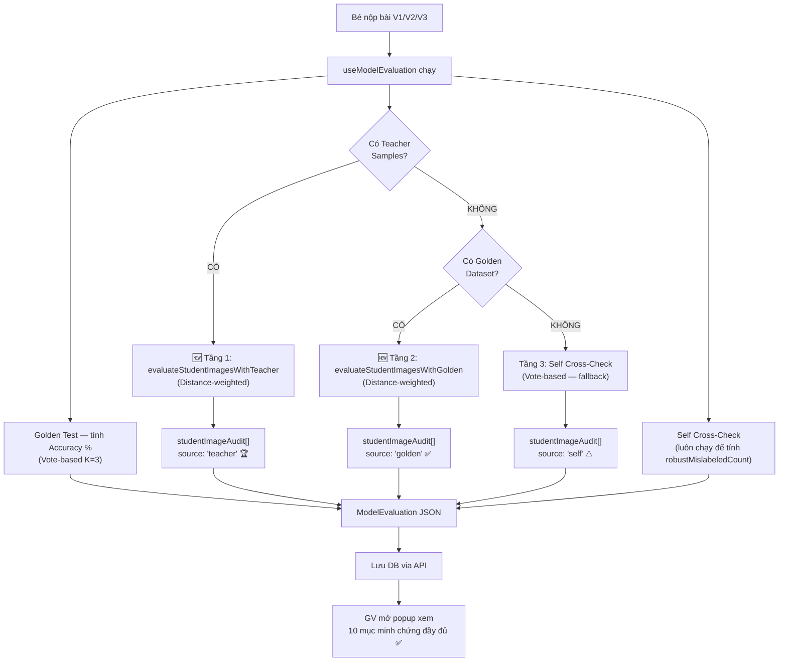

# Gửi minh chứng chất lượng mô hình & dữ liệu của bé cho Giáo viên

## Bối cảnh

Khi bé nộp bài (V1, V2, V3), Giáo viên cần thấy **minh chứng cụ thể** tại sao mô hình AI tốt hay tệ. Hiện tại hệ thống đã có rất nhiều thông tin, nhưng **thiếu 1 mảnh ghép quan trọng**: khi có Teacher samples, hệ thống **không đánh giá chéo từng ảnh học sinh** → phần "Kiểm Định Ảnh Học Sinh" luôn trống.

Ngoài ra, khi **KHÔNG có teacher samples**, hệ thống chỉ dùng Self cross-check (Vote-based) — tức là bé tự đánh giá chính mình. Nếu bé chụp nhiều ảnh sai → chúng "bảo vệ nhau" vì đa số bỏ phiếu sai cùng nhau → không phát hiện được lỗi.

## Hiện trạng — Những gì Giáo viên ĐÃ thấy (10 mục)

| # | Mục | Dữ liệu | Trạng thái |
|---|-----|----------|------------|
| 1 | **Tổng quan** | Accuracy %, Version, Tổng ảnh, Phase | ✅ Đã có |
| 2 | **Xem ảnh từng nhãn** | Thumbnails theo label, cảnh báo mất cân bằng | ✅ Đã có |
| 3 | **Ảnh chất lượng kém** | Ảnh mờ/tối kèm thumbnail, click zoom | ✅ Đã có |
| 4 | **Ảnh AI đoán sai** | Ảnh bị misclassified kèm nhãn gốc vs nhãn AI | ✅ Đã có |
| 5 | **Confusion Matrix & Golden Test** | Accuracy từng nhãn, chi tiết từng câu test, nhãn yếu nhất | ✅ Đã có |
| 5.5 | **Kiểm Định Từng Ảnh Học Sinh** | Đánh giá chéo từng ảnh bé chụp | ⚠️ **Chỉ hoạt động khi KHÔNG có teacher (Self cross-check, yếu)** |
| 6 | **Chất lượng dữ liệu** | qualityScore, balanceRatio, blurry/dark count | ✅ Đã có |
| 7 | **Cross-Check với Template GV** | agreementRate %, conflictCount | ✅ Đã có |
| 8 | **So sánh phiên bản** (V1→V2) | Delta accuracy, sample count, quality, balance | ✅ Đã có |
| 9 | **Nhật ký hành vi** | ADD/DELETE/RETRAIN actions | ✅ Đã có |
| 10 | **Phản hồi GV** | GV viết và gửi feedback cho bé | ✅ Đã có |

## Vấn đề cần giải quyết

> [!IMPORTANT]
> **Vấn đề 1**: Khi CÓ teacher samples → `studentImageAudit` luôn **rỗng** → GV không thấy từng ảnh bé chụp.
> 
> **Vấn đề 2**: Khi KHÔNG có teacher samples → Self cross-check dùng **Vote-based**, tức bé tự đánh giá mình. Nếu bé chụp 8 ảnh sai và 2 ảnh đúng cho cùng 1 nhãn → 8 ảnh sai bỏ phiếu cho nhau → hệ thống tưởng 2 ảnh đúng mới là sai! **Bé không thể tự đánh giá chính mình một cách công bằng.**

## Giải pháp: 3 tầng đánh giá (Teacher → Golden → Self)

```
Ưu tiên 1: CÓ Teacher Samples  → Dùng teacher samples làm chuẩn (Distance-weighted)
Ưu tiên 2: KHÔNG Teacher, CÓ Golden Dataset → Dùng golden dataset làm chuẩn (Distance-weighted)  
Ưu tiên 3: KHÔNG cả hai  → Self cross-check (Vote-based, adaptive K) — fallback cuối cùng
```

> [!TIP]
> **Golden Dataset** là bộ đề kiểm tra chuẩn do hệ thống tạo sẵn cho mỗi challenge. Nó đã có sẵn trong `config.goldenDataset` và đang được dùng để tính accuracy. Bây giờ ta **tận dụng ngược lại**: thay vì chỉ dùng golden test để test model, ta dùng golden dataset làm "giáo viên ảo" để đánh giá từng ảnh bé chụp.

### Ví dụ so sánh 3 tầng:

Bé chụp 10 ảnh cho nhãn "số 3", trong đó **3 ảnh thực ra giống "số 8"**:

| Tầng | Nguồn đối chiếu | Kết quả | Độ tin cậy |
|------|-----------------|---------|-----------|
| **Teacher** | Ảnh chuẩn của GV | Phát hiện 3/10 sai ✅ | Cao nhất — GV chụp chuẩn |
| **Golden** | Bộ test hệ thống | Phát hiện 2-3/10 sai ✅ | Cao — dữ liệu chuẩn, không phụ thuộc bé |
| **Self** | Ảnh của chính bé | Phát hiện 0/10 sai ❌ | Thấp — 7 ảnh sai bỏ phiếu cho nhau |

## Proposed Changes

### 1. Tạo KNN Teacher Classifier (Distance-weighted)

#### [NEW] [`knn-teacher-classifier.ts`](file:///d:/HOCTAP/Learn-Hub/client/src/lib/knn-teacher-classifier.ts)

File riêng cho luồng đánh giá chặt chẽ, dùng **Distance-weighted confidence**:

```typescript
// === Hàm KNN nội bộ: distance-weighted confidence ===
function classifyKNNTeacher(
  features: number[],
  refSamples: StoredSample[],
  k: number
): { label, confidence, nearest, counts, avgDistance }

// === Hàm chính #1: đánh giá bằng Teacher Samples ===
export function evaluateStudentImagesWithTeacher(
  studentSamples: StoredSample[],
  teacherSamples: StoredSample[],
  classes: { id: string; label: string }[],
  k: number
): StudentImageAuditItem[]  // evaluationSource = 'teacher'

// === Hàm chính #2: đánh giá bằng Golden Dataset ===
export function evaluateStudentImagesWithGolden(
  studentSamples: StoredSample[],
  goldenDataset: { features: number[]; expectedLabel: string }[],
  classes: { id: string; label: string }[],
  k: number
): StudentImageAuditItem[]  // evaluationSource = 'golden'
```

**Tại sao tách file riêng?**
- [`knn-classifier.ts`](file:///d:/HOCTAP/Learn-Hub/client/src/lib/knn-classifier.ts) giữ nguyên **Vote-based** → Student chơi/học realtime
- `knn-teacher-classifier.ts` dùng **Distance-weighted** → Đánh giá chặt chẽ khi nộp bài
- Không ảnh hưởng lẫn nhau

---

### 2. Kết nối vào Evaluation Pipeline

#### [MODIFY] [`useModelEvaluation.ts`](file:///d:/HOCTAP/Learn-Hub/client/src/hooks/useModelEvaluation.ts)

Thay đổi logic tạo `studentImageAudit` theo 3 tầng:

```typescript
// TRƯỚC (hiện tại):
if (!hasTeacher) {
  // Self cross-check → studentImageAudit (Vote-based)
}
// → Khi có teacher: studentImageAudit = [] (TRỐNG!)
// → Khi không teacher: bé tự đánh giá mình (YẾU!)

// SAU (sẽ sửa):
if (hasTeacher) {
  // Tầng 1: Teacher cross-check (Distance-weighted)
  studentImageAudit = evaluateStudentImagesWithTeacher(...)
} else if (hasGolden) {
  // Tầng 2: Golden cross-check (Distance-weighted)
  studentImageAudit = evaluateStudentImagesWithGolden(...)
}
// Self cross-check giữ nguyên CHỈ để tính robustMislabeledCount (phạt điểm)
// Không còn dùng self để tạo studentImageAudit nữa
```

> [!IMPORTANT] 
> Self cross-check (Vote-based) vẫn giữ lại để tính `robustMislabeledCount` → phạt `adjustedGoldenAccuracy`. Nhưng **không còn dùng để tạo `studentImageAudit`** vì không đủ tin cậy.

---

### 3. Các file khác — GIỮ NGUYÊN

| File | Lý do giữ nguyên |
|------|-------------------|
| [`knn-classifier.ts`](file:///d:/HOCTAP/Learn-Hub/client/src/lib/knn-classifier.ts) | Đã restore Vote-based, Student dùng |
| [`models.ts`](file:///d:/HOCTAP/Learn-Hub/client/src/types/models.ts) | Type `studentImageAudit` đã có `evaluationSource: 'teacher' \| 'golden' \| 'self'` — đủ dùng |
| [`StudentImageAuditViewer.tsx`](file:///d:/HOCTAP/Learn-Hub/client/src/components/teacher/StudentImageAuditViewer.tsx) | Component hiển thị đã sẵn sàng, đã xử lý cả 3 source |
| [`ConfusionMatrixViewer.tsx`](file:///d:/HOCTAP/Learn-Hub/client/src/components/teacher/ConfusionMatrixViewer.tsx) | Chỉ thay đổi UI |
| [`page.tsx`](file:///d:/HOCTAP/Learn-Hub/client/src/app/(private)/teacher/students/%5BuserId%5D/models/%5BmodelId%5D/page.tsx) | Đã import & render StudentImageAuditViewer |

## Tóm tắt luồng sau khi hoàn thành



## Giáo viên sẽ thấy gì cho từng V1, V2, V3?

| Minh chứng | V1 | V2 | V3 | Giải thích |
|---|---|---|---|---|
| **Accuracy %** | 60% | 75% | 90% | Golden test score, có phạt nếu ảnh sai nhãn |
| **Ảnh từng nhãn** | Xem thumbnail | Xem thumbnail | Xem thumbnail | GV thấy bé chụp ảnh thế nào |
| **Ảnh mờ/tối** | 5 ảnh mờ | 2 ảnh mờ | 0 | GV thấy bé cải thiện chất lượng ảnh |
| **Confusion Matrix** | Nhãn "3" yếu | Nhãn "3" khá hơn | Tất cả tốt | GV thấy nhãn nào bé khó |
| **🆕 Kiểm Định Ảnh** | 3/15 sai nhãn | 1/18 sai nhãn | 0/20 sai | GV thấy **từng ảnh** bé chụp đúng/sai, kèm % tin cậy |
| **So sánh V(n-1)** | — | V2 vs V1 ↑15% | V3 vs V2 ↑15% | GV thấy bé tiến bộ ra sao |
| **Nhật ký** | Thêm 15 ảnh | Xoá 3, thêm 6 | Thêm 2 | GV thấy bé debug thế nào |

## Verification Plan

### Manual Verification
- Kiểm tra popup "Phân Tích Dữ Liệu Của Bé" với K=3 vẫn check được ảnh sai nhãn
- Khi có teacher samples: `StudentImageAuditViewer` hiển thị source "Giáo viên" với distance-weighted confidence
- Khi không có teacher nhưng có golden: hiển thị source "Golden" với distance-weighted confidence
- Self cross-check vẫn tính `robustMislabeledCount` để phạt accuracy
