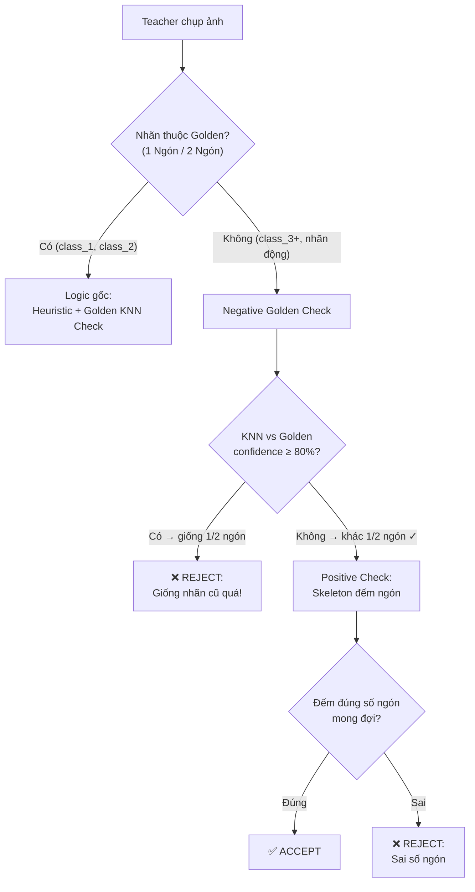
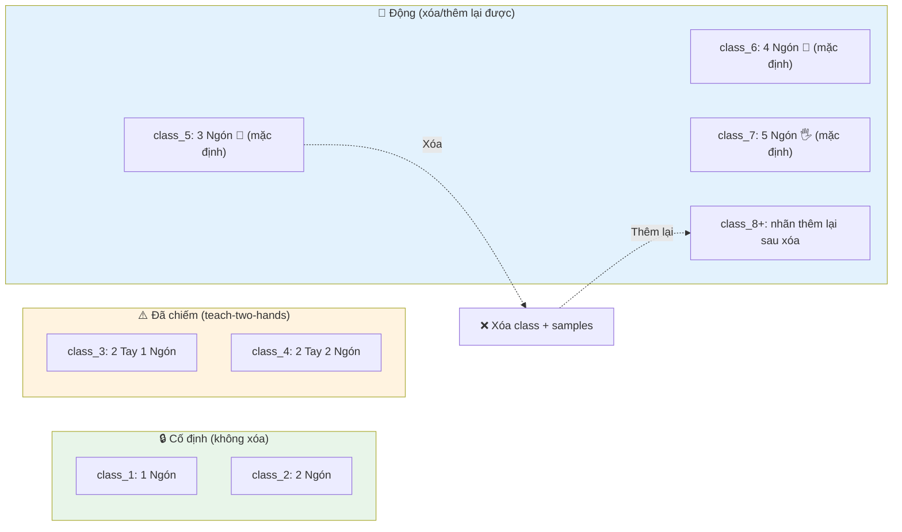
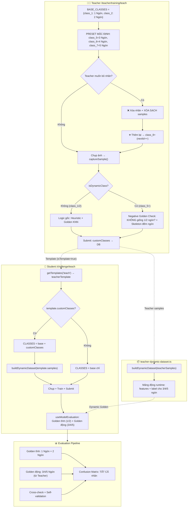

# Thêm nhãn động 3/4/5 Ngón Tay — Implementation Plan (v3)

> [!NOTE]
> **v3** — Cập nhật theo phản hồi lần 2:
> - Class ID bắt đầu từ `class_5` (tránh xung đột `class_3`/`class_4` của teach-two-hands)
> - 3 nhãn preset **hiện sẵn mặc định** trên trang Teacher, không cần nhấn "Thêm"
> - Xóa nhãn = xóa sạch class + toàn bộ samples
> - Thêm lại = tạo class mới (nextId++), không tái sử dụng ID cũ
> - File `teacher-dynamic-dataset.ts` tách biệt khỏi `golden-dataset.ts`

---

## 1. Tổng quan kiến trúc hiện tại

| Bài | challengeType | Golden Dataset | Nhãn cố định |
|-----|--------------|----------------|--------------|
| Đếm ngón (1 tay) | `teach` | [`golden-dataset.ts`](file:///d:/HOCTAP/Learn-Hub/client/src/lib/golden-dataset.ts) — 10 mẫu (5×`1 Ngón` + 5×`2 Ngón`) | `1 Ngón Tay ☝️`, `2 Ngón Tay ✌️` |
| Đếm ngón (2 tay) | `teach-two-hands` | `golden-dataset.ts` (dùng chung) | `class_1`→`class_4` |
| Cử chỉ tay | `teach-gestures` | [`golden-gestures-dataset.ts`](file:///d:/HOCTAP/Learn-Hub/client/src/lib/golden-gestures-dataset.ts) | `class_1`, `class_2` |
| Cảm xúc mặt | `teach-face` | [`golden-face-dataset.ts`](file:///d:/HOCTAP/Learn-Hub/client/src/lib/golden-face-dataset.ts) | `class_1`→`class_3` |

**Kết luận xung đột:** KHÔNG xung đột trực tiếp — mỗi bài tách biệt hoàn toàn. Nhãn `3/4/5 Ngón Tay` là chuỗi mới, không trùng bất kỳ Golden Dataset nào.

---

## 2. 🔄 Vấn đề 1: Validation khi chụp ảnh — Negative Golden Check

### Hiện trạng (code gốc)

```typescript
// teach/page.tsx line 277-293
if (isValid && GOLDEN_TEST_DATASET.length > 0) {
    const mappedGolden = GOLDEN_TEST_DATASET.map(g => ({
        label: g.expectedLabel, features: g.features
    }));
    const result = classifyKNN(features, mappedGolden, 3);
    // Nếu KNN nói cử chỉ này KHÔNG PHẢI goldenLabel → REJECT
    if (result.label !== goldenLabel && flippedResult.label !== goldenLabel) {
        isValid = false;  // ❌ reject
    }
}
```

**Vấn đề:** Khi Teacher chụp "3 Ngón Tay", `goldenLabel = ''` (rỗng, vì `CLASS_TO_GOLDEN_LABEL` không có) → điều kiện `result.label !== ''` luôn true → **mọi ảnh đều bị reject**.

### 🔄 Giải pháp: Negative Golden Check (kiểm tra ngược)

Thay vì "ảnh phải giống Golden đúng nhãn", ta đảo logic: **"ảnh KHÔNG ĐƯỢC giống Golden 1/2 ngón, VÀ skeleton phải đếm đủ số ngón mong đợi"**.

```typescript
// === LOGIC MỚI cho nhãn ĐỘNG (3/4/5 Ngón Tay) ===
const isDynamicClass = !CLASS_TO_GOLDEN_LABEL[activeClass]; // class không có trong Golden

if (isDynamicClass) {
    // Bước 1: NEGATIVE CHECK — ảnh KHÔNG ĐƯỢC giống Golden (1/2 ngón)
    if (isValid && GOLDEN_TEST_DATASET.length > 0) {
        const mappedGolden = GOLDEN_TEST_DATASET.map(g => ({
            label: g.expectedLabel, features: g.features
        }));
        const result = classifyKNN(features, mappedGolden, 3);
        const flippedFeatures = features.map((v, i) => i % 2 === 0 ? -v : v);
        const flippedResult = classifyKNN(flippedFeatures, mappedGolden, 3);

        // Nếu KNN nói ảnh này GIỐNG "1 Ngón" hoặc "2 Ngón" → REJECT
        // (vì Teacher đang muốn chụp 3/4/5 ngón, không phải 1/2 ngón)
        const bestResult = result.confidence >= flippedResult.confidence ? result : flippedResult;
        if (bestResult.confidence >= 80) { // Ngưỡng cao = rất chắc chắn là 1/2 ngón
            isValid = false;
            rejectedAny = true;
            rejectionMsg = `Cử chỉ này trông giống "${bestResult.label}" quá!`
                + ` Hãy giơ đủ ${activeClassLabel} nhé 🖐️`;
        }
    }

    // Bước 2: POSITIVE CHECK — skeleton đếm đúng số ngón mong đợi
    if (isValid && expectedFingers > 0) {
        const detectedFingers = countExtendedFingers(hands[handIndex].keypoints);
        if (detectedFingers >= 0 && detectedFingers !== expectedFingers) {
            isValid = false;
            rejectedAny = true;
            rejectionMsg = `Bạn đang giơ ${detectedFingers} ngón, nhưng "${activeClassLabel}" cần ${expectedFingers} ngón! 🖐️`;
        }
    }
} else {
    // === LOGIC GỐC cho nhãn CỐ ĐỊNH (1/2 Ngón) — giữ nguyên ===
    // Validation 1: Finger counting heuristic
    // Validation 2: KNN so sánh với Golden Dataset
}
```

**Luồng validation mới:**



### Cập nhật `getExpectedFingerCount()` cho nhãn động

```typescript
function getExpectedFingerCount(classId: string, label?: string): number {
    // Nhãn cố định
    if (classId === 'class_1' || classId === 'class_3') return 1;
    if (classId === 'class_2' || classId === 'class_4') return 2;

    // Nhãn động — parse từ label
    if (label) {
        if (label.includes('3 Ngón Tay')) return 3;
        if (label.includes('4 Ngón Tay')) return 4;
        if (label.includes('5 Ngón Tay')) return -1; // bỏ qua (ngón cái bị disable)
    }
    return -1; // unknown → skip heuristic
}
```

> [!NOTE]
> Hàm `countExtendedFingers()` hiện bỏ ngón cái (comment ở line 67-71), nên chỉ đếm tối đa 4 ngón. Cho "5 Ngón Tay" sẽ return `-1` (skip heuristic), chỉ dựa vào Negative Golden Check.

---

## 3. 🔄🔄 Class ID tăng cộng dồn — Phân tích lại (v3)

### 3.1 Phát hiện quan trọng: class_3 / class_4 đã bị chiếm

Bài `teach-two-hands` ([`teach-two-hands/page.tsx`](file:///d:/HOCTAP/Learn-Hub/client/src/app/(private)/teacher/training/teach-two-hands/page.tsx#L22-L25)) đã dùng `class_3` và `class_4`:

```typescript
// teach-two-hands/page.tsx line 22-25
const CLASSES = [
    { id: 'class_3', label: '2 Bàn Tay, 1 Ngón Tay ☝️☝️', ... },
    { id: 'class_4', label: '2 Bàn Tay, 2 Ngón Tay ✌️✌️', ... },
];
```

Và `CLASS_TO_GOLDEN_LABEL` (line 30-35) map `class_3 → '1 Ngón Tay ☝️'`, `class_4 → '2 Ngón Tay ✌️'`.

> [!CAUTION]
> Nếu nhãn động dùng `class_3`, `class_4` → **TRÙNG** với `teach-two-hands`. Dù hai bài có `challengeType` khác nhau (`teach` vs `teach-two-hands`), logic Golden KNN trong cùng file `CLASS_TO_GOLDEN_LABEL` sẽ bị nhầm lẫn. **→ Nhãn động phải bắt đầu từ `class_5`**.

### 3.2 Hành vi mặc định: 3 nhãn preset hiển thị SẴN

> [!IMPORTANT]
> **Làm rõ:** Hệ thống **mặc định hiện sẵn** 3 nhãn động trên trang `/teacher/training/teach`:
> - `3 Ngón Tay 🤟`
> - `4 Ngón Tay 🖖`  
> - `5 Ngón Tay 🖐️`
>
> Teacher **KHÔNG** cần nhấn nút "+ Thêm Nhãn" để tạo. Chỉ có **2 thao tác**: ❌ **Xóa nhãn** (nếu không cần) và ➕ **Thêm lại nhãn đã xóa** (nếu đổi ý).

### 3.3 Xóa = xóa sạch (class + toàn bộ samples)

Khi Teacher xóa một nhãn động, hệ thống xóa **HOÀN TOÀN**:
- Xóa class khỏi danh sách UI
- Xóa **tất cả samples** có `sourceId === classId` đó

→ Không còn dữ liệu "thừa" trong session. Sạch sẽ.

### 3.4 Thêm lại = tạo class mới, nextId CHỈ TĂNG

| Bước | Hành động | dynamicClasses | nextId | Samples |
|------|----------|---------------|--------|---------|
| Mở trang | 3 preset hiển thị sẵn | `[{class_5: 3 Ngón}, {class_6: 4 Ngón}, {class_7: 5 Ngón}]` | **8** | — |
| Teacher chụp 10 ảnh "3 Ngón" | — | *(giữ nguyên)* | 8 | 10 ảnh `sourceId=class_5` |
| Teacher xóa "3 Ngón Tay" | Xóa class + 10 samples | `[{class_6: 4 Ngón}, {class_7: 5 Ngón}]` | 8 | 0 ảnh class_5 |
| Teacher thêm lại "3 Ngón Tay" | Tạo class MỚI | `[{class_6: 4 Ngón}, {class_7: 5 Ngón}, {class_8: 3 Ngón}]` | **9** | — *(phải chụp lại)* |

**Tại sao không tái dùng class_5?** Vì samples cũ (`sourceId=class_5`) đã bị xóa, nhưng nếu đã submit lên server trước đó, server vẫn có dữ liệu cũ với `class_5`. Dùng `class_8` mới → tránh xung đột hoàn toàn.

### 3.5 Thiết kế state cho Teacher page

```typescript
// ── Nhãn cố định (không xóa được) ──
const BASE_CLASSES = [
    { id: 'class_1', label: '1 Ngón Tay ☝️', voicePrompt: '...' },
    { id: 'class_2', label: '2 Ngón Tay ✌️', voicePrompt: '...' },
];

// ── Danh sách nhãn preset có thể thêm lại sau khi xóa ──
const DYNAMIC_PRESETS = [
    { label: '3 Ngón Tay 🤟', emoji: '🤟' },
    { label: '4 Ngón Tay 🖖', emoji: '🖖' },
    { label: '5 Ngón Tay 🖐️', emoji: '🖐️' },
];

// ── State ──
// Khởi tạo mặc định: 3 preset HIỆN SẴN, ID bắt đầu từ class_5
const [dynamicClasses, setDynamicClasses] = useState<
    { id: string; label: string; emoji: string }[]
>([
    { id: 'class_5', label: '3 Ngón Tay 🤟', emoji: '🤟' },
    { id: 'class_6', label: '4 Ngón Tay 🖖', emoji: '🖖' },
    { id: 'class_7', label: '5 Ngón Tay 🖐️', emoji: '🖐️' },
]);
const [nextClassIdCounter, setNextClassIdCounter] = useState(8);
// ↑ 8 vì class_1..class_7 đã dùng (1-2 cố định, 3-4 teach-two-hands, 5-7 preset)

// ── Tổng hợp ──
const allClasses = useMemo(() => [
    ...BASE_CLASSES,
    ...dynamicClasses
], [dynamicClasses]);

// ── Xóa nhãn: xóa class + XÓA TOÀN BỘ samples ──
const removeDynamicClass = (classId: string) => {
    setDynamicClasses(prev => prev.filter(c => c.id !== classId));
    setSamples(prev => prev.filter(s => s.sourceId !== classId)); // 🔥 xóa sạch samples
    setIsTrained(false);
    // KHÔNG giảm nextClassIdCounter
};

// ── Thêm lại nhãn đã xóa ──
const addDynamicClass = (label: string, emoji: string) => {
    // Kiểm tra nhãn đã tồn tại chưa (tránh thêm trùng)
    if (dynamicClasses.some(c => c.label === label)) return;

    const newId = `class_${nextClassIdCounter}`;
    setDynamicClasses(prev => [...prev, { id: newId, label, emoji }]);
    setNextClassIdCounter(prev => prev + 1); // CHỈ TĂNG
};

// ── Danh sách nhãn đã bị xóa (để hiện nút "Thêm lại") ──
const removedPresets = useMemo(() => {
    const activeLabels = dynamicClasses.map(c => c.label);
    return DYNAMIC_PRESETS.filter(p => !activeLabels.includes(p.label));
}, [dynamicClasses]);
```

### 3.6 Sơ đồ vòng đời Class ID



### 3.7 Luồng Student `/challenge/teach` — chỉ đọc, không thao tác nhãn

> [!IMPORTANT]
> **Trang Student `/challenge/teach` KHÔNG có bất kỳ chức năng thêm / xóa / sửa nhãn nào.**
> Các nhãn động (3 Ngón Tay, 4 Ngón Tay, 5 Ngón Tay) **chỉ hiện khi** Teacher đã tạo bộ ảnh template chứa nhãn đó.

```typescript
// challenge/teach/page.tsx
const CLASSES = useMemo(() => {
    const base = [
        { id: 'class_1', label: '1 Ngón Tay ☝️', emoji: '☝️' },
        { id: 'class_2', label: '2 Ngón Tay ✌️', emoji: '✌️' },
    ];
    // Nhãn động CHỈ hiện khi Teacher template có customClasses (tức là có bộ ảnh mẫu)
    // Student KHÔNG có giao diện thêm / xóa / sửa nhãn
    if (teacherTemplate?.customClasses && teacherTemplate.customClasses.length > 0) {
        return [...base, ...teacherTemplate.customClasses];
    }
    return base;
}, [teacherTemplate]);
```

**Luồng hiển thị:**

| Tình huống | Nhãn Student thấy |
|-----------|-------------------|
| Teacher chưa tạo template | `1 Ngón Tay`, `2 Ngón Tay` (chỉ 2 nhãn cơ bản) |
| Teacher tạo template với 3 Ngón + 4 Ngón | `1 Ngón`, `2 Ngón`, `3 Ngón`, `4 Ngón` (4 nhãn) |
| Teacher tạo template với cả 3 + 4 + 5 Ngón | `1 Ngón`, `2 Ngón`, `3 Ngón`, `4 Ngón`, `5 Ngón` (5 nhãn) |
| Teacher tạo template nhưng xóa hết nhãn động | `1 Ngón Tay`, `2 Ngón Tay` (chỉ 2 nhãn cơ bản) |

---

## 4. 🔄 Vấn đề 2: Đánh giá điểm — Chỉ Golden cho nhãn cố định

### Chốt: Không tính Golden accuracy cho nhãn động

**Tại sao?** Golden Dataset chỉ có mẫu 1/2 ngón. Nếu model bé có samples 3/4/5 ngón lẫn trong khi classify Golden test:
- KNN có thể chọn sample "3 ngón" làm nearest neighbor của Golden "2 ngón" → kết quả sai
- Accuracy bị nhiễu, không phản ánh chất lượng dạy AI thực tế

### Giải pháp: Lọc samples khi chạy Golden test

```typescript
// handleOpenSubmit() — Teacher page
const handleOpenSubmit = () => {
    // CHỈ dùng samples của nhãn CƠ BẢN (1/2 ngón) khi chấm Golden test
    const baseClassIds = ['class_1', 'class_2'];
    const baseSamples = samples.filter(s => baseClassIds.includes(s.sourceId || ''));

    // Golden test chỉ trên nhãn 1/2 ngón
    const targetClasses = [BASE_CLASSES[0].label, BASE_CLASSES[1].label];
    const testCases = GOLDEN_TEST_DATASET.filter(g => targetClasses.includes(g.expectedLabel));

    let correctCount = 0;
    testCases.forEach(testCase => {
        // KNN chỉ so với baseSamples → không bị nhiễu bởi 3/4/5 ngón
        const result = classifyKNN(testCase.features, baseSamples, 3);
        if (result.label === testCase.expectedLabel) correctCount++;
    });

    let goldenAccuracy = testCases.length > 0
        ? Math.round((correctCount / testCases.length) * 100)
        : 0;

    // Nhãn động: dùng cross-check + self-validation
    const dynamicClassIds = allClasses
        .filter(c => !baseClassIds.includes(c.id))
        .map(c => c.id);
    const dynamicSamples = samples.filter(s => dynamicClassIds.includes(s.sourceId || ''));

    let dynamicScore = 100;
    if (dynamicSamples.length > 0) {
        // Self-validation: leave-one-out KNN — mỗi ảnh bỏ ra, phân loại bằng ảnh còn lại
        let selfCorrect = 0;
        dynamicSamples.forEach((sample, i) => {
            const others = dynamicSamples.filter((_, j) => j !== i);
            if (others.length > 0) {
                const result = classifyKNN(sample.features, others, 3);
                if (result.label === sample.label) selfCorrect++;
            }
        });
        dynamicScore = dynamicSamples.length > 0
            ? Math.round((selfCorrect / dynamicSamples.length) * 100)
            : 100;
    }

    // Tổng hợp: trung bình có trọng số dựa trên số lượng samples
    const totalSamples = baseSamples.length + dynamicSamples.length;
    const combinedScore = totalSamples > 0
        ? Math.round(
            (goldenAccuracy * baseSamples.length + dynamicScore * dynamicSamples.length)
            / totalSamples
        )
        : 0;

    setSubmitScore(combinedScore);
};
```

---

## 5. 🔄🔄 File mới: Dynamic Dataset — tách biệt khỏi golden-dataset.ts (v3)

### Tại sao tách file riêng?

| File | Nhãn | Dùng cho | Class IDs |
|------|------|---------|-----------|
| [`golden-dataset.ts`](file:///d:/HOCTAP/Learn-Hub/client/src/lib/golden-dataset.ts) | `1 Ngón Tay ☝️`, `2 Ngón Tay ✌️` | `teach` + `teach-two-hands` (dùng chung) | class_1 → class_4 |
| [`golden-gestures-dataset.ts`](file:///d:/HOCTAP/Learn-Hub/client/src/lib/golden-gestures-dataset.ts) | `class_1`, `class_2` | `teach-gestures` | class_1 → class_2 |
| [`golden-face-dataset.ts`](file:///d:/HOCTAP/Learn-Hub/client/src/lib/golden-face-dataset.ts) | `class_1` → `class_3` | `teach-face` | class_1 → class_3 |
| **[NEW] `teacher-dynamic-dataset.ts`** | `3 Ngón Tay 🤟`, `4 Ngón Tay 🖖`, `5 Ngón Tay 🖐️` | chỉ `teach` (nhãn động) | **class_5+** |

> [!WARNING]
> **KHÔNG** thêm nhãn 3/4/5 ngón vào `golden-dataset.ts` — vì file đó được dùng chung bởi cả `teach` và `teach-two-hands`. Thêm class_5+ vào đó sẽ khiến `teach-two-hands` bị nhiễu khi chạy Golden KNN (KNN sẽ tìm thấy "3 Ngón Tay" là nearest neighbor thay vì "1 Ngón Tay").

### Ý tưởng

Golden Dataset tĩnh (`golden-dataset.ts`) chỉ có 1/2 ngón → cần một **mảng động runtime** để làm "Golden Dataset" cho nhãn 3/4/5 ngón. Mảng này được **populate từ Teacher's template samples** khi Student load trang.

### [NEW] [`teacher-dynamic-dataset.ts`](file:///d:/HOCTAP/Learn-Hub/client/src/lib/teacher-dynamic-dataset.ts)

```typescript
/**
 * Teacher Dynamic Dataset — "Golden Dataset động" cho nhãn tuỳ chỉnh
 *
 * File này KHÔNG chứa data cố định (hardcoded) như golden-dataset.ts.
 * Thay vào đó, nó cung cấp:
 *   1. Interface và type cho dynamic dataset entries
 *   2. Hàm buildDynamicDataset() — tạo mảng từ Teacher template samples
 *   3. Hàm evaluateAgainstDynamic() — đánh giá bé dựa trên mảng này
 *
 * NGUỒN DỮ LIỆU: Teacher's template samples (API getTemplates → samples[])
 * MỤC ĐÍCH: Đánh giá Student cho các nhãn custom (3/4/5 Ngón Tay)
 *            mà Golden Dataset tĩnh không cover
 */

export interface DynamicDatasetSample {
    features: number[];
    expectedLabel: string;
}

/**
 * Build dynamic "golden" dataset từ Teacher template samples
 * Chỉ lấy samples có nhãn KHÔNG thuộc nhãn cơ bản (1/2 ngón)
 */
export function buildDynamicDataset(
    teacherSamples: { features: number[]; label: string; isValid?: boolean }[],
    baseLabels: string[] = ['1 Ngón Tay ☝️', '2 Ngón Tay ✌️']
): DynamicDatasetSample[] {
    return teacherSamples
        .filter(s => !baseLabels.includes(s.label) && s.isValid !== false)
        .map(s => ({
            features: s.features,
            expectedLabel: s.label
        }));
}

/**
 * Đánh giá Student samples dựa trên Dynamic Dataset (Teacher's data cho nhãn custom)
 * Dùng KNN tương tự evaluateAgainstGolden() nhưng chạy trên mảng động
 */
export function evaluateAgainstDynamic(
    studentSamples: { features: number[]; label: string }[],
    dynamicDataset: DynamicDatasetSample[],
    k: number = 3
): { accuracy: number; correctCount: number; totalCount: number } {
    if (dynamicDataset.length === 0) {
        return { accuracy: 100, correctCount: 0, totalCount: 0 };
    }

    let correctCount = 0;
    dynamicDataset.forEach(testCase => {
        const distances = studentSamples.map(s => ({
            label: s.label,
            distance: Math.sqrt(
                s.features.reduce((sum, v, i) => sum + (v - testCase.features[i]) ** 2, 0)
            )
        }));
        distances.sort((a, b) => a.distance - b.distance);
        const nearest = distances.slice(0, Math.min(k, distances.length));

        const counts: Record<string, number> = {};
        nearest.forEach(n => { counts[n.label] = (counts[n.label] || 0) + 1; });

        let bestLabel = '';
        let maxCount = 0;
        for (const [label, count] of Object.entries(counts)) {
            if (count > maxCount) { maxCount = count; bestLabel = label; }
        }

        if (bestLabel === testCase.expectedLabel) correctCount++;
    });

    return {
        accuracy: Math.round((correctCount / dynamicDataset.length) * 100),
        correctCount,
        totalCount: dynamicDataset.length
    };
}
```

### Cách sử dụng trong Student flow:

```typescript
// challenge/teach/page.tsx
import { buildDynamicDataset } from '@/lib/teacher-dynamic-dataset';

// Khi Teacher template load xong
const dynamicGolden = useMemo(() => {
    if (!teacherTemplate?.samples) return [];
    return buildDynamicDataset(teacherTemplate.samples);
}, [teacherTemplate]);

// Truyền vào evaluation hook
const { evaluation, ... } = useModelEvaluation({
    challengeType: 'teach',
    classes: CLASSES,
    goldenDataset: GOLDEN_TEST_DATASET,    // Golden tĩnh: 1/2 ngón
    dynamicDataset: dynamicGolden,          // Golden động: 3/4/5 ngón từ Teacher
    teacherSamples: teacherTemplate?.samples,
});
```

---

## 6. Proposed Changes — Danh sách files

### Tầng Client

---

#### [MODIFY] [`teach/page.tsx`](file:///d:/HOCTAP/Learn-Hub/client/src/app/(private)/teacher/training/teach/page.tsx) — Teacher training page

1. Thêm `DYNAMIC_PRESETS` (3 nhãn preset) + state `dynamicClasses` (khởi tạo sẵn class_5, class_6, class_7) + `nextClassIdCounter` = 8
2. UI: 3 nhãn động **hiện sẵn** khi mở trang + nút ❌ xóa trên mỗi nhãn động + nút ➕ "Thêm lại" cho nhãn đã xóa (từ danh sách `removedPresets`)
3. `removeDynamicClass()`: xóa class **VÀ** xóa sạch samples (`sourceId === classId`)
4. `addDynamicClass()`: tạo class mới với `class_${nextClassIdCounter++}`, check trùng label
5. `captureSample()`: phân nhánh validation theo `isDynamicClass`:
   - Dynamic: Negative Golden Check + Finger heuristic
   - Cố định: Logic gốc (KNN Golden + Heuristic)
6. `getExpectedFingerCount()`: thêm case 3 ngón → 3, 4 ngón → 4, 5 ngón → -1
7. `handleOpenSubmit()`: lọc `baseSamples` (class_1, class_2) khi chạy Golden test, self-validation cho nhãn động
8. `handleSubmitAssignment()`: gửi `customClasses: dynamicClasses` qua `api.createDataset()`
9. `CLASSES` → `allClasses = [...BASE_CLASSES, ...dynamicClasses]`

---

#### [MODIFY] [`challenge/teach/page.tsx`](file:///d:/HOCTAP/Learn-Hub/client/src/app/(private)/challenge/teach/page.tsx) — Student page

1. `CLASSES` → dynamic: base + `teacherTemplate.customClasses` (**chỉ đọc**, không có UI thêm/xóa/sửa nhãn)
2. Nhãn 3/4/5 Ngón Tay **chỉ hiện khi** Teacher template chứa `customClasses` có bộ ảnh mẫu tương ứng
3. Import `buildDynamicDataset` → build dynamic golden từ Teacher template samples
4. Truyền `dynamicDataset` vào `useModelEvaluation`
5. **KHÔNG** thêm bất kỳ nút thêm/xóa/sửa nhãn nào trên giao diện Student

---

#### [MODIFY] [`TeachPanel.tsx`](file:///d:/HOCTAP/Learn-Hub/client/src/components/journey/TeachPanel.tsx) — Shared TeachPanel component

1. `getExpectedFingerCount()`: thêm case 3/4/5 ngón (tương tự Teacher page)
2. `CLASS_TO_GOLDEN_LABEL`: giữ nguyên (chỉ có class_1→class_4)
3. Validation: khi `goldenLabel = ''` (nhãn động) → chạy Negative Golden Check thay vì Distance Check gốc

---

#### [NEW] [`teacher-dynamic-dataset.ts`](file:///d:/HOCTAP/Learn-Hub/client/src/lib/teacher-dynamic-dataset.ts) — Dynamic golden dataset

1. Interface `DynamicDatasetSample`
2. `buildDynamicDataset()` — lọc Teacher samples lấy nhãn custom
3. `evaluateAgainstDynamic()` — KNN evaluation dùng dynamic golden

---

#### [MODIFY] [`useModelEvaluation.ts`](file:///d:/HOCTAP/Learn-Hub/client/src/hooks/useModelEvaluation.ts) — Evaluation hook

1. Thêm `dynamicDataset` vào `EvalConfig`
2. `getEvaluationDataset()`: merge static Golden + dynamic dataset
3. Confusion matrix: bao gồm tất cả nhãn (base + custom)
4. `goldenAccuracy`: chỉ tính trên nhãn cố định, nhãn động dùng `evaluateAgainstDynamic()`

---

### Tầng Server (không cần sửa)

> [!TIP]
> Server **đã sẵn sàng**. Trường `customClasses` (JSON) đã có trong [`dataset.entity.ts`](file:///d:/HOCTAP/Learn-Hub/server/src/modules/datasets/entities/dataset.entity.ts#L48-L49) và [`create-dataset.dto.ts`](file:///d:/HOCTAP/Learn-Hub/server/src/modules/datasets/dto/create-dataset.dto.ts#L67-L74). API `createDataset` đã accept `customClasses` array. Không cần thêm migration hay endpoint mới.

---

## 7. Sơ đồ tổng thể luồng mới



---

## 8. Open Questions (đã giảm còn 1)

> [!IMPORTANT]
> **Câu hỏi còn lại:** Bạn xác nhận đây chỉ là tính năng lý thuyết ("phải huấn luyện AI rồi mới có AI game đếm tay"), game đếm tay `/challenge/fingers` vẫn dùng heuristic riêng, KHÔNG cần load model bé tự train. Đúng không?

---

## 9. Verification Plan

### Build & Compile
```bash
cd client && npm run build
```

### Functional Tests (Manual)
1. **Preset mặc định:** Mở `/teacher/training/teach` → thấy 5 nhãn: 1 Ngón (class_1), 2 Ngón (class_2), 3 Ngón (class_5), 4 Ngón (class_6), 5 Ngón (class_7)
2. **Teacher xóa nhãn:** Xóa "3 Ngón Tay" → class_5 biến mất **VÀ** tất cả samples class_5 bị xóa sạch
3. **Teacher thêm lại:** Thêm lại "3 Ngón Tay" → ID mới = class_8 (không phải class_5)
4. **Negative Golden Check:** Chụp 1 ngón cho nhãn "3 Ngón" → bị reject "giống 1 Ngón Tay quá!"
5. **Positive Check:** Chụp đúng 3 ngón → ACCEPT
6. **Teacher submit:** Dataset lưu DB với `customClasses: [{id:'class_5', label:'3 Ngón Tay 🤟'}, ...]`
7. **Student thấy nhãn:** Mở `/challenge/teach` → thấy 5 nhãn (1 + 2 + 3 + 4 + 5 Ngón) nếu Teacher submit đủ
8. **Student KHÔNG thể xóa nhãn:** Không có nút xóa trên nhãn
9. **Evaluation nhãn cố định:** Golden accuracy tính trên 1/2 ngón, không bị nhiễu bởi 3/4/5 ngón
10. **Evaluation nhãn động:** Self-validation + dynamic golden check
11. **Bài khác không ảnh hưởng:** Gesture, Face, teach-two-hands vẫn hoạt động bình thường
12. **Không xung đột class_3/4:** Kiểm tra teach-two-hands vẫn dùng class_3, class_4 bình thường
