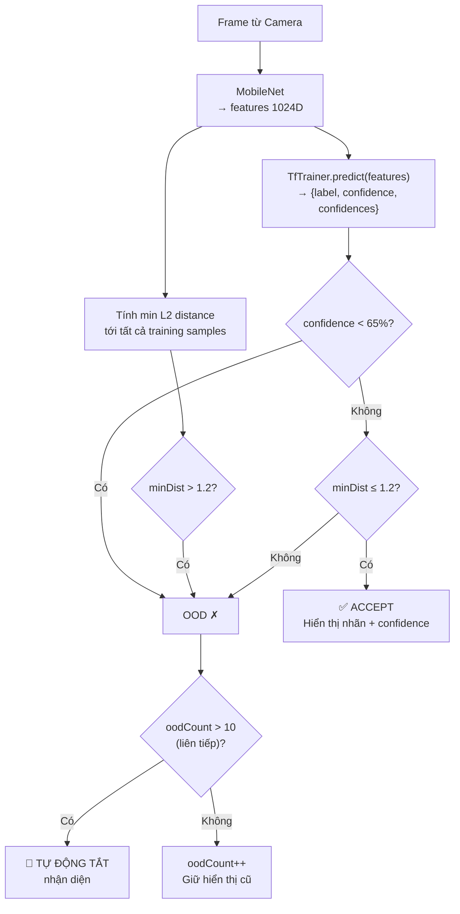
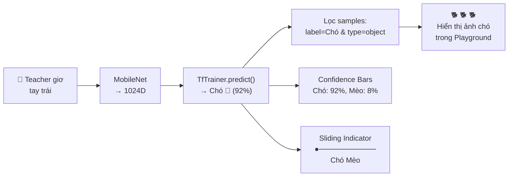
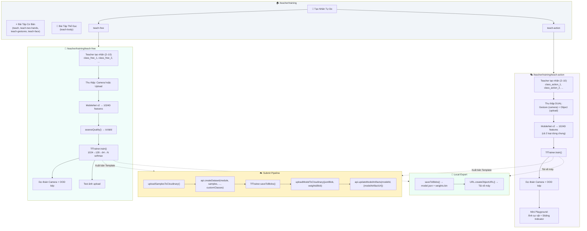

# Chế Độ Phân Loại Ảnh Tự Do & Gán Nhãn Bằng Hành Động — Implementation Plan

> [!NOTE]
> **Tính năng**: Hai chế độ huấn luyện AI mới trên trang `/teacher/training`:
> - **Teach-Free** (`/teacher/training/teach-free`): Phân loại ảnh tự do — tương tự Google Teachable Machine
> - **Teach-Action** (`/teacher/training/teach-action`): Gán nhãn bằng hành động — ánh xạ cử chỉ → sự vật
> - Sử dụng **MobileNet v2** thay vì MediaPipe Landmarks, trích xuất vector đặc trưng **1024 chiều** từ ảnh thô
> - Huấn luyện mạng nơ-ron MLP phân loại (`TfTrainer`) trực tiếp trên trình duyệt

---

## 1. Tổng quan kiến trúc hiện tại — Tại sao cần MobileNet?

| Bài | challengeType | Mô hình trích xuất | Kích thước vector | Nhãn |
|-----|--------------|--------------------|--------------------|------|
| Đếm ngón (1 tay) | `teach` | MediaPipe Hands | 42D (21 keypoints × 2) | Cố định: `1 Ngón`, `2 Ngón` + động: `3/4/5 Ngón` |
| Đếm ngón (2 tay) | `teach-two-hands` | MediaPipe Hands | 42D | Cố định: `class_1`→`class_4` |
| Cử chỉ tay | `teach-gestures` | MediaPipe Hands | 42D | Cố định: `class_1`, `class_2` |
| Cảm xúc mặt | `teach-face` | MediaPipe Face | 936D (468 × 2) | Cố định: `class_1`→`class_3` |
| Động tác thể dục | `teach-body` | MediaPipe Pose | 66D (33 × 2) | Tự do (động) |
| **Phân loại ảnh tự do** | **`teach-free`** | **MobileNet v2** | **1024D** | **Tự do (2–10 nhãn)** |
| **Gán nhãn hành động** | **`teach-action`** | **MobileNet v2** | **1024D** | **Tự do (2–10 nhãn)** |

**Vấn đề của MediaPipe:** Các bài truyền thống chỉ nhận diện được **cơ thể người** (tay, mặt, thân) thông qua tọa độ keypoints. Nếu muốn AI phân biệt **chó/mèo**, **táo/lê**, hay bất kỳ vật thể nào — MediaPipe không thể làm được vì nó không phát hiện được vật thể ngoài cơ thể.

**Giải pháp — Transfer Learning với MobileNet v2:**

```
Ảnh bất kỳ (640×480)
  → Resize 224×224
  → MobileNet v2 (frozen, pre-trained ImageNet)
  → Feature Vector 1024D (L2 normalized)
  → TfTrainer MLP (1024→128→64→N softmax)
  → Prediction
```

MobileNet v2 đã được huấn luyện trên 1.4 triệu ảnh ImageNet, "hiểu" được đặc trưng thị giác tổng quát (cạnh, hình dạng, kết cấu, màu sắc). Ta **đóng băng** backbone này và chỉ huấn luyện một đầu phân loại nhỏ (MLP) trên top — technique gọi là **Transfer Learning**.

---

## 2. Vấn đề 1: Trích xuất đặc trưng — MobileNet Feature Extractor

### Hiện trạng (trước commit `8d50ff2f`)

Không có bất kỳ mô hình trích xuất đặc trưng ảnh thô nào. Tất cả các trang đều dựa vào MediaPipe để detect skeleton rồi lấy tọa độ keypoints.

### Giải pháp: Singleton `MobileNetExtractor`

#### [NEW] [`mobilenet-extractor.ts`](file:///d:/HOCTAP/Learn-Hub/client/src/lib/mobilenet-extractor.ts)

```typescript
// mobilenet-extractor.ts — Singleton pattern
import { loadTf } from './tf-loader';
import { TFStatic } from '@/types/models';

const MOBILENET_URL =
  'https://tfhub.dev/google/tfjs-model/imagenet/mobilenet_v2_100_224/feature_vector/3/default/1';
const INPUT_SIZE = 224;
export const MOBILENET_FEATURE_DIM = 1024;

class MobileNetExtractor {
  private static instance: MobileNetExtractor | null = null;
  private tf: TFStatic | null = null;
  private model: any = null;
  private _status: 'idle' | 'loading' | 'ready' | 'error' = 'idle';
  private loadPromise: Promise<void> | null = null;

  private constructor() {}

  static getInstance(): MobileNetExtractor {
    if (!MobileNetExtractor.instance) {
      MobileNetExtractor.instance = new MobileNetExtractor();
    }
    return MobileNetExtractor.instance;
  }

  async load(): Promise<void> {
    if (this._status === 'ready') return;
    if (this.loadPromise) return this.loadPromise;
    this.loadPromise = this._doLoad();
    return this.loadPromise;
  }

  private async _doLoad(): Promise<void> {
    this._status = 'loading';
    this.tf = await loadTf();
    this.model = await (this.tf as any).loadGraphModel(MOBILENET_URL, { fromTFHub: true });
    this._status = 'ready';
  }
```

**Pipeline trích xuất (7 bước trong `tf.tidy()`):**

```typescript
  extractFeatures(source: HTMLCanvasElement | HTMLVideoElement | HTMLImageElement): number[] {
    const tf = this.tf as unknown as TFStaticExtended;
    return tf.tidy(() => {
      // 1. Chuyển source → tensor 3D [h, w, 3]
      let imgTensor = tf.browser.fromPixels(source);
      // 2. Resize về 224×224
      imgTensor = tf.image.resizeBilinear(imgTensor, [INPUT_SIZE, INPUT_SIZE]);
      // 3. Normalize pixel [0,255] → [0,1]
      const normalized = tf.div(imgTensor, 255.0);
      // 4. Expand dims → batch [1, 224, 224, 3]
      const batched = tf.expandDims(normalized, 0);
      // 5. MobileNet inference → output shape [1, 1024]
      const output = this.model.predict(batched);
      // 6. Lấy dữ liệu ra mảng JS
      const rawFeatures = Array.from(output.dataSync()) as number[];
      // 7. L2 normalization
      const norm = Math.sqrt(rawFeatures.reduce((sum, v) => sum + v * v, 0)) || 1;
      return rawFeatures.map(v => v / norm);
    });
  }
```

**Các phương thức tiện ích khác:**

| Phương thức | Input | Output | Mô tả |
|------------|-------|--------|--------|
| `extractFeaturesFromVideo(video)` | `HTMLVideoElement` | `number[]` | Vẽ frame hiện tại lên canvas tạm → `extractFeatures()` |
| `extractFeaturesFromBase64(base64)` | `string` | `Promise<number[]>` | Tạo `Image` element, đợi load → `extractFeatures()` |
| `dispose()` | — | `void` | Giải phóng model và tensor cache |

> [!IMPORTANT]
> **Tại sao dùng Singleton?** MobileNet v2 nặng ~7MB. Nếu mỗi component tạo instance riêng, trình duyệt sẽ tải lại model nhiều lần. Singleton đảm bảo chỉ tải 1 lần, tất cả component dùng chung.

> [!NOTE]
> **Tại sao L2 normalize?** Các vector đặc trưng thô từ MobileNet có magnitude khác nhau tùy ảnh. L2 normalization đưa tất cả vector về cùng hypersphere đơn vị, giúp khoảng cách Euclidean (dùng cho KNN và OOD detection) ổn định và có ý nghĩa thống nhất.

---

## 3. Vấn đề 2: React Hook quản lý vòng đời MobileNet

### Hiện trạng

Các trang truyền thống dùng `useMl5Handpose()`, `useMl5BodyPose()` — hook chuyên cho MediaPipe. Không có hook tương đương cho MobileNet.

### Giải pháp

#### [NEW] [`useMobilenet.ts`](file:///d:/HOCTAP/Learn-Hub/client/src/hooks/useMobilenet.ts)

```typescript
export function useMobilenet() {
  const [modelStatus, setModelStatus] = useState<'loading' | 'ready' | 'error'>('loading');
  const extractorRef = useRef<MobileNetExtractor | null>(null);

  useEffect(() => {
    let cancelled = false;
    const init = async () => {
      const extractor = MobileNetExtractor.getInstance();
      extractorRef.current = extractor;
      await extractor.load();
      if (!cancelled) setModelStatus('ready');
    };
    init().catch(() => { if (!cancelled) setModelStatus('error'); });
    return () => { cancelled = true; };
    // Không dispose singleton — có thể tái sử dụng bởi component khác
  }, []);

  const extractFeatures = useCallback(
    (source) => extractorRef.current?.extractFeatures(source) ?? null,
    [modelStatus]
  );

  const extractFeaturesFromVideo = useCallback(
    (video) => extractorRef.current?.extractFeaturesFromVideo(video) ?? null,
    [modelStatus]
  );

  const extractFeaturesFromBase64 = useCallback(
    async (base64) => extractorRef.current?.extractFeaturesFromBase64(base64) ?? null,
    [modelStatus]
  );

  return { modelStatus, extractFeatures, extractFeaturesFromVideo, extractFeaturesFromBase64 };
}
```

**So sánh với hook truyền thống:**

| Hook | Model | Output | Dùng cho |
|------|-------|--------|---------|
| `useMl5Handpose()` | MediaPipe Hands | `keypoints[21]` → 42D | teach, teach-two-hands, teach-gestures |
| `useMl5BodyPose()` | MediaPipe Pose | `keypoints[33]` → 66D | teach-body |
| **`useMobilenet()`** | **MobileNet v2** | **feature vector 1024D** | **teach-free, teach-action** |

---

## 4. Vấn đề 3: Mở rộng StoredSample — Phân biệt nguồn gốc mẫu

### Hiện trạng

Interface `StoredSample` trong [`knn-classifier.ts`](file:///d:/HOCTAP/Learn-Hub/client/src/lib/knn-classifier.ts) có `sourceId` để track class nào tạo ra sample, nhưng **không phân biệt** sample đến từ camera hay từ ảnh upload.

### Vấn đề

Chế độ `teach-action` cần thu thập **2 loại dữ liệu khác nhau** cho cùng 1 nhãn:
- `'gesture'`: Cử chỉ tay/hành động quay bằng camera
- `'object'`: Ảnh sự vật (chó, mèo, táo...) upload từ máy

Khi AI dự đoán, cần lọc ra chỉ ảnh `'object'` để hiển thị trong Playground.

### Giải pháp

#### [MODIFY] [`knn-classifier.ts`](file:///d:/HOCTAP/Learn-Hub/client/src/lib/knn-classifier.ts) — Dòng 20

```typescript
export interface StoredSample {
  id?: string;
  label: string;
  features: number[];       // 42D (tay), 936D (mặt), 1024D (MobileNet)
  sourceId?: string;
  sourceType?: 'gesture' | 'object';  // ← THÊM MỚI: nguồn gốc sample
  thumbnail?: string;
  rawThumbnail?: string;
  isValid?: boolean;
  isQuestionable?: boolean;
  questionableReason?: string;
  invalidReason?: string;
  quality?: SampleQualityMeta;
  aiFeedback?: { ... };
}
```

> [!WARNING]
> **Chỉ `teach-action` sử dụng `sourceType`.** Các trang khác (teach, teach-face, teach-gestures...) KHÔNG set `sourceType` — field này là `undefined` và bị bỏ qua hoàn toàn. Không ảnh hưởng backward compatibility.

---

## 5. Chế Độ 1: Phân Loại Ảnh Tự Do (`teach-free`)

### 5.1 Tổng quan

Chế độ cho phép Giáo viên tạo **2–10 nhãn tùy ý** (VD: Chó 🐶, Mèo 🐱, Ô tô 🚗) và huấn luyện AI phân biệt bằng ảnh thực từ camera hoặc file upload.

#### [NEW] [`teach-free/page.tsx`](file:///d:/HOCTAP/Learn-Hub/client/src/app/(private)/teacher/training/teach-free/page.tsx) — 1283 dòng

### 5.2 Hằng số cấu hình

```typescript
const MIN_SAMPLES_PER_CLASS = 5;       // Tối thiểu 5 ảnh hợp lệ / nhãn
const MAX_CLASSES = 10;                // Tối đa 10 nhãn
const OOD_CONFIDENCE_THRESHOLD = 65;   // Softmax < 65% → ngoài phân phối
const OOD_MAX_KNN_DISTANCE = 1.2;     // L2 distance > 1.2 → ngoài phân phối
```

### 5.3 State quản lý (23 biến useState)

| Nhóm | State | Type | Default | Mô tả |
|------|-------|------|---------|--------|
| **Nhãn** | `classes` | `{ id, label, emoji }[]` | `[]` | Danh sách nhãn tùy biến |
| | `newLabelInput` | `string` | `''` | Input tên nhãn mới |
| | `newEmojiInput` | `string` | `'✨'` | Input emoji nhãn mới |
| **Dữ liệu** | `samples` | `StoredSample[]` | `[]` | Tất cả mẫu đã thu thập |
| | `activeClass` | `string` | `''` | Class ID đang được chọn |
| **Huấn luyện** | `isTraining` | `boolean` | `false` | Đang train? |
| | `isTrained` | `boolean` | `false` | Đã train xong? |
| | `trainingProgress` | `number` | `0` | Tiến trình 0–100% |
| | `trainingLogs` | `{ epoch, loss, acc }[]` | `[]` | Log mỗi epoch |
| **Siêu tham số** | `hpEpochs` | `number` | `50` | Số epoch (10–200) |
| | `hpBatchSize` | `number` | `32` | Batch size (8–128) |
| | `hpLearningRate` | `number` | `0.005` | Learning rate (0.0001–0.01) |
| | `showSettings` | `boolean` | `false` | Hiện/ẩn panel cài đặt |
| **Dự đoán** | `predictedLabel` | `string` | `'Chưa nhận diện... 🤔'` | Nhãn dự đoán |
| | `confidence` | `number` | `0` | Độ tự tin (%) |
| | `confidences` | `Record<string, number>` | `{}` | Phân phối xác suất |
| | `predictionActive` | `boolean` | `false` | Bật/tắt dự đoán camera |
| **Chụp liên tục** | `isCapturing` | `boolean` | `false` | Đang giữ chụp? |
| **Test ảnh tĩnh** | `predictImage` | `string \| null` | `null` | Ảnh upload để test |
| | `predictResult` | `{ label, confidence, confidences, isOOD } \| null` | `null` | Kết quả test ảnh |
| | `isPredicting` | `boolean` | `false` | Đang xử lý ảnh test? |
| **Nộp bài** | `showSubmitModal` | `boolean` | `false` | Hiện modal nộp? |
| | `teacherNotes` | `string` | `'Bộ dữ liệu mẫu...'` | Ghi chú giáo viên |
| | `isSubmitting` / `uploadProgress` / `submitSuccess` | — | — | Trạng thái nộp |

### 5.4 Class ID — Quy tắc đặt tên

```typescript
const classIdCounterRef = useRef(0);

const addClass = () => {
  const newId = `class_free_${++classIdCounterRef.current}`;
  // → class_free_1, class_free_2, class_free_3, ...
};
```

> [!NOTE]
> **Prefix `class_free_`** khác hoàn toàn với `class_1`→`class_7` của các bài truyền thống → **KHÔNG xung đột** Class ID với teach, teach-two-hands, teach-gestures, hay teach-face.

### 5.5 Luồng thu thập dữ liệu

```mermaid
flowchart TD
    A["Teacher tạo nhãn\n(VD: Chó 🐶)"] --> B{Cách thu thập?}
    B -->|"Camera"| C["Giữ nút chụp liên tục\n(Hold-to-Record, 300ms/ảnh)"]
    B -->|"Upload"| D["Tải ảnh từ máy tính\n(Chọn nhiều file cùng lúc)"]
    
    C --> E["extractFeaturesFromVideo(video)\n→ MobileNet → 1024D vector"]
    D --> F["extractFeaturesFromBase64(base64)\n→ MobileNet → 1024D vector"]
    
    E --> G["assessQuality(canvas)"]
    G --> H{isDark || isBlurry?}
    H -->|Có| I["isValid = false\n⚠️ Toast cảnh báo"]
    H -->|Không| J["isValid = true"]
    
    F --> K["isValid = true\n(Upload không kiểm tra quality)"]
    
    I --> L["Thêm vào samples[]\nid, label, sourceId, features, thumbnail, isValid"]
    J --> L
    K --> L
```

### 5.6 Huấn luyện mô hình

```typescript
const handleTrain = async () => {
  const validSamples = samples.filter((s) => s.isValid !== false);
  
  await trainerRef.current.train(
    validSamples,
    (_epoch, progress, loss, acc) => {
      setTrainingProgress(progress);         // Thanh tiến trình
      setTrainingLogs(prev => [...prev, { epoch: _epoch, loss, acc }]);
    },
    {
      epochs: hpEpochs,          // 50 mặc định
      batchSize: hpBatchSize,    // 32 mặc định
      learningRate: hpLearningRate // 0.005 mặc định
    }
  );
};
```

**Kiến trúc mạng nơ-ron (bên trong `TfTrainer`):**

```
Input Layer: 1024 units (MobileNet features)
  ↓
Dense Layer 1: 128 units, ReLU activation
  ↓
Dense Layer 2: 64 units, ReLU activation
  ↓
Output Layer: N units, Softmax activation (N = số nhãn)
  ↓
Optimizer: Adam | Loss: Categorical Cross-entropy
```

### 5.7 Dự đoán thời gian thực — OOD Detection kép

```typescript
// useEffect prediction loop — chạy bằng requestAnimationFrame
const predict = async () => {
  const features = extractFeaturesFromVideo(videoRef.current);
  const result = await trainerRef.current.predict(features);

  // === KIỂM TRA #1: Softmax confidence ===
  const isLowConf = result.confidence < 65; // OOD_CONFIDENCE_THRESHOLD

  // === KIỂM TRA #2: Khoảng cách L2 tới sample gần nhất ===
  let minDist = Infinity;
  for (const s of validSamples) {
    let dist = 0;
    for (let i = 0; i < features.length; i++) {
      const d = features[i] - s.features[i];
      dist += d * d;
    }
    dist = Math.sqrt(dist);
    if (dist < minDist) minDist = dist;
  }
  const isFar = minDist > 1.2; // OOD_MAX_KNN_DISTANCE

  // === KẾT LUẬN ===
  const isOod = isLowConf || isFar;

  if (isOod) {
    oodCount++;
    if (oodCount > 10) {
      // TỰ ĐỘNG TẮT sau 10 frame OOD liên tiếp
      setPredictionActive(false);
      showToast('👀 Không thấy đối tượng đã học. Đã tắt nhận diện.');
    }
  } else {
    oodCount = 0;
    setPredictedLabel(result.label);
    setConfidence(result.confidence);
    setConfidences(result.confidences);
  }
};
```

**Luồng OOD Detection:**



> [!IMPORTANT]
> **Tại sao cần 2 tiêu chí OOD?**
> - **Chỉ softmax confidence:** Mạng nơ-ron thường **quá tự tin** trên input lạ (overconfident). VD: Đưa mặt người vào model phân biệt chó/mèo → model vẫn trả confidence 80%+ cho "Chó".
> - **Chỉ KNN distance:** Nếu model train kém (underfitting), KNN distance có thể thấp nhưng prediction sai.
> - **Kết hợp cả hai:** Chỉ accept khi model tự tin VÀ ảnh gần với dữ liệu đã học → giảm false positive đáng kể.

### 5.8 Self-Evaluation — Leave-One-Out KNN

```typescript
const selfAccuracy = useMemo(() => {
  const validSamples = samples.filter((s) => s.isValid !== false);
  if (validSamples.length < 4) return null;

  let correct = 0;
  validSamples.forEach((sample, i) => {
    const others = validSamples.filter((_, j) => j !== i);
    if (others.length > 0) {
      const result = classifyKNN(sample.features, others, 3);
      if (result.label === sample.label) correct++;
    }
  });

  return Math.round((correct / validSamples.length) * 100);
}, [samples]);
```

**Ý nghĩa:** Mỗi sample được bỏ ra, rồi phân loại bằng KNN (k=3) dựa trên các sample còn lại. Nếu accuracy thấp → dữ liệu bị lẫn nhau → Teacher cần chụp ảnh rõ ràng hơn.

---

## 6. Chế Độ 2: Gán Nhãn Bằng Hành Động (`teach-action`)

### 6.1 Khái niệm "Action-to-Object Mapping"

Khác biệt cốt lõi so với `teach-free`: mỗi nhãn nhận dữ liệu từ **2 nguồn**:

| Nguồn | `sourceType` | Ví dụ | Mục đích |
|-------|-------------|-------|---------|
| Camera (cử chỉ) | `'gesture'` | Giơ tay trái | AI học để **nhận diện** cử chỉ |
| Upload (sự vật) | `'object'` | 3 ảnh con chó | AI **liên kết** cử chỉ với sự vật; Playground **hiển thị** ảnh |

**Cả hai loại đều được đưa vào huấn luyện chung** dưới cùng 1 nhãn → AI hiểu "Giơ tay trái" VÀ "Ảnh con chó" = `"Chó"`.

#### [NEW] [`teach-action/page.tsx`](file:///d:/HOCTAP/Learn-Hub/client/src/app/(private)/teacher/training/teach-action/page.tsx) — 761 dòng

### 6.2 Class ID — Prefix khác biệt

```typescript
const classIdCounterRef = useRef(0);

const addClass = () => {
  const newId = `class_action_${++classIdCounterRef.current}`;
  // → class_action_1, class_action_2, class_action_3, ...
};
```

> [!NOTE]
> **3 prefix riêng biệt** đảm bảo không xung đột:
> - `class_1`→`class_7`: Các bài truyền thống
> - `class_free_*`: Teach-free
> - `class_action_*`: Teach-action

### 6.3 Thu thập dữ liệu phân đôi (Dual-Modality)

```typescript
// captureSample nhận tham số type
const captureSample = (type: 'gesture' | 'object') => {
  // ... MobileNet extraction ...
  
  setSamples((prev) => [
    ...prev,
    {
      id: crypto.randomUUID(),
      label: activeClassLabel,
      sourceId: activeClass,
      sourceType: type,       // ← Phân loại nguồn gốc
      features,
      thumbnail,
      rawThumbnail: thumbnail,
      isValid,
      quality,
    },
  ]);
};

// handleFileUpload cũng nhận type
const handleFileUpload = async (e, type: 'gesture' | 'object') => {
  // ...
  setSamples((prev) => [...prev, {
    ...newSample,
    sourceType: type,  // ← Upload cũng ghi sourceType
  }]);
};
```

**Giao diện thu thập được chia đôi:**

```
┌──────────────────────────────────────────┐
│ 🏷️ Nhãn: Chó 🐶                          │
│                                          │
│ ┌─────────────────┐ ┌──────────────────┐ │
│ │ 🖼️ Ảnh sự vật    │ │ 👋 Ảnh cử chỉ tay │ │
│ │ (Amber theme)   │ │ (Emerald theme)  │ │
│ │                 │ │                  │ │
│ │ [Tải ảnh lên]   │ │ [Tải ảnh lên]    │ │
│ │ [Giữ để chụp]   │ │ [Giữ để chụp]    │ │
│ │                 │ │                  │ │
│ │ Gallery: 🐕🐕🐕 │ │ Gallery: ✋✋✋   │ │
│ └─────────────────┘ └──────────────────┘ │
└──────────────────────────────────────────┘
```

### 6.4 clearClassSamples — Hỗ trợ xóa theo loại

```typescript
const clearClassSamples = (classId: string, type?: 'object' | 'gesture') => {
  setSamples((prev) => prev.filter((s) => {
    if (s.sourceId !== classId) return true;        // Giữ samples class khác
    if (type && s.sourceType !== type) return true;  // Giữ samples loại khác
    return false;                                    // Xóa
  }));
};
```

**So sánh với `teach-free`:** `teach-free` chỉ có `clearClassSamples(classId)` (không tham số `type`), vì không phân biệt gesture/object.

### 6.5 Mini Playground — Action-to-Image Display

Khi `predictionActive === true` và model đã train:

```typescript
{/* Display uploaded object images */}
{(() => {
  // Lọc samples: cùng nhãn dự đoán VÀ là ảnh sự vật (object)
  const displaySamples = samples.filter(
    (s) => s.label === predictedLabel && s.sourceType === 'object'
  );
  
  if (displaySamples.length > 0) {
    return (
      <div className="bg-white/10 rounded-2xl p-4 mb-4 border border-white/20">
        <p className="text-xs font-semibold text-violet-300 mb-2">
          Ảnh sự vật tương ứng:
        </p>
        <div className="flex gap-2 overflow-x-auto pb-1">
          {displaySamples.slice(0, 10).map((s) => (
            <div key={s.id} className="w-16 h-16 shrink-0 rounded-xl overflow-hidden">
              
            </div>
          ))}
        </div>
      </div>
    );
  }
  return null;
})()}
```

**Luồng tương tác:**



### 6.6 Sliding Indicator — Chỉ báo vị trí nhãn

```typescript
{/* Sliding indicator */}
{classes.length >= 2 && (
  <div className="relative h-3 bg-white/10 rounded-full">
    <div
      className="absolute w-5 h-5 bg-gradient-to-r from-amber-400 to-orange-400 rounded-full"
      style={{
        left: `${(() => {
          const topIdx = classes.findIndex((c) => c.label === predictedLabel);
          if (topIdx < 0 || classes.length < 2) return 50;
          return (topIdx / (classes.length - 1)) * 100;
          // VD: 3 nhãn [Chó, Mèo, Xe] → topIdx=0 → 0%, topIdx=1 → 50%, topIdx=2 → 100%
        })()}%`,
        transform: 'translate(-50%, -50%)',
      }}
    />
  </div>
)}
```

---

## 7. So sánh `teach-free` vs `teach-action`

| Tiêu chí | `teach-free` | `teach-action` |
|----------|-------------|----------------|
| **Đường dẫn** | `/teacher/training/teach-free` | `/teacher/training/teach-action` |
| **Màu chủ đạo** | Teal/Indigo | Violet/Purple |
| **Class ID prefix** | `class_free_*` | `class_action_*` |
| **Số dòng code** | 1283 | 761 |
| **Nguồn dữ liệu** | 1 loại (Camera hoặc Upload) | 2 loại (Gesture + Object) |
| **`sourceType` trong sample** | Không set (undefined) | `'gesture'` hoặc `'object'` |
| **`clearClassSamples()`** | `(classId)` | `(classId, type?)` — có thể xóa theo loại |
| **File input refs** | 1 (`fileInputRef`) | 2 (`fileInputObjectRef`, `fileInputGestureRef`) |
| **Hold-to-record state** | `isCapturing: boolean` | `capturingType: 'gesture' \| 'object' \| null` |
| **Prediction display** | Nhãn + Confidence bars | Nhãn + Confidence bars + **Ảnh sự vật gallery** + **Sliding indicator** |
| **OOD logic** | Giống nhau | Giống nhau |
| **Self-evaluation** | Leave-one-out KNN (k=3) | Leave-one-out KNN (k=3) |
| **TfTrainer architecture** | Giống nhau (1024→128→64→N) | Giống nhau (1024→128→64→N) |
| **Submit module name** | `'teach-free'` | `'teach-action'` |

---

## 8. Điểm truy cập giao diện — Training Dashboard

#### [MODIFY] [`training/page.tsx`](file:///d:/HOCTAP/Learn-Hub/client/src/app/(private)/teacher/training/page.tsx) — Thêm section "Tạo Nhãn Tự Do"

```typescript
// Dòng 115-148: Section mới
<div>
  <h2 className="text-2xl font-bold text-slate-800 mb-6 flex items-center gap-2">
    <FlaskConical className="w-8 h-8 text-teal-500" /> Tạo Nhãn Tự Do
  </h2>
  <div className="grid grid-cols-1 md:grid-cols-2 gap-6">
    <Link href="/teacher/training/teach-free">
      <div className="p-8 rounded-3xl border-4 bg-teal-50 border-teal-200 hover:border-teal-400">
        <div className="w-20 h-20 bg-white rounded-full flex items-center justify-center text-4xl">
          🧪
        </div>
        <h2 className="text-2xl font-bold">Phân Loại Ảnh Tự Do</h2>
        <p>Tạo nhãn tùy ý và huấn luyện AI phân biệt bằng ảnh thực.</p>
      </div>
    </Link>
    <Link href="/teacher/training/teach-action">
      <div className="p-8 rounded-3xl border-4 bg-violet-50 border-violet-200 hover:border-violet-400">
        <div className="w-20 h-20 bg-white rounded-full flex items-center justify-center text-4xl">
          🎭
        </div>
        <h2 className="text-2xl font-bold">Gán Nhãn Bằng Hành Động</h2>
        <p>Tạo nhiều nhãn, dùng cử chỉ tay để gán — AI học liên kết hành động với nhãn.</p>
      </div>
    </Link>
  </div>
</div>
```

**Bố cục trang dashboard sau khi cập nhật:**

| Section | Nội dung |
|---------|---------|
| ⭐ Bài Tập Cơ Bản | 4 card: Đếm ngón 1 tay, 2 tay, Cử chỉ, Biểu cảm |
| 🤸 Bài Tập Thể Dục | 1 card: Tất cả Động tác (teach-body) |
| 🧪 **Tạo Nhãn Tự Do** | **2 card: Phân Loại Ảnh Tự Do + Gán Nhãn Bằng Hành Động** |

---

## 9. Xuất bản & Lưu trữ — MLOps Pipeline

### 9.1 Luồng submit (cả `teach-free` và `teach-action`)

```typescript
const handleSubmit = async () => {
  // BƯỚC 1: Upload ảnh lên Cloudinary (nếu configured)
  if (isCloudinaryConfigured()) {
    processedSamples = await uploadSamplesToCloudinary(
      samples, 'teach-free', // hoặc 'teach-action'
      (uploaded, total) => setUploadProgress(`Tải ảnh ${uploaded}/${total}...`)
    );
  }

  // BƯỚC 2: Tạo dataset template trên server
  const response = await api.createDataset(
    'teach-free',         // hoặc 'teach-action'
    processedSamples,
    selfAccuracy ?? 100,
    '',                   // description
    true,                 // isTemplate
    teacherNotes,
    true,                 // isPublished
    'camera',             // inputType
    classes               // customClasses → lưu vào DB
  );

  // BƯỚC 3: Export model weights → upload lên Cloudinary
  if (trainerRef.current?.isTrained()) {
    const blobs = await trainerRef.current.saveToBlobs();
    // → { jsonBlob: Blob (model.json), weightsBlob: Blob (weights.bin) }
    
    if (blobs && isCloudinaryConfigured()) {
      const { modelJsonUrl } = await uploadModelToCloudinary(
        blobs.jsonBlob, blobs.weightsBlob, 'teach-free'
      );
      
      // BƯỚC 4: Cập nhật model artifact URL trên server
      await api.updateModelArtifacts(response.model.id, {
        algorithm: 'neural_network',
        modelArtifactUrl: modelJsonUrl,
        testScore: selfAccuracy ?? 100,
      });
    }
  }
};
```

### 9.2 Export model offline

```typescript
// Tải model.json + weights.bin về máy tính
const blobs = await trainerRef.current?.saveToBlobs();
if (!blobs) return;

// File 1: model.json (topology + metadata)
const jsonUrl = URL.createObjectURL(blobs.jsonBlob);
const a1 = document.createElement('a');
a1.href = jsonUrl; a1.download = 'model.json'; a1.click();
URL.revokeObjectURL(jsonUrl);

// File 2: weights.bin (trọng số nơ-ron)
const weightsUrl = URL.createObjectURL(blobs.weightsBlob);
const a2 = document.createElement('a');
a2.href = weightsUrl; a2.download = 'weights.bin'; a2.click();
URL.revokeObjectURL(weightsUrl);
```

---

## 10. Proposed Changes — Danh sách files

### Tầng Client

---

#### [NEW] [`mobilenet-extractor.ts`](file:///d:/HOCTAP/Learn-Hub/client/src/lib/mobilenet-extractor.ts) — MobileNet v2 Feature Extractor

1. Singleton class `MobileNetExtractor` với `getInstance()`
2. Tải MobileNet v2 GraphModel từ TFHub (~7MB, browser cached)
3. `extractFeatures()`: Canvas/Video/Image → 1024D vector (L2 normalized)
4. `extractFeaturesFromVideo()`: Tiện ích chụp frame video hiện tại
5. `extractFeaturesFromBase64()`: Tiện ích xử lý ảnh base64
6. `dispose()`: Giải phóng tài nguyên
7. Interface `TFStaticExtended` và `TFTensorExt` cho TF.js CDN type safety

---

#### [NEW] [`useMobilenet.ts`](file:///d:/HOCTAP/Learn-Hub/client/src/hooks/useMobilenet.ts) — React Hook quản lý MobileNet lifecycle

1. `modelStatus`: `'loading' | 'ready' | 'error'`
2. Tự động nạp MobileNet singleton khi mount, không dispose khi unmount (tái sử dụng)
3. 3 hàm `useCallback`: `extractFeatures`, `extractFeaturesFromVideo`, `extractFeaturesFromBase64`

---

#### [MODIFY] [`knn-classifier.ts`](file:///d:/HOCTAP/Learn-Hub/client/src/lib/knn-classifier.ts) — Thêm `sourceType` vào StoredSample

1. Thêm `sourceType?: 'gesture' | 'object'` vào interface `StoredSample` (dòng 20)
2. Không ảnh hưởng các trang khác (field optional, mặc định undefined)

---

#### [NEW] [`teach-free/page.tsx`](file:///d:/HOCTAP/Learn-Hub/client/src/app/(private)/teacher/training/teach-free/page.tsx) — Phân Loại Ảnh Tự Do (1283 dòng)

1. 23 `useState` + 6 `useRef` quản lý toàn bộ vòng đời
2. **Class management**: `addClass()` (class_free_* prefix), `removeClass()`, `clearClassSamples()`
3. **Data collection**: `captureSample()` (Camera → MobileNet → assessQuality → sample), `handleFileUpload()` (File → base64 → MobileNet → sample), Hold-to-Record (300ms interval)
4. **Training**: `handleTrain()` với TfTrainer + hyperparameters tuỳ chỉnh
5. **Prediction**: `requestAnimationFrame` loop + OOD detection kép (confidence + KNN distance) + auto-stop sau 10 frame
6. **Test ảnh tĩnh**: `handlePredictUpload()` + OOD check cho ảnh upload
7. **Self-evaluation**: Leave-one-out KNN (k=3) tính accuracy trước khi nộp
8. **Submit**: Cloudinary upload samples + model weights + `api.createDataset('teach-free', ...)`
9. **Export**: Download model.json + weights.bin trực tiếp

---

#### [NEW] [`teach-action/page.tsx`](file:///d:/HOCTAP/Learn-Hub/client/src/app/(private)/teacher/training/teach-action/page.tsx) — Gán Nhãn Bằng Hành Động (761 dòng)

1. **Dual-modality data collection**: `captureSample(type)` và `handleFileUpload(e, type)` nhận tham số `'gesture' | 'object'`
2. **Split UI**: 2 khu vực thu thập riêng biệt (Amber: Object, Emerald: Gesture) với 2 file input ref riêng
3. **`clearClassSamples(classId, type?)`**: Hỗ trợ xóa theo loại (chỉ xóa gesture hoặc chỉ xóa object)
4. **`capturingType: 'gesture' | 'object' | null`**: State hold-to-record phân biệt đang chụp loại nào
5. **Mini Playground** (khi prediction active):
   - Confidence bars cho tất cả nhãn
   - **Object gallery**: Lọc `samples.filter(s => s.label === predictedLabel && s.sourceType === 'object')` → hiển thị ảnh sự vật
   - **Sliding indicator dot**: Vị trí = `(topIdx / (classes.length - 1)) * 100%`
6. Phần còn lại (training, OOD, self-eval, submit, export) **GIỐNG** teach-free

---

#### [MODIFY] [`training/page.tsx`](file:///d:/HOCTAP/Learn-Hub/client/src/app/(private)/teacher/training/page.tsx) — Thêm section vào Training Dashboard

1. Import thêm icon `FlaskConical` từ `lucide-react` (dòng 3)
2. Thêm section "Tạo Nhãn Tự Do" (dòng 115–148): 2 card Link đến `/teach-free` và `/teach-action`

---

### Tầng Server (KHÔNG cần sửa)

> [!TIP]
> Server **đã sẵn sàng**. Trường `customClasses` (JSON) đã có trong [`dataset.entity.ts`](file:///d:/HOCTAP/Learn-Hub/server/src/modules/datasets/entities/dataset.entity.ts) và [`create-dataset.dto.ts`](file:///d:/HOCTAP/Learn-Hub/server/src/modules/datasets/dto/create-dataset.dto.ts). API `createDataset` đã accept `customClasses` array. Không cần thêm migration hay endpoint mới.

---

## 11. Sơ đồ tổng thể luồng hệ thống



---

## 12. Các bài khác KHÔNG bị ảnh hưởng

> [!IMPORTANT]
> **Xác nhận:** Tính năng mới **hoàn toàn cô lập** khỏi các bài truyền thống:
> - `teach-free` và `teach-action` dùng MobileNet (không import MediaPipe)
> - Class ID prefix khác (`class_free_*`, `class_action_*`) → không xung đột
> - Không sửa bất kỳ Golden Dataset nào (`golden-dataset.ts`, `golden-gestures-dataset.ts`, `golden-face-dataset.ts`)
> - Không sửa `TeachPanel.tsx`, `BodyTeachPanel.tsx`, hay bất kỳ trang Student nào
> - Field `sourceType` trong `StoredSample` là optional → các trang cũ không set, không bị lỗi

---

## 13. Bộ Dữ Liệu Kaggle Tham Khảo — Dùng Để Demo & Kiểm Thử

> [!NOTE]
> Các bộ dữ liệu bên dưới được chọn lọc từ Kaggle, phù hợp để **demo tính năng `teach-free` và `teach-action`** cho Giáo viên. Tiêu chí chọn:
> - Kích thước nhỏ (< 100MB), tải nhanh
> - Ảnh rõ ràng, dễ phân biệt bằng mắt thường
> - Phân loại nhị phân (2 lớp) hoặc đa lớp đơn giản (3–5 lớp)
> - Phù hợp lứa tuổi học sinh (chủ đề thân thiện, không nhạy cảm)

### 13.1 Dataset cho `teach-free` — Phân loại ảnh tự do

#### 🐶🐱 Dataset 1: Chó vs Mèo (Mini)

| Thông tin | Chi tiết |
|-----------|---------|
| **Tên** | Cats-And-Dogs-Mini-Dataset |
| **URL** | [kaggle.com/datasets/aleemaparakatta/cats-and-dogs-mini-dataset](https://www.kaggle.com/datasets/aleemaparakatta/cats-and-dogs-mini-dataset) |
| **Dung lượng** | ~23MB |
| **Số ảnh** | ~816 ảnh (500 chó + 316 mèo) |
| **Cấu trúc** | `cats_set/` (316 ảnh) và `dogs_set/` (500 ảnh) |
| **Thư mục local** | `D:\HOCTAP\Learn-Hub\dataset\Cats_And_Dogs_Mini_Dataset\` |
| **Độ khó** | ⭐ Rất dễ — Nhị phân, ảnh rõ ràng |

**Cách dùng trên `teach-free`:**
1. Tạo nhãn `Chó 🐶` và `Mèo 🐱`
2. Bấm "Tải ảnh từ máy tính" → chọn 10–15 ảnh từ `dataset\Cats_And_Dogs_Mini_Dataset\dogs_set\`
3. Chuyển sang nhãn Mèo → tải 10–15 ảnh từ `cats_set\`
4. Bấm "Dạy AI Học" → Train
5. Bật camera, đưa ảnh chó/mèo trên điện thoại trước webcam → AI nhận diện đúng

---

#### 🍎 Dataset 2: Táo Khoẻ vs Táo Bệnh (từ PlantVillage)

| Thông tin | Chi tiết |
|-----------|---------|
| **Tên** | PlantVillage Dataset — Apple subset |
| **URL** | [kaggle.com/datasets/mohitsingh1804/plantvillage](https://www.kaggle.com/datasets/mohitsingh1804/plantvillage) |
| **Số ảnh** | 1,820 ảnh (1,316 táo khoẻ + 504 táo ghẻ) |
| **Cấu trúc** | `train/Apple___healthy/` (1316 ảnh) và `train/Apple___Apple_scab/` (504 ảnh) |
| **Thư mục local** | `D:\HOCTAP\Learn-Hub\dataset\Plant_Village\train\` |
| **Độ khó** | ⭐ Rất dễ — Lá xanh sạch vs lá có đốm nâu rõ ràng |

**Cách dùng trên `teach-free`:**
1. Tạo nhãn `Táo Khoẻ 🍏` và `Táo Bệnh (Ghẻ) 🍂`
2. Bấm "Tải ảnh từ máy tính" → chọn 15 ảnh từ `dataset\Plant_Village\train\Apple___healthy\`
3. Chuyển sang nhãn Táo Bệnh → tải 15 ảnh từ `Apple___Apple_scab\`
4. Bấm "Dạy AI Học" → Train
5. Upload ảnh lá táo mới → AI phân biệt khoẻ/bệnh

---

#### 🌿🍅 Dataset 3: Cà chua Khoẻ vs Cà chua Bệnh (từ PlantVillage)

| Thông tin | Chi tiết |
|-----------|---------|
| **Tên** | PlantVillage Dataset — Tomato subset |
| **URL** | [kaggle.com/datasets/mohitsingh1804/plantvillage](https://www.kaggle.com/datasets/mohitsingh1804/plantvillage) |
| **Dung lượng** | Tổng dataset ~250MB, chỉ cần 2 folder |
| **Số ảnh** | 2,073 ảnh (1,273 cà chua khoẻ + 800 cà chua Early blight) |
| **Cấu trúc** | `train/Tomato___healthy/` (1273 ảnh) và `train/Tomato___Early_blight/` (800 ảnh) |
| **Thư mục local** | `D:\HOCTAP\Learn-Hub\dataset\Plant_Village\train\` |
| **Tổng số lớp** | 38 loại bệnh cây trồng — **chỉ cần chọn 2 folder** |
| **Độ khó** | ⭐⭐ Trung bình — Phân biệt lá sạch vs lá có đốm bệnh |

**Cách dùng trên `teach-free` (kịch bản "Lá có đốm vs Lá không đốm"):**
1. Tạo nhãn `Lá Khoẻ 🌿` và `Lá Bệnh 🍂`
2. Tải 15 ảnh từ `dataset\Plant_Village\train\Tomato___healthy\`
3. Tải 15 ảnh từ `dataset\Plant_Village\train\Tomato___Early_blight\`
4. Train → Upload ảnh lá cây mới → AI phân biệt lá khoẻ/bệnh

> [!TIP]
> **Mở rộng thú vị cho học sinh:** PlantVillage có **38 lớp bệnh** trên 14 loại cây trồng (Táo, Nho, Ngô, Cà chua, Khoai tây...). Cho học sinh ra vườn trường chụp ảnh lá cây thật, rồi upload lên `teach-free` để AI đánh giá.

> [!NOTE]
> **Các folder PlantVillage có sẵn (đã tải về):**
> `Apple___healthy`, `Apple___Apple_scab`, `Apple___Black_rot`, `Apple___Cedar_apple_rust`,
> `Tomato___healthy`, `Tomato___Early_blight`, `Tomato___Late_blight`, `Tomato___Leaf_Mold`,
> `Grape___healthy`, `Grape___Black_rot`, `Peach___healthy`, `Peach___Bacterial_spot`,
> `Potato___healthy`, `Potato___Early_blight`, `Corn_(maize)___healthy`, `Corn_(maize)___Common_rust_`, ...

---

#### 🐛🪲 Dataset 4: Côn trùng — Bọ cánh cứng vs Châu chấu vs Rệp (Pest Dataset)

| Thông tin | Chi tiết |
|-----------|---------|
| **Tên** | Pest Dataset |
| **URL** | [kaggle.com/datasets/simranvolunesia/pest-dataset](https://www.kaggle.com/datasets/simranvolunesia/pest-dataset) |
| **Số ảnh** | ~2000 ảnh, 9 loài sâu bệnh |
| **Các loài** | `aphids` (rệp), `armyworm` (sâu keo), `beetle` (bọ cánh cứng), `bollworm`, `grasshopper` (châu chấu), `mites` (nhện), `mosquito` (muỗi), `sawfly`, `stem_borer` |
| **Cấu trúc** | `train/[tên_loài]/` — mỗi loài ~218 ảnh (có augmented copies) |
| **Thư mục local** | `D:\HOCTAP\Learn-Hub\dataset\Pest_Dataset\train\` |
| **Độ khó** | ⭐⭐ Trung bình — Một số loài côn trùng trông khá giống nhau |

**Cách dùng trên `teach-free` (kịch bản "Bọ cánh cứng vs Châu chấu"):**
1. Tạo nhãn `Bọ Cánh Cứng 🪲` và `Châu Chấu 🦗`
2. Tải 10–15 ảnh từ `dataset\Pest_Dataset\train\beetle\`
3. Tải 10–15 ảnh từ `dataset\Pest_Dataset\train\grasshopper\`
4. Train → AI phân biệt 2 loại côn trùng

**Kịch bản mở rộng (3–5 nhãn):**
- Thêm nhãn `Rệp 🐛` (từ folder `aphids\`) và `Muỗi 🦟` (từ folder `mosquito\`)
- Train đa lớp → Demo khả năng phân loại nhiều loại côn trùng cùng lúc

---

#### 🍌🍎🍊 Dataset 5: Phân loại Trái cây 10 loại (Fruit Classification 10 Class)

| Thông tin | Chi tiết |
|-----------|---------|
| **Tên** | Fruit Classification 10 Class |
| **URL** | [kaggle.com/datasets/karimabdulnabi/fruit-classification10-class](https://www.kaggle.com/datasets/karimabdulnabi/fruit-classification10-class) |
| **Số ảnh train** | 2,301 ảnh (10 lớp, ~230 ảnh/lớp) |
| **Số ảnh test** | 1,025 ảnh (độc lập, dùng kiểm thử độ chính xác) |
| **Số ảnh predict** | 48 ảnh |
| **10 lớp trái cây** | `Apple` (230), `Banana` (230), `avocado` (230), `cherry` (230), `kiwi` (230), `mango` (231), `orange` (230), `pinenapple` (230), `strawberries` (230), `watermelon` (230) |
| **Cấu trúc** | `MY_data/train/[loại_quả]/` và `MY_data/test/[loại_quả]/` |
| **Thư mục local** | `D:\HOCTAP\Learn-Hub\dataset\Fruit_Classification_10_Class\MY_data\` |
| **Trạng thái** | ✅ **Đã tải về local** |
| **Độ khó** | ⭐⭐ Trung bình — Đa lớp trực quan, ảnh chụp trái cây góc cạnh đa dạng |

**Cách dùng trên `teach-free` (kịch bản "Nhận biết trái cây 3–5 loại"):**
1. Tạo 3 nhãn: `Quả Chuối 🍌`, `Quả Cam 🍊`, `Dưa Hấu 🍉`
2. Tải 15 ảnh từ `dataset\Fruit_Classification_10_Class\MY_data\train\Banana\`
3. Tải 15 ảnh từ `dataset\Fruit_Classification_10_Class\MY_data\train\orange\`
4. Tải 15 ảnh từ `dataset\Fruit_Classification_10_Class\MY_data\train\watermelon\`
5. Bấm "Dạy AI Học" → Train với MobileNet
6. Dùng ảnh từ thư mục `test\` hoặc `predict\` để kiểm tra độ chính xác dự đoán

---

### 13.2 Dataset cho `teach-action` — Gán nhãn bằng hành động

#### ✊✋✌️ Dataset 6: Kéo Búa Bao (Cử chỉ tay)

| Thông tin | Chi tiết |
|-----------|---------|
| **Tên** | Rock-Paper-Scissors Images |
| **URL** | [kaggle.com/datasets/drgfreeman/rockpaperscissors](https://www.kaggle.com/datasets/drgfreeman/rockpaperscissors) |
| **Dung lượng** | ~40MB |
| **Số ảnh** | 2,188 ảnh PNG (Rock: 726, Paper: 712, Scissors: 750) |
| **Cấu trúc** | `rock/` (726 ảnh), `paper/` (712 ảnh), `scissors/` (750 ảnh) |
| **Thư mục local** | `D:\HOCTAP\Learn-Hub\dataset\Rock_Paper_Scissors_Images\` |
| **Trạng thái** | ✅ **Đã tải về local** |
| **Độ khó** | ⭐ Rất dễ — Nền xanh sạch (green screen), ảnh 300×200 px, 3 lớp rõ ràng |

**Cách dùng trên `teach-action` (kịch bản "Cử chỉ điều khiển"):**
1. Tạo 3 nhãn: `Đá ✊`, `Giấy ✋`, `Kéo ✌️`
2. Cho mỗi nhãn:
   - **Ảnh cử chỉ (`gesture`)**: Tải 10–15 ảnh từ `dataset\Rock_Paper_Scissors_Images\rock\` (hoặc giơ tay chụp webcam)
   - **Ảnh sự vật (`object`)**: Tải 5–10 ảnh đồ vật tương ứng (hòn đá, tờ giấy, cây kéo)
3. Train → Bật Playground
4. Giơ cử chỉ trước camera → AI nhận diện → Playground bung ra ảnh sự vật + Sliding indicator di chuyển

---

### 13.3 Bảng tổng hợp Dataset

| # | Dataset | Nhãn gợi ý | Số ảnh | Chế độ phù hợp | Local path | Trạng thái |
|---|---------|-----------|--------|----------------|------------|------------|
| 1 | Cats & Dogs Mini | Chó 🐶, Mèo 🐱 | ~816 | `teach-free` | `dataset\Cats_And_Dogs_Mini_Dataset\` | ✅ Đã tải |
| 2 | PlantVillage (Apple) | Táo Khoẻ 🍏, Táo Bệnh 🍂 | 1,820 | `teach-free` | `dataset\Plant_Village\train\Apple___*\` | ✅ Đã tải |
| 3 | PlantVillage (Tomato) | Lá Khoẻ 🌿, Lá Bệnh 🍂 | 2,073 | `teach-free` | `dataset\Plant_Village\train\Tomato___*\` | ✅ Đã tải |
| 4 | Pest Dataset | Bọ 🪲, Châu chấu 🦗, Rệp 🐛 | ~2,000 | `teach-free` | `dataset\Pest_Dataset\train\` | ✅ Đã tải |
| 5 | Fruit 10 Class | Chuối 🍌, Cam 🍊, Dưa hấu 🍉 | 3,326 | `teach-free` | `dataset\Fruit_Classification_10_Class\MY_data\` | ✅ Đã tải |
| 6 | Rock-Paper-Scissors | Đá ✊, Giấy ✋, Kéo ✌️ | 2,188 | `teach-action` | `dataset\Rock_Paper_Scissors_Images\` | ✅ Đã tải |

### 13.4 Kịch bản kiểm thử với Dataset Kaggle

Sử dụng các dataset trên để kiểm thử tính năng `teach-free` và `teach-action` theo các kịch bản cụ thể:

#### Kịch bản A: "Lớp học Sinh vật — Lá cây Khoẻ vs Bệnh" (teach-free)

```
Bước 1: Mở /teacher/training/teach-free
Bước 2: Tạo nhãn "Lá Khoẻ 🌿" → tải 15 ảnh từ dataset\Plant_Village\train\Tomato___healthy\
Bước 3: Tạo nhãn "Lá Bệnh 🍂" → tải 15 ảnh từ dataset\Plant_Village\train\Tomato___Early_blight\
Bước 4: Cài đặt Epochs=30, LR=0.005 → Bấm "Dạy AI Học"
Bước 5: Upload ảnh lá mới (chưa dùng khi train) → AI đoán đúng ≥ 85%
Bước 6: Bật camera, đưa ảnh lá trên màn hình điện thoại → AI nhận diện realtime
Bước 7: Đưa vật thể lạ (bàn tay, bút) → OOD detection → "Không nhận diện được"

Kết quả mong đợi:
  ✅ Accuracy trên ảnh test ≥ 85%
  ✅ OOD chặn đúng vật thể lạ
  ✅ Self-evaluation (LOO-KNN) ≥ 90%
```

#### Kịch bản B: "Bọ cánh cứng vs Châu chấu" (teach-free)

```
Bước 1: Mở /teacher/training/teach-free
Bước 2: Tạo nhãn "Bọ Cánh Cứng 🪲" → tải 10 ảnh từ dataset\Pest_Dataset\train\beetle\
Bước 3: Tạo nhãn "Châu Chấu 🦗" → tải 10 ảnh từ dataset\Pest_Dataset\train\grasshopper\
Bước 4: Train → Upload ảnh test → AI phân biệt được 2 loài côn trùng

Kết quả mong đợi:
  ✅ MobileNet nhận diện hình dạng cơ thể côn trùng thành công
  ✅ Accuracy ≥ 80%
```

#### Kịch bản C: "Kéo Búa Bao — Cử chỉ điều khiển ảnh" (teach-action)

```
Bước 1: Tải Rock-Paper-Scissors → lấy 3 folder
Bước 2: Mở /teacher/training/teach-action
Bước 3: Tạo nhãn "Đá ✊":
  - Gesture: Chụp 10 ảnh nắm đấm trước camera
  - Object: Tải 5 ảnh hòn đá từ Google Images (hoặc ảnh từ dataset)
Bước 4: Tạo nhãn "Giấy ✋":
  - Gesture: Chụp 10 ảnh bàn tay mở
  - Object: Tải 5 ảnh tờ giấy
Bước 5: Tạo nhãn "Kéo ✌️":
  - Gesture: Chụp 10 ảnh kéo ngón
  - Object: Tải 5 ảnh cây kéo
Bước 6: Train → Bật Playground
Bước 7: Giơ nắm đấm → AI nhận "Đá" → Gallery bung ra ảnh hòn đá
Bước 8: Giơ bàn tay mở → AI nhận "Giấy" → Gallery bung ra ảnh tờ giấy
Bước 9: Sliding indicator dot di chuyển mượt giữa 3 vị trí

Kết quả mong đợi:
  ✅ Playground hiển thị đúng ảnh sự vật tương ứng với cử chỉ
  ✅ Confidence ≥ 85% cho mỗi cử chỉ quen
  ✅ Sliding indicator phản hồi mượt mà
  ✅ OOD khi giơ cử chỉ lạ (VD: giơ 4 ngón) → tự tắt nhận diện
```

> [!IMPORTANT]
> **Lưu ý quan trọng:** Các dataset Kaggle này **KHÔNG được nhúng vào source code** của Learn-Hub. Chúng chỉ được sử dụng làm **dữ liệu kiểm thử thủ công** — Giáo viên tải về máy tính, rồi upload lên giao diện `teach-free`/`teach-action` qua nút "Tải ảnh từ máy tính".

---

## 14. Verification Plan

### Build & Compile
```bash
cd client && npx tsc --noEmit   # TypeScript check
cd client && npm run build       # Next.js production build
```

### Functional Tests (Manual)

#### MobileNet Extractor
1. **Singleton:** Gọi `MobileNetExtractor.getInstance()` 2 lần → cùng 1 object
2. **Load:** Đợi `modelStatus === 'ready'` → MobileNet badge xanh hiện "MobileNet sẵn sàng"
3. **Features:** `extractFeatures(canvas)` trả về `number[]` với length = 1024
4. **L2 norm:** Tính `||features||₂` ≈ 1.0 (trong sai số floating point)

#### Teach-Free
5. **Tạo nhãn:** Thêm "Quả Cam 🍊" và "Quả Chuối 🍌" → `classes.length === 2`
6. **Giới hạn:** Thêm nhãn trùng tên → toast "Nhãn này đã tồn tại!", thêm quá 10 nhãn → toast "Tối đa 10 nhãn!"
7. **Hold-to-Record:** Giữ nút chụp 3 giây → ~10 ảnh được thêm (3000ms / 300ms)
8. **Upload ảnh:** Chọn 5 ảnh từ máy tính → 5 samples mới, `isValid: true`
9. **Quality check:** Che camera → chụp → toast "Ảnh hơi tối!" và `isValid: false`
10. **canTrain:** Khi mỗi nhãn có ≥5 ảnh valid → nút "DẠY AI HỌC" sáng lên
11. **Train:** Bấm train → progress bar 0%→100%, loss giảm, accuracy tăng, phát "Learning complete"
12. **OOD (camera):** Bật nhận diện, đưa vật lạ (không phải cam/chuối) → OOD → tự tắt sau ~10 frame
13. **OOD (upload):** Upload ảnh xe hơi → "Không nhận diện được"
14. **Export:** Bấm "Tải Model về máy" → tải model.json + weights.bin thành công
15. **Submit:** Bấm "Lưu & Xuất bản Template" → ảnh + model upload Cloudinary → toast thành công

#### Teach-Free với Dataset (đã tải về local)
16. **Chó/Mèo:** Upload 10 ảnh từ `dataset\Cats_And_Dogs_Mini_Dataset\dogs_set\` + 10 ảnh từ `cats_set\` → Train → Accuracy ≥ 85%
17. **Táo Khoẻ/Bệnh:** Upload 15 ảnh từ `dataset\Plant_Village\train\Apple___healthy\` + 15 ảnh từ `Apple___Apple_scab\` → AI phân biệt lá có đốm vs lá sạch
18. **Cà chua Khoẻ/Bệnh:** Upload 15 ảnh từ `Tomato___healthy\` + 15 ảnh từ `Tomato___Early_blight\` → Accuracy ≥ 85%
19. **Côn trùng:** Upload 10 ảnh từ `dataset\Pest_Dataset\train\beetle\` + 10 ảnh từ `grasshopper\` → AI phân biệt 2 loài
20. **Trái cây 10 loại:** Upload 15 ảnh Chuối từ `dataset\Fruit_Classification_10_Class\MY_data\train\Banana\` + 15 ảnh Cam từ `orange\` + 15 ảnh Dưa hấu từ `watermelon\` → Train 3 lớp → Test trên ảnh từ thư mục `test\`

#### Teach-Action
21. **Dual capture:** Tạo nhãn "Chó 🐶", chụp 10 ảnh cử chỉ (sourceType=gesture), upload 3 ảnh chó (sourceType=object)
22. **Gallery phân đôi:** Tab Object hiện 3 ảnh chó, tab Gesture hiện 10 ảnh cử chỉ
23. **Clear theo loại:** Bấm xóa gesture → chỉ xóa 10 ảnh cử chỉ, 3 ảnh chó vẫn còn
24. **Train dual:** Train trên cả 13 ảnh (gesture + object) → model hiểu cả 2 modality
25. **Mini Playground:** Giơ tay trái trước camera → AI nhận "Chó" → hiện 3 ảnh chó trong gallery + sliding indicator dot di chuyển
26. **Submit:** `api.createDataset('teach-action', ...)` thành công, Cloudinary có ảnh

#### Teach-Action với Dataset (đã tải về local)
27. **Kéo Búa Bao:** Dùng ảnh từ `dataset\Rock_Paper_Scissors_Images\`: gesture tải 15 ảnh từ `rock/`, `paper/`, `scissors/`, object tải ảnh tương ứng → Train → Playground nhận diện mượt mà

#### Không ảnh hưởng bài khác
28. **teach:** Mở `/teacher/training/teach` → vẫn hoạt động bình thường với MediaPipe + Golden Dataset
29. **teach-gestures:** Mở → vẫn hoạt động, không import MobileNet
30. **teach-face:** Mở → vẫn hoạt động bình thường
31. **teach-two-hands:** class_3, class_4 vẫn dùng được, không bị xung đột
32. **Dashboard:** 3 section hiện đúng: Bài Tập Cơ Bản (4 card) + Thể Dục (1 card) + Tạo Nhãn Tự Do (2 card)
