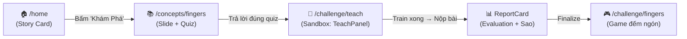
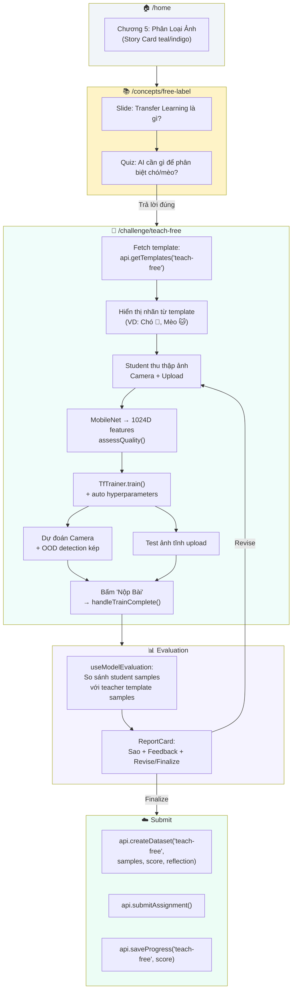
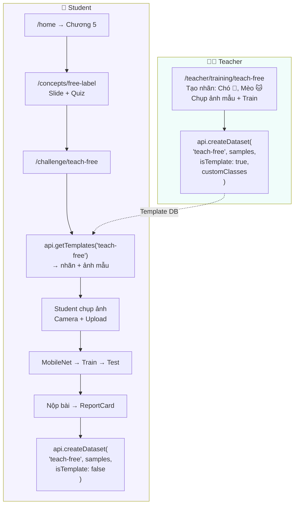

# Trang Học Sinh Dạy AI Phân Loại Ảnh Tạo Nhãn Tự Do — Implementation Plan

> [!NOTE]
> **Tính năng**: Trang challenge cho **Học sinh** tập dạy AI phân loại ảnh theo bài tập mà Giáo viên đã tạo nhãn tự do (`teach-free`).
> - **Đường dẫn**: `/challenge/teach-free`
> - **Điểm vào**: Trang Home (`/home`) — thêm Chương 5 mới
> - **Trang giới thiệu**: `/concepts/free-label` — slide khái niệm + quiz trước khi vào sandbox
> - Student nhận **template** từ Teacher (nhãn + ảnh mẫu) → tự thu thập dữ liệu → train → test → nộp bài → nhận **Report Card**

---

## 1. Tổng quan kiến trúc hiện tại — Luồng Student Challenge

### Chuỗi trang Student hiện có (ví dụ bài "Đếm ngón tay"):



### Các trang challenge hiện có:

| Challenge | Route | Model | Component UI | Template from Teacher |
|-----------|-------|-------|-------------|----------------------|
| Đếm ngón 1 tay | `/challenge/teach` | MediaPipe Hands | `TeachPanel` (mode='hand-1') | `api.getTemplates('teach')` |
| Đếm ngón 2 tay | `/challenge/teach-two-hands` | MediaPipe Hands | `TeachPanel` (mode='hand-2') | `api.getTemplates('teach-two-hands')` |
| Cử chỉ tay | `/challenge/teach-gestures` | MediaPipe Hands | `TeachPanel` (mode='gesture') | `api.getTemplates('teach-gestures')` |
| Biểu cảm mặt | `/challenge/teach-face` | MediaPipe Face | `TeachPanel` (mode='emotion') | `api.getTemplates('teach-face')` |
| Thể dục | `/challenge/teach-body` | MediaPipe Pose | `BodyTeachPanel` | `api.getTemplates('teach-body-*')` |
| **Phân loại ảnh tạo nhãn tự do** | **`/challenge/teach-free`** | **MobileNet v2** | **Trang mới (không dùng TeachPanel)** | **`api.getTemplates('teach-free')`** |

> [!IMPORTANT]
> **Tại sao KHÔNG tái sử dụng `TeachPanel`?** `TeachPanel` (1816 dòng) được thiết kế chuyên cho MediaPipe — phụ thuộc `useMl5Handpose`, `useMl5FaceMesh`, `drawHandSkeleton`, `normalizeHandKeypoints`... Trang teach-free dùng **MobileNet** (`useMobilenet`), KHÔNG có skeleton/landmark. Cần trang riêng, nhưng tái sử dụng các component con: `SampleGallery`, `AIConfidenceEnergyBars`, `ReportCard`.

---

## 2. Khác biệt giữa Teacher teach-free và Student teach-free

| Tiêu chí | Teacher (`/teacher/training/teach-free`) | Student (`/challenge/teach-free`) |
|----------|----------------------------------------|----------------------------------|
| **Mục đích** | Tạo template (nhãn + ảnh mẫu) để giao bài | Làm bài tập theo template của Teacher |
| **Tạo nhãn** | ✅ Tự do tạo/xóa/sửa nhãn (2–10) | ❌ Nhãn **cố định** theo template |
| **Siêu tham số** | ✅ Tùy chỉnh epochs, batch size, learning rate | ❌ Tự động (auto hyperparameters) |
| **Export model** | ✅ Tải model.json + weights.bin | ❌ Không cần |
| **Submit** | `isTemplate: true` — tạo template | `isTemplate: false` — nộp bài Student |
| **Evaluation** | Self-evaluation LOO-KNN | `useModelEvaluation` + `ReportCard` + skill assessment |
| **Teacher notes** | ✅ Ghi chú cho bài tập | ❌ Không |
| **Reflection question** | ❌ | ✅ Câu hỏi phản hồi trước khi nộp |
| **OOD detection** | ✅ Có | ✅ Có (giống nhau) |
| **Ảnh mẫu tham khảo** | ❌ Không (tự tạo mẫu) | ✅ Xem ảnh mẫu từ Teacher template |

---

## 3. Luồng hoạt động chi tiết



---

## 4. Evaluation — So sánh Student vs Teacher (không có Golden Dataset)

### Vấn đề: Không có Golden Dataset cho phân loại ảnh tạo nhãn tự do

Các bài truyền thống (teach, teach-gestures...) có **Golden Test Dataset** cứng — hardcode trong code với feature vectors chuẩn. Bài teach-free **không thể có golden dataset** vì nhãn do Teacher tự tạo (Chó/Mèo hôm nay, Táo/Lê ngày mai).

### Giải pháp: Dùng Teacher template samples làm "gold standard"

```typescript
// Evaluation cho teach-free
const { evaluation, runEvaluation } = useModelEvaluation({
  challengeType: 'teach-free',
  classes: templateClasses,         // Nhãn từ template
  goldenDataset: [],                // Không có golden → mảng rỗng
  dynamicDataset: [],               // Không có dynamic → mảng rỗng
  teacherSamples: templateSamples,  // ← Ảnh mẫu từ Teacher = gold standard
});
```

`useModelEvaluation` **đã hỗ trợ** trường hợp `goldenDataset = []`:
- Khi không có golden, hook chỉ dùng **dataset health** (balance, quality) + **teacher cross-check** (so sánh KNN student vs teacher samples)
- Vẫn tạo được ReportCard với sao + feedback

> [!TIP]
> **Teacher template samples quan trọng!** Khi Teacher tạo bài teach-free, mỗi sample đều có `features: number[]` (1024D MobileNet vector). Student chụp ảnh mới, KNN cross-check so sánh features student vs teacher → đánh giá chất lượng.

---

## 5. Giao diện Student Challenge — Thiết kế UI

### Layout tổng quát

```
┌─────────────────────────────────────────────────┐
│ ← Quay về     🧪 Phân Loại Ảnh Tạo Nhãn Tự Do          │
│               📋 Bài tập từ Thầy/Cô giáo       │
├─────────────────────────────────────────────────┤
│                                                 │
│  ┌─── MobileNet Status ────────────────────┐   │
│  │ 🟢 MobileNet sẵn sàng (hoặc Loading...)│   │
│  └────────────────────────────────────────┘   │
│                                                 │
│  ┌─── Camera View ────────────────────────┐   │
│  │                                        │   │
│  │         [Video Preview 640×480]        │   │
│  │                                        │   │
│  └────────────────────────────────────────┘   │
│                                                 │
│  ┌─── Chọn nhãn ─────────────────────────┐   │
│  │ [🐶 Chó] [🐱 Mèo] [🚗 Ô tô]         │   │
│  │ (nhãn từ template, KHÔNG sửa được)     │   │
│  └────────────────────────────────────────┘   │
│                                                 │
│  ┌─── Thu thập dữ liệu ─────────────────┐   │
│  │ [📷 Giữ để chụp]  [📁 Tải ảnh lên]   │   │
│  │                                        │   │
│  │ Gallery: 🐕 🐕 🐕 (SampleGallery)    │   │
│  │ Ảnh hợp lệ: 8/10                      │   │
│  └────────────────────────────────────────┘   │
│                                                 │
│  ┌─── Ảnh mẫu từ Thầy/Cô ──────────────┐   │
│  │ "Xem ảnh mẫu: 🐶 Chó (15 ảnh)"      │   │
│  │ 🐕🐕🐕🐕🐕 (thumbnails nhỏ)         │   │
│  └────────────────────────────────────────┘   │
│                                                 │
│  [⚙️ Siêu tham số: Auto]                      │
│                                                 │
│  [ 🧠 DẠY AI HỌC ! ] (khi đủ 5 ảnh/nhãn)     │
│                                                 │
│  ┌─── Kết quả (sau khi train) ──────────┐   │
│  │ Dự đoán: 🐶 Chó (92%)                │   │
│  │ ████████████░░░░ Chó: 92%             │   │
│  │ ██░░░░░░░░░░░░░░ Mèo: 8%             │   │
│  │                                        │   │
│  │ Self-evaluation: 95% ✅               │   │
│  │                                        │   │
│  │ [ 📤 NỘP BÀI CHO THẦY CÔ ]          │   │
│  └────────────────────────────────────────┘   │
└─────────────────────────────────────────────────┘
```

---

## 6. Proposed Changes — Danh sách files

### Tầng Client

---

#### [NEW] [`challenge/teach-free/page.tsx`](file:///d:/HOCTAP/Learn-Hub/client/src/app/(private)/challenge/teach-free/page.tsx) — Trang Student dạy AI phân loại ảnh tạo nhãn tự do

Đây là file chính, dự kiến ~500-700 dòng. Lấy cảm hứng từ `challenge/teach/page.tsx` (434 dòng) nhưng thay TeachPanel bằng logic MobileNet inline.

1. **Template fetch**: `api.getTemplates('teach-free')` → lấy `customClasses` + `samples` (ảnh mẫu Teacher)
2. **State management**: ~18 `useState` (samples, classes, isTraining, isTrained, trainingProgress, predictionActive, predictedLabel, confidence, confidences, predictImage, predictResult, showSubmitModal, showReportCard, ...)
3. **MobileNet hook**: `useMobilenet()` → `{ modelStatus, extractFeatures, extractFeaturesFromVideo, extractFeaturesFromBase64 }`
4. **Data collection**:
   - `captureSample()`: Camera → MobileNet → `assessQuality()` → sample
   - `handleFileUpload()`: Batch upload + extension regex + toast (reuse logic từ teacher teach-free)
   - Hold-to-Record: `onPointerDown` → `setInterval(300ms)` → `onPointerUp` → `clearInterval`
5. **Training**: `TfTrainer` + `calculateAutoHyperparameters(sampleCount)` (KHÔNG cho Student chỉnh siêu tham số)
6. **Prediction**: `requestAnimationFrame` loop + OOD detection kép (confidence < 65% || L2 > 1.2)
7. **Test ảnh tĩnh**: Upload 1 ảnh → predict + OOD check
8. **Self-evaluation**: Leave-one-out KNN (k=3) — giống teacher
9. **Nộp bài**: `handleTrainComplete()` → `showSubmitModal` → `handleSubmitAssignment()`:
   - `uploadSamplesToCloudinary(samples, 'teach-free')`
   - `api.createDataset('teach-free', samples, score, reflection)` — `isTemplate: false`
   - `api.submitAssignment(score, { samples }, reflection, 'teach-free')`
   - `api.saveProgress('teach-free', score)`
   - `runEvaluation(samples, modelId)` → `showReportCard`
10. **ReportCard**: Hiện evaluation + sao + feedback → "Revise" (quay lại cải thiện) hoặc "Finalize" (hoàn tất)
11. **Finalize**: `api.getModelChain('teach-free')` → tính skill scores → hiện kết quả cuối cùng
12. **Xem ảnh mẫu Teacher**: Toggle section hiển thị template samples theo từng nhãn

---

#### [MODIFY] [`home/page.tsx`](file:///d:/HOCTAP/Learn-Hub/client/src/app/(private)/home/page.tsx) — Thêm Chương 5: Phân Loại Ảnh

1. Thêm Story Card mới (Chương 5) sau Chương 4 (Thể Dục), trước footer
2. Màu chủ đạo: **teal/cyan** (khác biệt với blue, pink, emerald, amber)
3. Emoji: 🧪
4. Tag: "Khám phá: Phân loại ảnh bằng Transfer Learning"
5. Link: `href="/concepts/free-label"`

---

#### [MODIFY] [`concepts/[slug]/page.tsx`](file:///d:/HOCTAP/Learn-Hub/client/src/app/(public)/concepts/[slug]/page.tsx) — Thêm concept "free-label"

1. Thêm entry `'free-label'` vào `CONCEPTS_DATA`:
   - **Slide**: Giới thiệu Transfer Learning — MobileNet đã học trên 1.4 triệu ảnh, bé chỉ cần cho AI xem thêm vài ảnh nữa là AI biết phân biệt!
   - **Quiz**: "AI cần bao nhiêu ảnh để học phân biệt chó và mèo?" → "Thật nhiều ảnh đa dạng"
   - `nextUrl: '/challenge/teach-free'`
   - `btnText: 'Vào Sandbox Phân Loại Ảnh'`

---

#### [MODIFY] [`teacher/page.tsx`](file:///d:/HOCTAP/Learn-Hub/client/src/app/(private)/teacher/page.tsx) — Gộp thống kê teach-free

1. Thêm `api.getDatasetsByChallenge('teach-free')` vào Promise.all (dòng 35-38)
2. Thêm field `teachFree: { completed: boolean; bestScore: number }` vào `studentMap`
3. Thêm nhánh `else if (ds.challengeType === 'teach-free')` (dòng 67-79)
4. Cập nhật sort formula để tính average bao gồm teach-free

---

#### [MODIFY] [`student/history/[challengeType]/page.tsx`](file:///d:/HOCTAP/Learn-Hub/client/src/app/(private)/student/history/[challengeType]/page.tsx) — Đã có label ✅

> Đã thêm `'teach-free': 'Phân loại ảnh tạo nhãn tự do 🧪'` trong commit trước. Không cần sửa thêm.

---

#### [MODIFY] [`teacher/datasets/[challengeType]/page.tsx`](file:///d:/HOCTAP/Learn-Hub/client/src/app/(private)/teacher/datasets/[challengeType]/page.tsx) — Đã có label ✅

> Đã thêm `'teach-free': 'Phân loại ảnh tạo nhãn tự do 🧪'` trong commit trước. Không cần sửa thêm.

---

### Tầng Server (KHÔNG cần sửa)

> [!TIP]
> Server **đã sẵn sàng**. API `createDataset`, `getTemplates`, `submitAssignment`, `saveProgress`, `getModelChain` đều nhận `challengeType` dạng string — không cần thêm migration hay endpoint mới.

---

## 7. Sơ đồ tổng thể



---

## 8. Open Questions

> [!IMPORTANT]
> **Q1:** Sau khi Student hoàn thành bài teach-free, có nên mở khóa game nào không? (Các bài truyền thống: teach → fingers game, teach-gestures → gesture game). Teach-free hiện tại không có game tương ứng. Có 2 lựa chọn:
> - **A)** Sau khi nộp bài xong → quay về Home (không có game)
> - **B)** Sau khi nộp bài xong → mở khóa sandbox tự do (Student có thể tiếp tục thử nghiệm)

> [!IMPORTANT]
> **Q2:** Có cần thêm Chương 5 vào home/page.tsx ngay không? Hay chờ đến khi student challenge hoàn chỉnh rồi mới hiện? Tôi đề xuất **thêm luôn** vì concepts page là nội dung tĩnh, không phụ thuộc backend.

---

## 9. Verification Plan

### Build & Compile
```bash
cd client && npx tsc --noEmit   # TypeScript check
cd client && npm run build       # Next.js production build
```

### Functional Tests (Manual)

#### Concepts Page
1. **Truy cập `/concepts/free-label`** → Slide giới thiệu Transfer Learning hiện đúng
2. **Quiz**: Trả lời đúng → nút "Vào Sandbox Phân Loại Ảnh" hiện, link tới `/challenge/teach-free`

#### Home Page
3. **Chương 5**: Story card teal/cyan hiện sau Chương 4, bấm "Khám Phá" → `/concepts/free-label`

#### Student Challenge (khi KHÔNG có template)
4. **Không có template**: Truy cập `/challenge/teach-free` khi Teacher chưa tạo bài → hiện thông báo "Chưa có bài tập từ Thầy/Cô" + nút quay về Home

#### Student Challenge (khi CÓ template)
5. **Fetch template**: Teacher đã tạo template teach-free (VD: Chó 🐶 + Mèo 🐱) → Student vào → nhãn hiện đúng theo template
6. **Nhãn readonly**: Student KHÔNG có nút thêm/xóa nhãn
7. **Camera capture**: Chọn nhãn "Chó" → giữ nút chụp → MobileNet trích xuất features → sample thêm vào gallery
8. **File upload**: Bấm "Tải ảnh lên" → chọn nhiều file → batch process → toast "Đã thêm X ảnh"
9. **Extension regex**: Upload file `.JPG` (PlantVillage) → vẫn nhận diện là ảnh hợp lệ
10. **Train button**: Khi mỗi nhãn đủ ≥5 ảnh valid → nút "DẠY AI HỌC" sáng lên
11. **Training**: Bấm train → progress bar + loss/accuracy log
12. **OOD camera**: Bật nhận diện → đưa vật lạ → OOD → auto-stop
13. **OOD upload**: Upload ảnh lạ → "Không nhận diện được"
14. **Self-evaluation**: Hiện accuracy % (LOO-KNN)
15. **Xem ảnh mẫu Teacher**: Bấm toggle → hiện thumbnails ảnh mẫu theo nhãn

#### Nộp bài
16. **Submit modal**: Bấm "Nộp Bài" → hiện câu hỏi phản hồi + textarea gửi lời nhắn
17. **Upload Cloudinary**: Ảnh upload lên cloud + dataset tạo thành công
18. **ReportCard**: Hiện evaluation + sao + feedback
19. **Revise**: Bấm "Sửa lại" → quay về sandbox, giữ nguyên samples
20. **Finalize**: Bấm "Hoàn tất" → tính skill scores → hiện kết quả cuối

#### Teacher Overview
21. **Thống kê**: Teacher vào `/teacher` → thấy dataset teach-free của Student trong bảng
