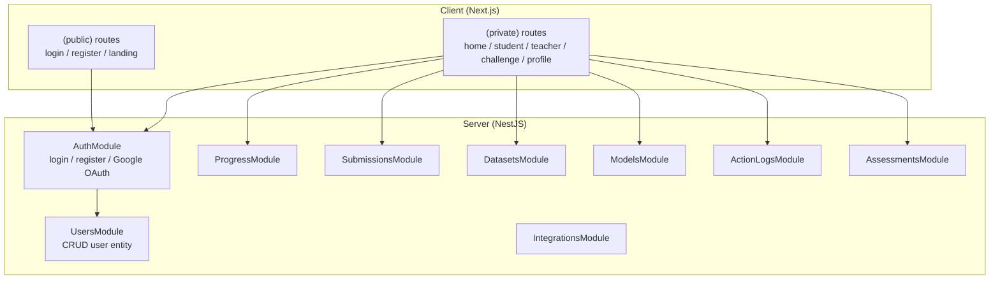
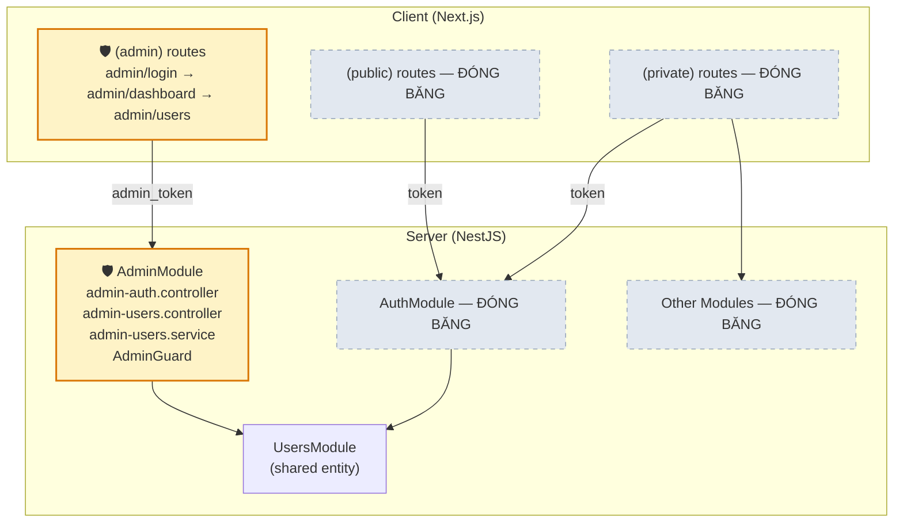

# Hệ thống Quản trị viên (Admin Panel) — Tách biệt hoàn toàn

## Tổng quan

Xây dựng hệ thống quản trị viên **tách biệt hoàn toàn** với hệ thống Learn-Hub hiện tại. Admin Panel chỉ phục vụ 1 chức năng chính: **quản lý user và phân vai trò** (student / teacher). Hệ thống hiện tại (student & teacher flows) được **đóng băng**, không sửa đổi logic nghiệp vụ.

## Phân tích Codebase hiện tại

### Tech Stack
| Layer | Technology |
|-------|-----------|
| **Backend** | NestJS 11, TypeORM, PostgreSQL, JWT + Passport |
| **Frontend** | Next.js 16, React 19, TailwindCSS 4 |
| **Auth** | JWT Bearer + Google OAuth2 |
| **Database** | PostgreSQL, `synchronize: true` (dev mode) |

### Kiến trúc hiện tại



### User Entity hiện tại ([user.entity.ts](file:///d:/HOCTAP/Learn-Hub/server/src/modules/users/entities/user.entity.ts))
- `id` (UUID), `username`, `email`, `password?`, `avatar`, `role` (default `'student'`)
- `googleId?`, `googleAccessToken?`, `googleRefreshToken?`, `avatarUrl?`
- `createdAt`, `updatedAt`

### Hạ tầng Auth hiện tại
- **RolesGuard** + `@Roles()` decorator đã tồn tại nhưng **chưa được sử dụng** ở bất kỳ controller nào
- JWT token chứa `{ sub: userId }`, guard lấy user từ DB
- Role chỉ là string column, chưa có enum hay validation

> [!IMPORTANT]
> **Đóng băng (Freeze)**: Toàn bộ modules hiện tại (`progress`, `submissions`, `datasets`, `models`, `integrations`, `action-logs`, `assessments`) và client routes (`student`, `teacher`, `challenge`, `home`, `profile`) sẽ **không bị sửa đổi** trong quá trình triển khai admin system.

---

## Proposed Changes

### Nguyên tắc thiết kế

1. **Tách biệt hoàn toàn**: Admin panel là route group riêng trên client (`/admin/*`) và module riêng trên server (`AdminModule`)
2. **Không chạm code cũ**: Chỉ **thêm mới** files, không sửa đổi logic hiện tại (trừ 2 điểm nhỏ bắt buộc: thêm `isActive` vào User Entity và register AdminModule)
3. **Admin role**: Thêm role `'admin'` vào hệ thống role, admin chỉ được tạo thông qua seed/CLI, không qua register
4. **Bảo mật nhiều lớp**: Admin Guard riêng, AdminJwtStrategy riêng (có thể cùng JWT secret nhưng validate riêng)

---

### Component 1: User Entity — Nâng cấp nhẹ

#### [MODIFY] [user.entity.ts](file:///d:/HOCTAP/Learn-Hub/server/src/modules/users/entities/user.entity.ts)

Thêm các trường quản trị cần thiết (backward-compatible, không phá code cũ):

```typescript
// Thêm trường mới (tất cả đều có default → không phá DB hiện tại)
@Column({ default: true })
isActive: boolean;           // Admin có thể disable user

@Column({ type: 'timestamp', nullable: true })
lastLoginAt?: Date;          // Tracking lần đăng nhập cuối

@Column({ nullable: true })
deactivatedBy?: string;      // UUID admin đã disable user

@Column({ nullable: true })
deactivatedAt?: Date;        // Thời điểm disable

@Column({ nullable: true })
roleChangedBy?: string;      // UUID admin đã đổi role

@Column({ nullable: true })
roleChangedAt?: Date;        // Thời điểm đổi role
```

> [!NOTE]
> Do `synchronize: true`, TypeORM sẽ tự thêm columns mới vào bảng `users` với giá trị default. Không cần migration.

---

### Component 2: Server — Admin Module (HOÀN TOÀN MỚI)

#### [NEW] [admin.module.ts](file:///d:/HOCTAP/Learn-Hub/server/src/modules/admin/admin.module.ts)

Module gốc cho toàn bộ admin system, import `UsersModule` để tái sử dụng repository.

#### [NEW] [admin.guard.ts](file:///d:/HOCTAP/Learn-Hub/server/src/modules/admin/guards/admin.guard.ts)

Guard riêng cho admin — kiểm tra JWT **và** `user.role === 'admin'`. Tách biệt với `RolesGuard` hiện tại.

```typescript
@Injectable()
export class AdminGuard implements CanActivate {
  async canActivate(context: ExecutionContext): Promise<boolean> {
    // 1. Verify JWT token
    // 2. Load user from DB
    // 3. Check user.role === 'admin' AND user.isActive === true
    // 4. Attach user to request
  }
}
```

#### [NEW] [admin-users.controller.ts](file:///d:/HOCTAP/Learn-Hub/server/src/modules/admin/controllers/admin-users.controller.ts)

REST API tách biệt dưới prefix `/admin/users`:

| Method | Endpoint | Mô tả |
|--------|----------|-------|
| `GET` | `/admin/users` | Danh sách users (phân trang, search, filter by role/status) |
| `GET` | `/admin/users/:id` | Chi tiết 1 user |
| `PATCH` | `/admin/users/:id/role` | Đổi role (student ↔ teacher) |
| `PATCH` | `/admin/users/:id/status` | Kích hoạt / Vô hiệu hóa user |
| `GET` | `/admin/stats` | Thống kê tổng quan (tổng user, user theo role, user mới hôm nay) |

#### [NEW] [admin-users.service.ts](file:///d:/HOCTAP/Learn-Hub/server/src/modules/admin/services/admin-users.service.ts)

Service riêng xử lý business logic admin — inject `UsersService` và `UserRepository`.

```typescript
// Core methods:
findAllPaginated(query: AdminUserQueryDto)  → { data: User[], total, page, limit }
findOneById(id: string)                      → User (with full info)
changeRole(id: string, role: string, adminId: string) → User
toggleActive(id: string, active: boolean, adminId: string) → User
getStats()                                   → { total, byRole, newToday, activeCount }
```

#### [NEW] [admin-auth.controller.ts](file:///d:/HOCTAP/Learn-Hub/server/src/modules/admin/controllers/admin-auth.controller.ts)

Endpoint đăng nhập riêng cho admin:

| Method | Endpoint | Mô tả |
|--------|----------|-------|
| `POST` | `/admin/auth/login` | Login bằng email/password, chỉ cho phép role=admin |
| `GET` | `/admin/auth/profile` | Lấy thông tin admin đang đăng nhập |

#### [NEW] DTOs

| File | Mô tả |
|------|-------|
| `admin-user-query.dto.ts` | Query params: `page`, `limit`, `search`, `role`, `isActive`, `sortBy`, `sortOrder` |
| `change-role.dto.ts` | Body: `{ role: 'student' \| 'teacher' }` |
| `toggle-status.dto.ts` | Body: `{ isActive: boolean }` |
| `admin-login.dto.ts` | Body: `{ email, password }` |

#### [NEW] [admin-seed.command.ts](file:///d:/HOCTAP/Learn-Hub/server/src/modules/admin/admin-seed.command.ts)

Script seed tạo admin account đầu tiên khi chạy lệnh:
```bash
npx ts-node src/modules/admin/admin-seed.command.ts
```

---

### Component 3: Server — Register AdminModule

#### [MODIFY] [app.module.ts](file:///d:/HOCTAP/Learn-Hub/server/src/app.module.ts)

Chỉ thêm **1 dòng** import `AdminModule` vào mảng `imports`. Không sửa gì khác.

---

### Component 4: Client — Admin Panel (HOÀN TOÀN MỚI)

Toàn bộ admin UI nằm trong route group `(admin)`, **tách biệt** khỏi `(private)` và `(public)`.

#### Cấu trúc thư mục mới

```
client/src/app/
├── (admin)/                          ← MỚI: Route group admin
│   ├── layout.tsx                    ← Admin layout (sidebar + topbar)
│   ├── admin/
│   │   ├── page.tsx                  ← Dashboard: thống kê tổng quan
│   │   ├── login/
│   │   │   └── page.tsx              ← Trang đăng nhập admin (riêng)
│   │   └── users/
│   │       ├── page.tsx              ← Bảng danh sách users
│   │       └── [id]/
│   │           └── page.tsx          ← Chi tiết user + đổi role
│
├── (private)/                        ← ĐÓNG BĂNG — không sửa
├── (public)/                         ← ĐÓNG BĂNG — không sửa
```

#### [NEW] Admin Layout & Components

| File | Mô tả |
|------|-------|
| `(admin)/layout.tsx` | Layout riêng: check admin token, sidebar navigation, topbar |
| `admin/login/page.tsx` | Form đăng nhập admin — gọi `/admin/auth/login`, lưu token riêng (`admin_token`) |
| `admin/page.tsx` | Dashboard — card thống kê: tổng users, student count, teacher count, new today |
| `admin/users/page.tsx` | Bảng user: search, filter role, filter status, phân trang, nút đổi role / toggle active |
| `admin/users/[id]/page.tsx` | Chi tiết user: avatar, email, role, trạng thái, lịch sử thay đổi |

#### [NEW] Admin API Client

| File | Mô tả |
|------|-------|
| `lib/admin-api.ts` | API client riêng cho admin panel — dùng `admin_token` thay vì `token`. **Hoàn toàn tách biệt** với `lib/api.ts` |

#### [NEW] Admin Components

| File | Mô tả |
|------|-------|
| `components/admin/AdminSidebar.tsx` | Sidebar navigation: Dashboard, Users |
| `components/admin/AdminTopbar.tsx` | Topbar: tên admin, nút logout |
| `components/admin/UserTable.tsx` | Bảng user responsive với search/filter/pagination |
| `components/admin/RoleBadge.tsx` | Badge hiển thị role (student = xanh, teacher = tím) |
| `components/admin/StatusBadge.tsx` | Badge hiển thị trạng thái (active = xanh, disabled = đỏ) |
| `components/admin/StatsCard.tsx` | Card thống kê số liệu |
| `components/admin/ConfirmModal.tsx` | Modal xác nhận khi đổi role / disable user |

---

### Component 5: Kiến trúc tổng thể



---

## Danh sách file cần tạo / sửa

### 🆕 Files MỚI (17 files)

**Server (8 files):**
1. `server/src/modules/admin/admin.module.ts`
2. `server/src/modules/admin/guards/admin.guard.ts`
3. `server/src/modules/admin/controllers/admin-auth.controller.ts`
4. `server/src/modules/admin/controllers/admin-users.controller.ts`
5. `server/src/modules/admin/services/admin-users.service.ts`
6. `server/src/modules/admin/dto/admin-login.dto.ts`
7. `server/src/modules/admin/dto/admin-user-query.dto.ts`
8. `server/src/modules/admin/dto/change-role.dto.ts`
9. `server/src/modules/admin/admin-seed.command.ts`

**Client (8+ files):**
1. `client/src/app/(admin)/layout.tsx`
2. `client/src/app/(admin)/admin/login/page.tsx`
3. `client/src/app/(admin)/admin/page.tsx`
4. `client/src/app/(admin)/admin/users/page.tsx`
5. `client/src/app/(admin)/admin/users/[id]/page.tsx`
6. `client/src/lib/admin-api.ts`
7. `client/src/components/admin/AdminSidebar.tsx`
8. `client/src/components/admin/UserTable.tsx`

### ✏️ Files SỬA ĐỔI (2 files — thay đổi tối thiểu)

1. `server/src/modules/users/entities/user.entity.ts` — thêm columns `isActive`, `lastLoginAt`, audit fields
2. `server/src/app.module.ts` — thêm 1 dòng import `AdminModule`

### 🧊 Files ĐÓNG BĂNG (KHÔNG SỬA)

Tất cả files còn lại trong cả `server/src/modules/*` (trừ `users/entities`) và `client/src/app/(private)`, `client/src/app/(public)`.

---

## Open Questions

> [!IMPORTANT]
> **Q1**: Admin account đầu tiên — bạn muốn tạo bằng cách nào?
> - **Option A (Recommended)**: Seed script chạy 1 lần: `npx ts-node admin-seed.command.ts` — tạo admin với email/password cố định (đổi được sau)
> - **Option B**: Thêm biến môi trường `ADMIN_EMAIL` + `ADMIN_PASSWORD` vào `.env`, server tự tạo khi khởi động nếu chưa có

> [!IMPORTANT]
> **Q2**: Token storage — Admin panel nên dùng key riêng (`admin_token`) trong localStorage hay dùng chung key `token`?
> - **Option A (Recommended)**: Key riêng `admin_token` → admin có thể đăng nhập cả 2 hệ thống cùng lúc trên cùng browser
> - **Option B**: Chung key `token` → đơn giản hơn nhưng admin phải logout hệ thống chính nếu muốn dùng admin panel

> [!NOTE]
> **Q3**: Bạn có muốn thêm chức năng **xem chi tiết user** (submissions, progress, datasets) ở admin panel, hay hệ thống này chỉ cần quản lý user + role thôi?

---

## Verification Plan

### Automated Tests
```bash
# Build kiểm tra không lỗi TypeScript
cd server && npm run build
cd client && npm run build
```

### Manual Verification
1. Chạy seed script tạo admin account
2. Đăng nhập admin panel tại `/admin/login`
3. Xem dashboard thống kê
4. Vào trang users → search, filter, phân trang
5. Đổi role 1 user từ student → teacher → verify DB đã thay đổi
6. Disable 1 user → verify user đó không thể login hệ thống chính
7. Kiểm tra hệ thống chính (student/teacher flows) **vẫn hoạt động bình thường**
